# 项目功能图

## 模块依赖图

```mermaid
graph LR
    User[用户] --> ChatUI[Chat UI]
    ChatUI --> SSEHook[useChatStream]
    ChatUI --> ConvCtx[ConversationContext]
    ConvCtx --> Sidebar[Sidebar 侧边栏]
    SSEHook --> ApiClient[apiClient 统一网络层]
    SSEHook --> ResumeFn[resumeStream 重连]
    ApiClient --> SSEEndpoint[SSE /api/chat/stream]
    ApiClient --> StopEP[POST /chat/stop]
    ApiClient --> TokenMgr[TokenManager]
    ApiClient --> ConvAPI[Conversation API]

    SSEEndpoint --> AuthMiddleware[JWT 鉴权 Depends]
    ChatAPI --> AuthMiddleware
    RetrieveAPI[POST /api/retrieve] --> AuthMiddleware
    ConvAPI --> AuthMiddleware

    AuthMiddleware --> StateGraph[LangGraph StateGraph]
    StateGraph --> Summarize[summarize 摘要压缩]
    Summarize --> Rewrite[rewrite 多轮改写]
    Rewrite --> Classify[classify 分类器]
    Classify -->|textbook| Retrieve[混合检索+Rerank]
    Classify -->|unrelated| Refuse[refuse 拒绝]
    Retrieve --> CtxInject[context injection 分级注入]
    CtxInject --> Respond[respond ChatOpenAI]

    Retrieve --> Embedding[DashScopeEmbedding]
    Retrieve --> VectorStore[ChromaDBStore]
    Retrieve --> BM25[BM25Retriever]
    Retrieve --> Reranker[Reranker]

    SSEEndpoint --> RunGraph[_run_graph 后台任务]
    SSEEndpoint --> ConvRouter[conversation_router]
    RunGraph --> Queue[asyncio.Queue]
    Queue --> SSEGen[_create_sse_generator]
    ResumeEP[GET /resume] --> Queue
    StopEP --> RunGraph
    ConvRouter --> Checkpointer[PostgresSaver/MemorySaver]

    ConvAPI --> ConvRepo[ConversationRepo]
    ConvRepo --> PG[(PostgreSQL)]

    Respond --> Generator[LLMGenerator]
    Generator --> LLM[OpenAI 兼容 LLM]

    TokenMgr -.-> AuthCenter[auth-center]

    EvalCLI --> FaithEval[Faithfulness Eval]
    FaithEval --> DetGrader[确定性 Grader]
    FaithEval --> LLMJudge[LLM-as-Judge]
    FaithEval --> Retrieve
    FaithEval --> Generator

    Embedding -.-> DashScope[DashScope API]
    Reranker -.-> DashScope
    VectorStore -.-> ChromaDB[(ChromaDB)]
    BM25 -.-> ChromaDB
    LLM -.-> NewAPI[NewAPI 配置切换]

    style StateGraph fill:#A5D6A7
    style Summarize fill:#A5D6A7
    style Rewrite fill:#A5D6A7
    style Classify fill:#A5D6A7
    style CtxInject fill:#A5D6A7
    style Respond fill:#A5D6A7
    style Refuse fill:#A5D6A7
    style ConvRouter fill:#A5D6A7
    style Checkpointer fill:#A5D6A7
    style ConvRepo fill:#A5D6A7
    style AuthMiddleware fill:#A5D6A7
    style DetGrader fill:#CE93D8
    style LLMJudge fill:#CE93D8
    style ApiClient fill:#90CAF9
    style TokenMgr fill:#90CAF9
    style ConvCtx fill:#90CAF9
    style Sidebar fill:#90CAF9
    style SSEHook fill:#FFB74D
    style ResumeFn fill:#FFB74D
    style RunGraph fill:#FFD54F
    style Queue fill:#FFD54F
    style SSEGen fill:#FFD54F
    style ResumeEP fill:#FFD54F
    style StopEP fill:#FFD54F
```

## 颜色分级

| 颜色 | 前缀 | 含义 |
|------|------|------|
| 🔵 蓝色 | FF | 前端基础（apiClient, TokenManager, ConversationContext, Sidebar） |
| 🟢 绿色 | BF/BB | 后端基础+业务（StateGraph, Auth, Checkpointer, ConvRouter, ConvRepo） |
| 🟡 浅黄 | BB | 后端业务（Router + R012 SSE 解耦：_run_graph, Queue, Resume, Stop） |
| 🟠 橙色 | FB | 前端业务（useChatStream, resumeStream） |
| 🟣 紫色 | BB | 评估基础设施（DetGrader, LLMJudge） |
