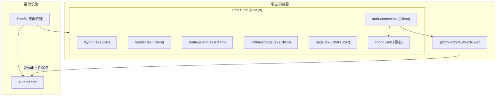

# OctoTutor 架构文档

## 1. 项目概述

章鱼哥解题（OctoTutor）是基于高中数学的智能教学助手。项目采用 Next.js 16 App Router，纯前端 SPA，认证通过 `@xlfoundry/auth-sdk-web` 接入 xlfoundryTest 的 auth-center。

**技术栈**：Next.js 16.2.6 + React 19 + Tailwind CSS 4 + TypeScript

**外部服务依赖**：
- auth-center：OAuth 2.0 授权服务器（Docker 部署）
- Traefik：反向代理 + TLS 终结

## 2. 系统拓扑



## 3. 模块边界

| 模块 | 路径 | 运行环境 | 职责 |
|------|------|---------|------|
| 根布局 | `src/app/layout.tsx` | SSR | 全局 Shell，注入 AuthProvider + Header |
| 首页 | `src/app/page.tsx` | SSR | 落地页，无需认证 |
| OAuth 回调 | `src/app/callback/page.tsx` | Client | 处理 OAuth code 换 token |
| 对话页 | `src/app/chat/page.tsx` | SSR | 受保护页面，RouteGuard 包裹 |
| 导航栏 | `src/components/header.tsx` | Client | 登录状态展示 + 登录/退出操作 |
| 路由守卫 | `src/components/route-guard.tsx` | Client | 未登录自动跳转认证中心 |
| 认证核心 | `src/contexts/auth-context.tsx` | Client | SDK 单例管理，全局认证状态 |
| 工具函数 | `src/lib/utils.ts` | 通用 | CSS 类名合并（cn） |

## 4. 数据流

### 4.1 认证流程

```
用户访问受保护页面 → RouteGuard 检测未登录 → 跳转 auth-center
→ 用户完成登录 → auth-center 回调 /callback?code=xxx&state=xxx
→ handleCallback() 校验 state + PKCE → code 换 token → 存 localStorage
→ 跳转首页（已登录）
```

### 4.2 配置加载

```
运行时 fetch('/config.json') → { clientId, authCenterBaseURL } → AuthService.init()
```

`config.json` 放在 `public/` 目录，Docker 部署时可通过 volume mount 覆盖，同一镜像适配不同环境。

### 4.3 状态传播

```
AuthService (SDK 单例)
  → AuthProvider (React Context)
    → { isAuthenticated, user, login, logout, handleCallback, isInitialized }
      → Header / RouteGuard / CallbackPage
```

## 5. 架构不变量

1. **AuthService 全局单例** — 模块级变量确保唯一实例
2. **SDK 初始化幂等** — `initRef` 防止 useEffect 重复触发
3. **回调处理幂等** — `processedRef` 防止 handleCallback 重复调用
4. **认证先于渲染** — RouteGuard 在认证完成前不渲染子组件
5. **配置与构建解耦** — 运行时从 config.json 加载，不硬编码
6. **Docker standalone 部署** — `output: "standalone"` 最小化镜像

## 6. 禁止模式

| 禁止 | 原因 |
|------|------|
| 在 SSR 组件中调用 `useAuth()` | Context 仅在客户端子树可用 |
| 在 SSR 阶段调用 auth-sdk | SDK 依赖 window/localStorage/sessionStorage |
| 绕过 RouteGuard 暴露受保护页面 | 未认证用户不能看到页面内容 |
| 硬编码 clientId/authCenterBaseURL | 必须从 config.json 运行时读取 |
| 在 Next.js Middleware 使用 auth-sdk | Edge Runtime 不兼容浏览器 API |
| 修改 auth-sdk-web 代码 | 外部包，通过本地 file: 引用，不动源码 |

## 7. 外部服务契约

### 7.1 auth-center

| 接口 | 方法 | 用途 | 调用方 |
|------|------|------|--------|
| `/api/v1/auth/authorize` | GET | OAuth 授权页 | SDK → 浏览器跳转 |
| `/api/v1/auth/token` | POST | code 换 token（含 PKCE） | SDK → fetch（需 CORS） |
| `/api/v1/auth/logout` | POST | 登出 | SDK → fetch（需 CORS） |
| `/api/v1/user/me` | GET | 获取用户信息 | SDK → fetch（需 Bearer token） |

**CORS 前置条件**：auth-center 的 `CORS_ORIGINS` 必须包含 octotutor 的域名。

### 7.2 auth-center 应用注册

| 字段 | 值 |
|------|-----|
| client_id | `MlP4hO8DKk-BOByD` |
| redirect_uris | `http://octotutor.localhost/callback`, `https://octotutor.xiaolutang.top/callback` |

## 8. 部署架构

### 8.1 本地部署

```bash
# 前置：xlfoundryTest 的 auth-center + Traefik 已运行
bash deploy/build.sh                              # 构建镜像
docker compose -f deploy/docker-compose.local.yml up -d  # 启动
# 访问 http://octotutor.localhost
```

- 网络：`auth-network-local`（外部，复用 xlfoundryTest）
- 路由：Traefik `octotutor.localhost` → :3000

### 8.2 生产部署

```bash
bash deploy/deploy.sh remote   # 一键远程部署
```

- 网络：`gateway`（Traefik 网关）+ `auth-network`（认证服务）
- 路由：Traefik `octotutor.xiaolutang.top` → :3000，HTTPS + Let's Encrypt
- 配置：通过 volume mount 覆盖 `config.json` 的 `authCenterBaseURL`

### 8.3 Docker 构建

两阶段构建：builder（node:20-alpine）→ runtime（node:20-alpine + standalone 产物）

关键点：`auth-sdk-web` 本地源码在 builder 阶段通过 `file:./auth-sdk-web` 安装，构建后不进入 runtime 镜像。

## 9. 测试要求

### 9.1 测试分层

| 层级 | 工具 | 覆盖范围 | 运行时机 |
|------|------|---------|---------|
| 集成测试 | Playwright | OAuth 登录/退出/路由保护 | 变更后 |
| 单元测试 | 待定 | 组件逻辑 | 每次提交 |

### 9.2 集成测试执行

```bash
# 前置：本地 Docker auth-center 已运行
E2E_USERNAME=xxx E2E_PASSWORD=xxx npx playwright test
```

- 测试目录：`e2e/`
- 配置：`playwright.config.ts`，baseURL = `http://octotutor.localhost`
- 凭据：从环境变量 `E2E_USERNAME` / `E2E_PASSWORD` 读取
- 不 mock 认证流程

### 9.3 最低覆盖

| 场景 | 验证项 |
|------|--------|
| 首页加载 | 标题正确，登录按钮可见 |
| 路由保护 | 未登录访问 /chat 跳转认证中心 |
| 登录 | 正确凭据登录成功，页面显示用户名 |
| 退出 | 退出后回到未登录状态 |
| 错误密码 | 登录失败，停留在认证中心 |
