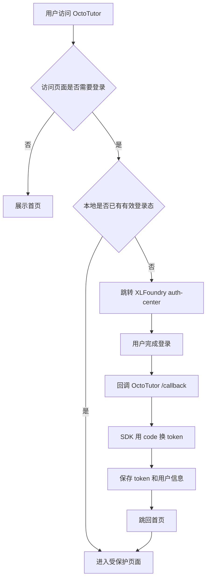
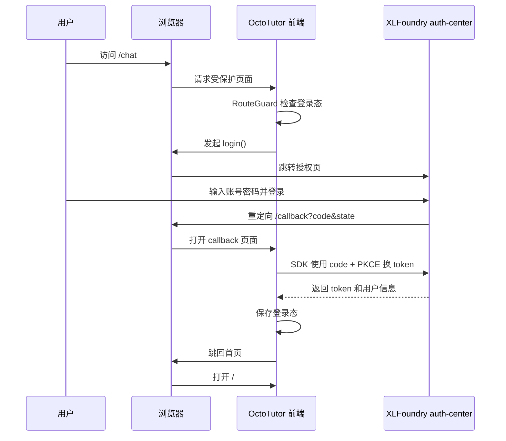
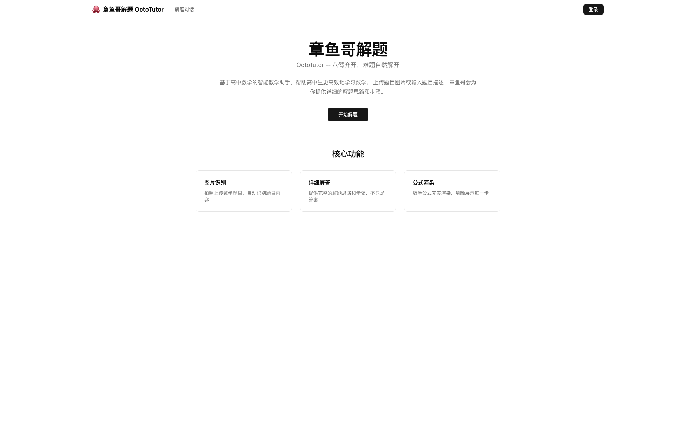
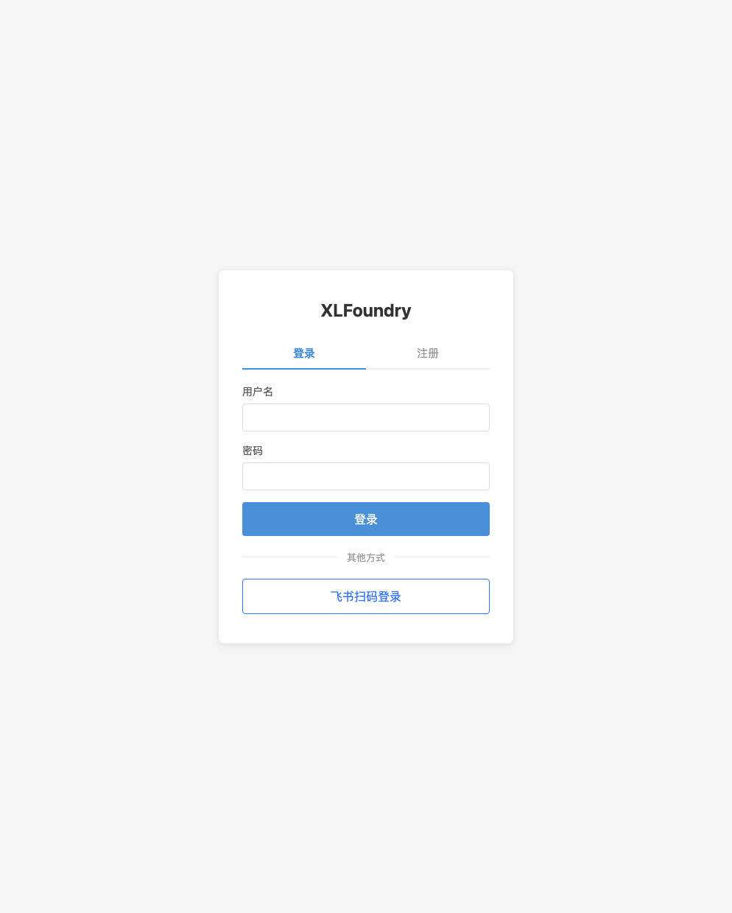
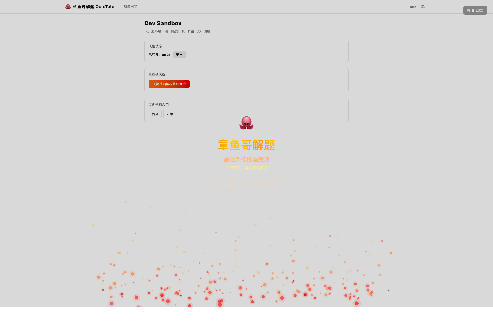

# Vibe Coding 全栈实战：章鱼哥解题 01｜搭好产品底座与登录链路

## 一、故事背景：为什么要做这个系列

平均每天消耗约 4-5 亿 token——这是我现在用 AI 写代码的日常。从"让 AI 写个函数"到"让 AI 搭一个页面"，我越来越依赖 **Vibe Coding** 这种开发方式：用自然语言描述意图，由 AI 生成实现代码，我来负责审查、决策和组装。

但用着用着，我开始好奇一个更大的问题：**Vibe Coding 到底能不能支撑一个完整项目？**

不只是写一个函数、一个组件、一个页面，而是从 0 到 1 做一个真实的全栈产品：有需求分析，有技术选型，有登录，有前后端，有本地开发环境，也有线上部署。AI 能不能一路参与？哪些地方它能直接搞定，哪些地方还是需要人来判断、兜底和收口？

所以我决定拿一个真实项目做实验：**探索 Vibe Coding 从 0 到 1 实现全栈项目的完整过程。**

OctoTutor（章鱼哥解题）就是这个实验对象。它的目标是做一个面向高中数学学习场景的 AI 解题助手：用户可以输入题目，系统不是直接给出答案，而是解释思路、拆解步骤、指出易错点，最终像一个耐心的数学助教一样陪学生把题做明白。

---

## 二、产品要做什么：先把目标分清楚

OctoTutor 不是一开始就直接进入开发的。我先和 AI 做了一轮需求对齐，把一个问题说清楚：**这个产品到底要帮学生完成什么任务？**

### 2.1 长期产品目标

现在回头看，最开始写的“基于固定高中数学教材的启发式问答助手”有点太像技术方案。它里面已经包含了“固定教材”“启发式”这些实现策略，但还没有先把用户问题讲清楚。

我更愿意把章鱼哥解题的长期目标改成一句更直白的话：

**做一个陪学生把高中数学题想明白的 AI 学习助手。**

这里的重点不是“AI 能不能给出答案”，而是学生遇到不会的题时，它能不能把卡住的地方拆开：题目在问什么、用到哪个知识点、第一步该从哪里入手、为什么这一步能这么做、哪里最容易错。

所以，章鱼哥不是一个什么都答的通用聊天机器人，也不是一个只返回标准答案的搜题工具。它更像一个在线数学助教：学生把题发过来，它陪着学生把题目想清楚。

### 2.2 完整产品能力

顺着这个目标往下拆，完整产品链路大概是这样：

```
登录 → 进入学习空间 → 提交题目 → 理解题意 → 找到相关知识 → 分步骤引导 → 继续追问 → 回看学习过程
```

这条链路背后至少有几类用户需求：

- 学生能登录自己的学习空间
- 学生能用文字描述问题，也能上传题目图片
- 系统能看懂题目在问什么，并判断它大概对应哪些高中数学知识点
- 系统能找到相关的教材内容、定义、公式或例题作为依据
- 回答不能只是给最终答案，而是要拆解思路、提示关键步骤和易错点
- 学生没听懂时，可以继续追问，而不是每次都重新开始
- 学生之后能回看之前问过的问题和解题过程
- 后续还可以基于这些记录，形成薄弱点分析和复习建议

这也是我觉得适合拿它做 Vibe Coding 实验的原因。它不是一个只有前端页面的小 demo，也不是一上来就复杂到不可控的平台系统。它有完整产品形态，有登录，有知识库，有 AI 能力，有部署上线，刚好可以观察 AI 在一个真实全栈项目里到底能走多远。

不过完整方向定下来，不代表后面就按这份清单机械执行。真实开发过程中，经常会在讨论和实现里冒出新的想法，也会因为时间、依赖和技术风险不断修正优先级。

### 2.3 技术框架的选型

知道要做什么之后，下一步才是决定怎么做。这里我先回答几个最基础的问题：为什么先做 Web，前端用什么，后端用什么。

#### 为什么是 Web

如果做移动端 App，用户体验当然可以更贴近学生日常使用场景，但对个人开发者来说，成本会明显变高。iOS 和 Android 都要处理应用打包、真机调试、商店审核、版本发布、隐私合规等问题。尤其是早期产品还在快速变化时，每次改动都走一轮客户端发布流程，迭代速度会被拖慢。

Web 是相对成本最低的方式。浏览器打开就能用，发布也更简单；出了问题可以直接在线上修，不需要等用户更新 App。更重要的是，Web 很适合快速搭一条从前端到后端的全栈链路：页面、登录、API、部署、域名、HTTPS 都能在一套工程节奏里跑通。

所以第一版先选 Web，不是因为它是最终形态的唯一答案，而是因为它最适合验证产品和技术链路。

#### 前端为什么选 Next.js

前端我选择 Next.js App Router。这个选择主要是为了少拆一些基础设施：路由、页面布局、middleware、构建输出都在同一个框架里完成。对于一个从 0 到 1 的项目来说，这比自己组合 React、路由、构建工具和部署方式更省心。

这篇文章里最先用到的能力就是这些：

- `app/` 目录组织页面和布局
- `callback/page.tsx` 处理 OAuth 回调
- `route-guard.tsx` 保护需要登录的页面
- `middleware.ts` 控制 dev sandbox 的生产访问
- `output: "standalone"` 方便 Docker 部署

#### 后端为什么选 Python / FastAPI

后端我倾向用 Python / FastAPI。原因很直接：后面会接教材解析、RAG、Embedding、模型调用和评估脚本，这些能力在 Python 生态里更顺手。FastAPI 本身也足够轻量，写 API、定义请求响应模型、跑本地服务都很快。

不过第一篇的重点不是后端智能能力，而是先把产品底座跑通。所以这一阶段后端不会展开讲，先把前端入口、认证链路和部署方式立住。

#### 技术框架小结

最终这一轮的技术框架先收成这样：


| 层级     | 选择                    | 理由                                                   |
| -------- | ----------------------- | ------------------------------------------------------ |
| 产品形态 | Web 应用                | 个人开发成本低，发布快，适合先验证全栈链路             |
| 前端框架 | Next.js 16 (App Router) | 路由、布局、middleware 和部署输出都比较完整 |
| 后端框架 | Python / FastAPI        | 后续 AI、RAG、评估脚本更适合接 Python 生态             |
| 部署方式 | Docker standalone       | 一个镜像搞定，方便本地和线上保持一致                   |

### 2.4 第一篇先讲什么

完整产品会一路走到教材知识库、RAG 检索、AI 对话、Agent 编排、消息持久化和会话管理。但第一篇不适合一上来就讲这些。

如果一个产品连访问、登录、配置、调试入口和部署都没跑通，后面接再复杂的 AI 能力也会不断被基础问题打断。所以这一篇先把范围收窄到一个更朴素的阶段目标：

**先搭好章鱼哥解题的产品底座与登录链路。**

也就是先验证几件事：用户能访问，能登录，登录后能进入受保护页面，开发时有调试入口，最后能部署到线上。至于教材知识库、RAG 和真正的解题能力，会放到后面的文章里展开。

---

## 三、编码前先把登录链路画清楚

阶段目标定下来后，我把第一轮实施范围收敛成 **项目初始化**。这个名字听起来很基础，但它解决的是一个真实产品最开始必须面对的问题：用户怎么进来、状态怎么保存、受保护页面怎么拦、环境配置怎么切、最后怎么上线。

用 Vibe Coding 写这种全栈链路时，我发现不能直接让 AI “帮我接登录”。这个描述太粗，AI 很容易只写出某个局部，比如一个登录按钮，或者一个 callback 页面。

真正要先讲清楚的是两条链路：

- **用户交互链路**：用户从哪里进入，什么时候看到登录页，登录成功后回到哪里。
- **代码逻辑链路**：SDK 在哪里初始化，token 存在哪里，页面靠什么判断登录态，受保护页面由谁拦截。

所以在动手写代码前，我先把用户交互流程、内部代码时序和目录结构梳理出来，再让 AI 按这个结构逐步实现。

### 3.1 本期要跑通的链路

这一轮只做几件事：

1. 搭建 Next.js 项目脚手架
2. 接入自有登录 SDK
3. 跑通 OAuth 登录、回调、登出
4. 做 RouteGuard 路由保护
5. 补齐 Header 登录状态展示
6. 补齐基础部署脚本
7. 用端到端测试验证完整登录链路

这一期没有直接做 AI 解题，而是先把产品底座跑稳。后面再接教材知识库、图片识别和智能体能力时，基础工程问题就不会反复打断主线。

### 3.2 用户交互链路

从用户视角看，登录链路其实分成两条：访问公开页面时可以直接浏览；访问受保护页面时，如果没登录，就要跳到统一认证中心。



这个流程图先回答用户体验上的问题：用户从哪里开始，什么时候离开 OctoTutor 去登录，登录完成后看到什么。

### 3.3 代码逻辑链路

再往细看，OAuth 这段不是一个普通的前端表单提交，而是跨了三个角色：浏览器、OctoTutor 前端、XLFoundry 认证中心。



这里有两个关键点。

第一个是 OAuth state + PKCE。登录跳转离开了 OctoTutor 页面，回来时必须靠 SDK 校验 state，并用授权码换 token。这部分我直接交给 `@xlfoundry/auth-sdk-web` 处理，不在业务代码里重写 OAuth 细节。

第二个是 callback 幂等。开发环境里 React StrictMode 会让副作用重复执行，所以 callback 页面必须防止重复处理同一个授权码。

这条时序图定下来后，代码职责就比较清楚了：AuthProvider 负责初始化 SDK 和维护登录状态，RouteGuard 负责保护需要登录的页面，Callback 页面负责接 OAuth 回调，Header 只负责展示当前状态和触发登录/退出。

### 3.4 登录底座目录结构

流程图和时序图确定后，再落到目录结构。登录底座完成时，项目结构大致是这样：

```
src/
├── app/
│   ├── layout.tsx          # 根布局：AuthProvider + Header
│   ├── page.tsx            # 首页
│   ├── callback/page.tsx   # OAuth 回调
│   └── chat/page.tsx       # 解题对话页
├── contexts/auth-context.tsx  # 认证上下文
├── components/
│   ├── header.tsx          # 全局导航
│   └── route-guard.tsx     # 路由保护
└── public/config.json      # 运行时认证配置
```

这个结构的好处是边界清楚：`app/` 目录即路由，`components/` 是共享组件，`contexts/` 管理全局状态。受保护页面由 `RouteGuard` 包裹，运行时认证配置先放在 `public/config.json`，后面需要切环境时再继续优化。

---

## 四、按设计把登录链路落成代码

设计图画完后，编码就不是“让 AI 自由发挥”，而是把每个节点拆成明确文件，让 AI 按职责补实现。

### 4.1 认证架构：不自建，复用已有的 auth-center

我没有选择自建用户系统。原因很简单：

1. 已有一个基于 auth-center 的统一认证平台（之前搭建的统一认证服务）
2. 它支持 OAuth 2.0 Authorization Code + PKCE 流程
3. 有现成的客户端 SDK（`@xlfoundry/auth-sdk-web`）

架构关系是这样的：

```
用户浏览器 → OctoTutor 前端 → (跳转) → auth-center 登录页
                                          ↓ (授权码回调)
                                     OctoTutor /callback → SDK 换 token → 登录完成
```

实际点登录后，会跳到已有的 XLFoundry 登录页。这个页面不属于 OctoTutor 自己实现的页面，而是 auth-center 提供的统一认证入口。

这也是为什么我没有在 OctoTutor 里重新做账号注册和密码管理。对于第一期来说，账号体系本身不是要验证的重点。更重要的是把“从业务应用跳到统一登录页，再带着授权码回到业务应用”的链路跑通。

### 4.2 AuthProvider：集中管理登录状态

登录状态没有散落在各个页面里，而是统一放在 `auth-context.tsx`。它负责几件事：

- 初始化 SDK
- 暴露 `login()`、`logout()`、`handleCallback()`
- 维护 `isAuthenticated`、`user`、`isInitialized`

这样 Header、RouteGuard、Callback 页面和其他业务组件都只依赖同一个认证上下文，不需要各自理解 OAuth 细节。

### 4.3 Callback：只处理一次授权码

OAuth 回调页只做一件事：接住 auth-center 带回来的 `code` 和 `state`，交给 SDK 完成 token 交换，然后跳回首页。

这里保留一个很小但必要的防重入逻辑：

```typescript
const processedRef = useRef(false)

useEffect(() => {
  if (!isInitialized || processedRef.current) return
  processedRef.current = true
  handleCallback().then(() => router.replace("/"))
}, [isInitialized])
```

它不是文章主线里的“踩坑故事”，但在代码里必须存在。否则开发模式下副作用重复触发时，同一个 OAuth state 可能被消费两次。

### 4.4 RouteGuard：保护需要登录的页面

`/chat` 这种页面不能只靠“按钮隐藏”来保护。我单独写了一个 `RouteGuard`，用来包住需要登录的页面：

- SDK 初始化完成前不渲染业务页面
- 已登录时渲染子组件
- 未登录时触发 `login()`，跳转到 auth-center

OAuth 的 state 和 PKCE verifier 会由 SDK 写入 `sessionStorage`。回调时 SDK 读取它们完成校验和 token 交换，业务代码不直接处理这些细节。

这个实现比较克制：RouteGuard 不关心 OAuth 协议，只负责在“未登录且访问受保护页面”时触发 `login()`。

### 4.5 运行时配置：先用 config.json 跑通

最后一个关键点是配置。我先用 `public/config.json` 提供认证 SDK 初始化需要的 `clientId` 和 `authCenterBaseURL`：

```json
{
  "clientId": "MlP4hO8DKk-BOByD",
  "authCenterBaseURL": "http://auth.localhost"
}
```

AuthProvider 初始化时读取这个文件，再初始化 SDK：

```typescript
fetch("/config.json")
  .then((res) => res.json())
  .then((config) => {
    return service.init({
      clientId: config.clientId,
      authCenterBaseURL: config.authCenterBaseURL,
      redirectUri: window.location.origin + "/callback",
    })
  })
```

这个方案足够简单，也能保证配置不硬编码在源码里。只是到了线上部署时，本地和线上 clientId、auth-center 地址不同，`config.json` 的维护会变麻烦。这个问题先留到部署阶段再处理。

### 4.6 登录链路效果

登录链路跑通后，未登录首页的状态是这样的：顶部是全局导航，右侧是登录按钮；页面主体展示产品名、slogan、产品说明和“开始解题”入口，下面先用三张卡片展示后续会支持的核心能力。



点击登录后，会跳转到 XLFoundry 的统一登录页。OctoTutor 自己不处理账号注册、密码管理和扫码登录，只负责把用户送到认证中心，再在回调时完成登录态接入。



---

## 五、构建自己的 Playground：给后续智能体开发留调试空间

登录跑通后，后续开发需要一个能快速调试各种功能的地方。所以我继续补了一个只在开发环境使用的 Playground。

### 5.1 为什么需要一个开发沙箱

AI 产品的开发过程中，有大量需要快速验证的场景：登录状态切换、组件效果预览、API 调试，后面还会有模型响应、工具调用、流式输出、解题步骤渲染等调试需求。如果每次都走正式页面，效率太低。

我在 `/dev` 路由下搭建了一个开发沙箱，集中展示：

- **认证状态**：一键登录/登出，实时显示用户信息
- **庆祝动效**：Canvas 粒子火焰系统
- **快捷入口**：各页面跳转链接

Playground 的价值不只是“方便看效果”，更重要的是把开发验证和正式产品页面隔离开。后续每接入一个智能体能力，都可以先在这里验证输入输出、异常状态和交互体验，再决定是否进入正式页面。

### 5.2 生产环境保护：双重防线

dev 沙箱不能暴露给线上用户。我设计了两层防护：

**第一层：构建时裁剪**

Dockerfile 里加了一个 build arg：

```dockerfile
ARG EXCLUDE_DEV=false
RUN if [ "$EXCLUDE_DEV" = "true" ]; then rm -rf ./src/app/dev; fi
```

线上构建传 `--build-arg EXCLUDE_DEV=true`，直接从源码层面删除 dev 页面。

**第二层：运行时拦截**

即使构建时没有裁剪，middleware 也会拦截：

```typescript
export function middleware() {
  if (process.env.ENABLE_DEV_SANDBOX !== "true") {
    return NextResponse.rewrite(new URL("/not-found", "http://localhost"))
  }
  return NextResponse.next()
}
```

只有显式设置 `ENABLE_DEV_SANDBOX=true` 才能访问 `/dev`，线上默认不设置。

### 5.3 一个小彩蛋：火焰粒子庆祝动效

在基础架构搭建完成后，我在 dev 沙箱里做了一个 Canvas 2D 火焰粒子系统来庆祝：

- 300 个粒子，3 层渲染（红、橙、黄）
- 全屏 Overlay，展示项目名和技术栈
- ESC 键或按钮关闭



这不是核心功能，但它让开发过程有了仪式感。从零到一构建一个项目，每一步都值得庆祝。
