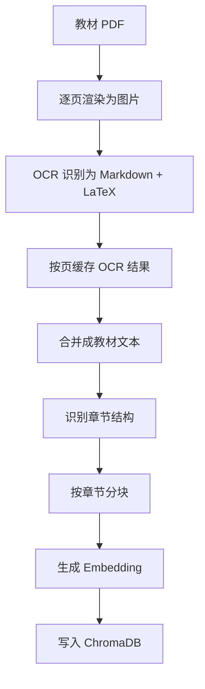
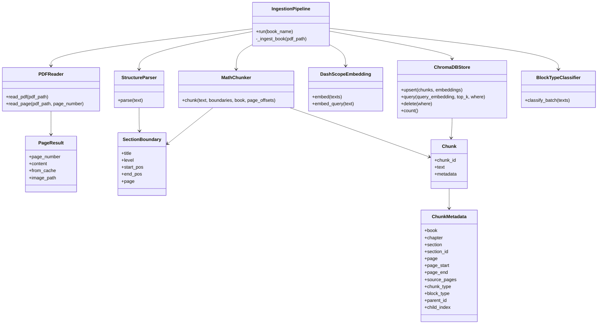
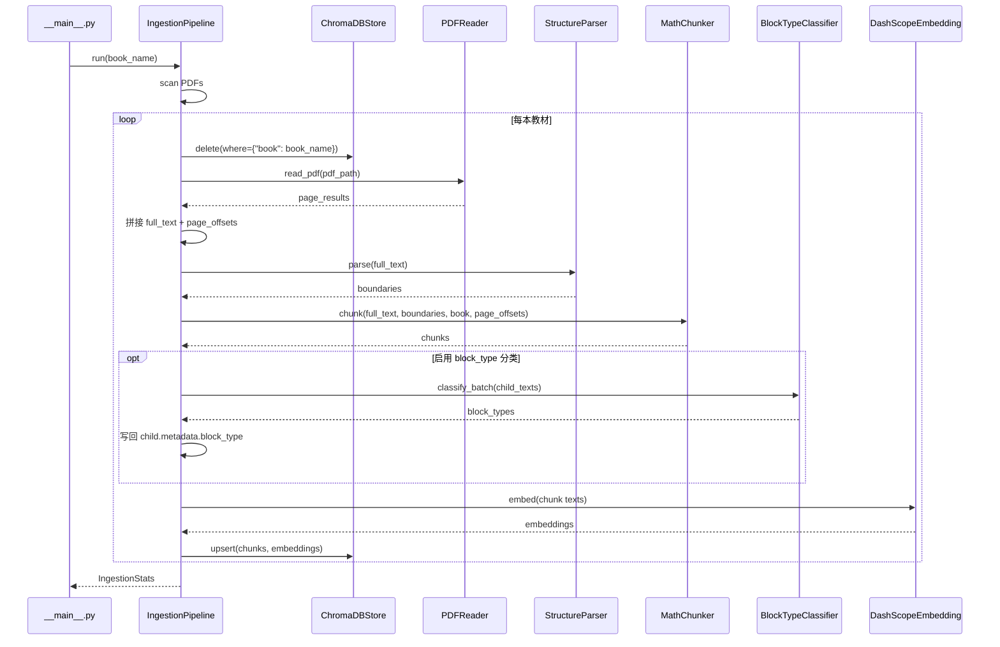
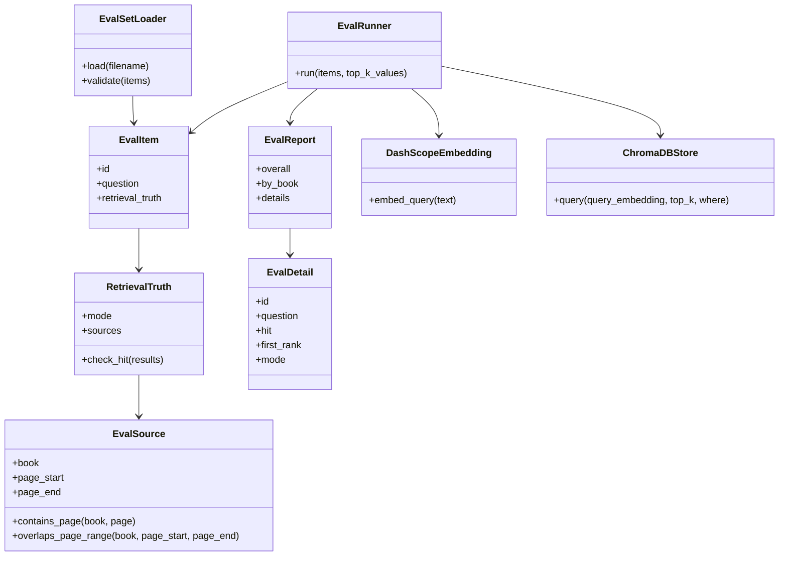
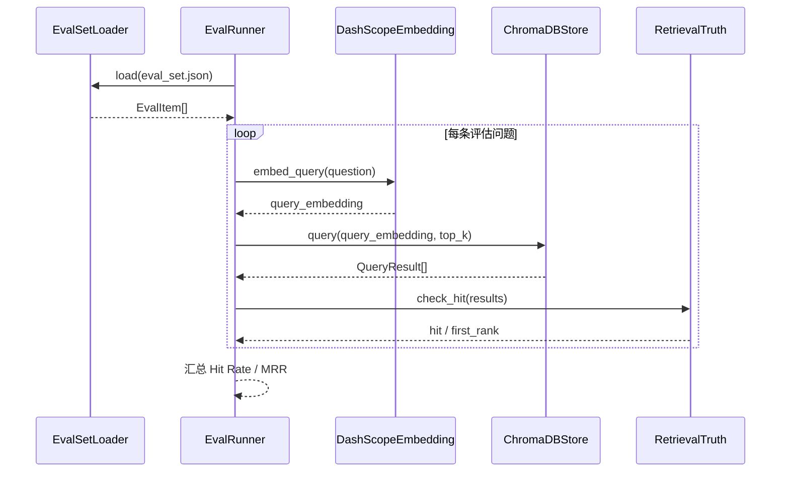

# Vibe Coding 全栈实战：章鱼哥解题 02｜搭建教材知识库与检索基线

上一期我把章鱼哥解题的产品底座跑通了：页面能访问，登录能跳转，开发环境和部署链路也有了基本形态。

但这只是把入口搭起来了。对一个数学解题助手来说，真正的问题还在后面：当学生问一道题时，系统到底依据什么来回答？

如果只是把问题直接丢给大模型，它当然可以生成一个看起来不错的答案。但这不是我想要的章鱼哥解题。它应该尽量基于固定教材内容来解释概念、拆解步骤和指出易错点。

所以第二期开始，项目进入了更接近真实产品的一层：RAG 数据底座。

这里的 RAG 不是 demo 里的“切几段文本丢进向量库”，而是一条完整的数据工程链路：教材 PDF 怎么解析，OCR 结果怎么缓存，内容怎么按章节分块，向量怎么入库，检索结果怎么抽检，最后又怎么知道这套检索到底准不准。

```text
教材 PDF → OCR 解析 → 章节分块 → Embedding → 向量库 → 检索 API → 评估数据集 → 检索基线
```

这一期的重点，就是把教材内容变成系统可以检索、可以验证的数据，为后面的解题能力准备好知识来源。

---

## 一、先把 RAG 拆成一条数据链路

在真实项目里，RAG 不是一个按钮，也不是一个单独的函数。它至少包含几段链路：

1. **数据准备**：资料从哪里来，PDF 怎么解析，内容怎么清洗和切分。
2. **数据存储**：chunk 怎么保存，metadata 怎么设计，向量怎么写入数据库。
3. **检索召回**：用户问题怎么变成 query embedding，又怎么找到相关教材片段。
4. **生成回答**：LLM 怎么基于检索结果组织回答，而不是凭空发挥。
5. **评估反馈**：怎么判断检索和回答到底有没有变好。

这一期只做其中的一部分：

- 数据准备
- 数据存储
- 基础检索
- 检索评估

生成回答、Reranker、BM25、RRF、智能体编排和前端对话体验，都放到后面。

这个边界很重要。因为如果一开始就说“做一个 RAG 智能体”，范围会很快失控。AI 可以帮我写代码，但项目推进时必须先判断：当前阶段最该跑通哪一段链路。

这一期的答案就是：**先让章鱼哥拥有自己的教材知识库，并知道这套知识库能不能被稳定检索。**

所以接下来不是直接写 Prompt，也不是直接接智能体，而是先处理一个更具体的问题：教材数据怎么进入系统。

---

## 二、教材数据怎么进入系统

这一期最主要的工程工作，就是把教材从 PDF 变成可检索、可抽检、可评估的数据。这里面不是一个动作，而是一串连续步骤：先解析教材，再分块，再写入向量库，最后提供基础检索接口。

### 2.1 数据录入设计：到底要录入什么

在真正写入向量库之前，我先把教材入库这条线设计清楚。它解决的是“系统能检索什么”：从 PDF 开始，最后变成 ChromaDB 里的 chunks 和 embeddings。

这条线实际需要保留下来的内容包括：

- 原始 PDF：5 本高中数学教材，作为最初的数据来源。
- 页面 OCR 结果：每一页转成 Markdown + LaTeX，缓存到 `data/parsed/{书名}/page_{N}.md`。
- 页面图片：每页渲染后的图片，保存到 `data/images/{书名}/page_{N}.png`。
- 章节边界：识别出来的章、小节、习题等结构，用来决定后面怎么分块。
- chunk 数据：每个 chunk 有 `chunk_id`、`text` 和 `metadata`。
- 向量数据：对 chunk 文本生成 embedding，写入 ChromaDB。

这一版 chunk 的 metadata 重点记录来源、页码和 Parent-Child 关系，用来说明这段内容来自哪里，以及它在分块结构里的位置：

| 字段 | 含义 |
| --- | --- |
| `book` | 教材册别，比如“必修第一册” |
| `chapter` | 所属章，用于来源展示 |
| `section` | 所属小节，用于来源展示和后续定位 |
| `section_id` | 稳定小节标识，用来跨流程关联同一个小节 |
| `page` | 小节起始页，保留给早期字段兼容 |
| `page_start` | chunk 覆盖的起始页 |
| `page_end` | chunk 覆盖的结束页 |
| `source_pages` | chunk 覆盖的页码列表 |
| `chunk_type` | 分块类型，区分 `parent` 和 `child` |
| `block_type` | 内容类型，比如定义、性质、例题、练习、解释或未知 |
| `has_formula` | 这段内容里是否包含 LaTeX 公式 |
| `parent_id` | child chunk 所属的 parent chunk |
| `child_index` | child 在 parent 内的顺序 |

这些字段看起来不少，但目标很收敛：稳定回答三个问题。这段内容来自哪本书、哪一节、哪几页，以及它在 Parent-Child 分块里的位置。

所以这一期的数据录入，不是单纯“把教材塞进向量库”。它要把原始教材、页面缓存、章节结构、chunk 文本、来源 metadata 和向量数据都串起来，让后面的检索和评估有可靠的数据基础。

### 2.2 数据的处理：从 PDF 到 Markdown

最开始看起来，教材入库好像就是“读 PDF，然后切成文本块”。但真正处理数学教材时，会发现它不是普通文本。

高中数学教材里有大量公式、坐标图、表格、例题排版和题目配图。如果只用 PDF 文本抽取，很多内容会漏掉。尤其是图表和公式，一旦在入库阶段丢失，后面检索和回答都补不回来。

所以我没有直接把 PDF 当成最终文本来源，而是先把每一页处理成 Markdown。Markdown 在这里不是为了好看，而是作为一个中间数据格式：它比 PDF 更容易被程序读取和切分，又能保留标题层级、公式和段落结构。后面做章节识别、Parent-Child 分块、来源定位和评估时，都需要依赖这个相对稳定的文本结构。

这里其实对应智能体开发里一个很常见的概念：**垃圾进，垃圾出**。

如果进入知识库的是残缺文本、错乱公式或者丢失上下文的段落，后面即使换更好的 embedding、更复杂的检索策略、更强的模型，也只是基于错误数据继续推理。RAG 的质量上限，很大程度上在数据处理阶段就已经被决定了。

具体处理时，这一期采用了更稳的方式：**每一页先渲染成图片，再做 OCR，把结果保存成 Markdown + LaTeX。**

完整的数据录入链路大致是这样：



OCR 后的每页内容会保存到：

```text
data/parsed/{书名}/page_{N}.md
```

页面图片会保存到：

```text
data/images/{书名}/page_{N}.png
```

这样后面重新入库时，如果某一页已经有 Markdown 缓存，就不再重新渲染和调用 OCR。后续如果要在前端展示“教材来源页截图”，这些图片也可以继续复用。

核心逻辑可以简化成这样：

```python
for page in pdf.pages:
    image = render_page(page)
    markdown = ocr(image)

    save(f"data/images/{book}/page_{page.number}.png", image)
    save(f"data/parsed/{book}/page_{page.number}.md", markdown)
```

实际实现里还会处理缓存命中、空页跳过和失败重试，但主线就是这几步：先把 PDF 页面变成图片，再通过 OCR 得到 Markdown，最后把图片和文本都缓存下来。

这是项目级 RAG 和 demo 的第一个差异：真实项目的数据链路必须考虑重复运行。没有缓存，调一次分块策略就可能重新花一遍 OCR 成本，开发节奏会很快失控。

### 2.3 分块要尊重教材结构

有了 OCR 文本之后，下一步不是马上按字数切 chunk，而是先识别教材结构。

数学教材天然是有层级的：章、小节、练习、例题、习题。直接按固定字数切，会把原本属于同一个知识点的内容切散。

这一节我主要处理四个问题：页面位置怎么保留，章节结构怎么识别，Parent-Child 怎么切，以及这些信息最后怎么跟向量一起写入数据库。

#### 先维护页码映射

OCR 缓存是按页保存的，但章节识别和分块面对的是整本书的连续文本。所以入库时会按页码顺序把每页 Markdown 拼成 `full_text`，同时维护一张 `page_offsets`。

```python
page_results = self._pdf_reader.read_pdf(pdf_path)

full_text = ""
page_offsets = []

for pr in page_results:
    if not pr.content:
        continue

    # 记录这一页在整本书文本里的字符范围
    start = len(full_text)
    full_text += pr.content + "\n\n"
    end = len(full_text)

    page_offsets.append((start, end, pr.page_number))
```

`full_text` 是整本书的 Markdown 文本，`page_offsets` 记录每一页在 `full_text` 里的起止字符位置。它大概长这样：

```text
[
  (0, 1320, 1),
  (1320, 2768, 2),
  (2768, 4210, 3),
]
```

这张表的作用是：后面只要知道某段内容在 `full_text` 里的字符位置，就能反查它来自哪一页。

#### 再识别教材结构

有了整本书的 `full_text` 后，`StructureParser` 会在文本上识别章节边界：

```python
boundaries = self._structure_parser.parse(full_text)
```

实现里会按正则尝试识别几类结构：

- `第X章`
- `X.X 标题`
- `习题X.X`
- `练习X.X`
- `复习题X.X`
- `X.X.X 标题`

每个 `boundary` 会记录：

| 字段 | 含义 |
| --- | --- |
| `title` | 章节标题，比如 `4.2 指数函数` |
| `level` | 标题层级，比如章、小节、习题、子节 |
| `start_pos` | 这个标题在 `full_text` 里的起始字符位置 |
| `end_pos` | 这个章节内容在 `full_text` 里的结束字符位置 |

有了 `start_pos` 和 `end_pos`，就可以把一个小节的完整内容截出来，也可以通过 `page_offsets` 反查它覆盖的页码：

```python
section_text = full_text[boundary.start_pos:boundary.end_pos]
page_start = _lookup_page(boundary.start_pos, page_offsets)

# Parent 的结束页会参考下一个同级或更高级章节的位置
next_boundary = find_next_boundary(level_lte=boundary.level)
page_end = _lookup_page(next_boundary.start_pos, page_offsets) - 1
```

所以，章节和页码的关系不是靠模型猜出来的，而是在入库时通过“字符位置 → 页码范围”映射出来的。

#### 再切 Parent-Child

这些结构会先被识别成章节边界，但分块的主粒度没有选“页”或“单道题”，而是选了 `X.X` 这种编号小节。这样一个小节里的概念、例题、练习和习题会尽量保留在同一个上下文范围内，再由 Child chunk 切成更适合检索的小块。

这一期采用的是 Parent-Child 分块：

```text
Parent：一个编号小节的完整内容
Child ：把 Parent 切成更小的检索块
```

这里的关键不是“切得越碎越好”，而是先用教材结构确定一个稳定的上下文范围。Parent 保留小节完整语义，Child 负责提高检索命中的精度。

#### 最后把来源信息写进 metadata

`MathChunker` 会把来源信息写进每个 chunk 的 metadata。Parent 和 Child 都会保存页码范围，只是含义不一样：

- Parent 的 `page_start` / `page_end` 表示整个编号小节覆盖的页码范围。
- Child 的 `page_start` / `page_end` 表示这个检索小块实际覆盖的页码范围。

```python
parent.metadata = {
    "book": book_name,
    "chapter": current_chapter,
    "section": boundary.title,
    "section_id": section_id,
    "page": section_page_start,
    "page_start": section_page_start,
    "page_end": section_page_end,
    "source_pages": range(section_page_start, section_page_end + 1),
    "chunk_type": "parent",
    "block_type": "unknown",
    "parent_id": parent_id,
    "child_index": 0,
}

child.metadata = {
    "book": book_name,
    "chapter": current_chapter,
    "section": boundary.title,
    "section_id": section_id,
    "page": child_page_start,
    "page_start": child_page_start,
    "page_end": child_page_end,
    "source_pages": range(child_page_start, child_page_end + 1),
    "chunk_type": "child",
    "block_type": block_type,
    "parent_id": parent_id,
    "child_index": child_index,
}
```

最后写入 ChromaDB 的不只是 chunk 文本和 embedding，还有这份 metadata。正常情况下，每个入库 chunk 都会带上 `book`、`chapter`、`section`、`section_id`、`page_start`、`page_end`、`source_pages`、`parent_id` 等来源字段。这里的 `chapter` 来自前面识别到的章标题；如果 OCR 或章节识别没有识别到对应章名，它就可能为空，所以后面还需要入库抽检来兜底。

这样做的好处是，检索阶段不需要重新去 PDF 里找来源。只要命中某个 chunk，系统就能直接从 metadata 里拿到它对应的书、章节、小节和页码范围，同时兼顾两件事：

- 检索时，Child 更小，命中更精确
- 后续生成回答时，还能追溯到它来自哪本书、哪一章、哪一节、哪几页

这些 metadata 不是装饰。它们后面会直接决定：

- 能不能展示引用来源
- 能不能解释页码
- 能不能把 child chunk 关联回 parent chunk
- 能不能按书、页码、chunk 类型做过滤
- 能不能支撑第一版检索评估

这也是我在这一期里踩出来的一个判断：**chunk 正文重要，metadata 一样重要。**

如果只存文本，不存来源和结构，后面即使检索到了内容，也很难解释“它来自哪里”，更难评估“它是不是搜对了”。

#### 写入向量库时要保证可重复

分块和 metadata 准备好以后，向量库这一层要解决的是：怎么把 chunks 稳定写进去，后面又怎么按条件查出来。

入库脚本在开发阶段一定会反复跑：OCR 策略会调，分块策略会调，metadata 也会调。如果每次都直接追加写入，同一本书的数据很快就会重复。

所以入库前会先按书删除旧数据，再重新写入：

```python
self._vector_store.delete(where={"book": book_name})
self._vector_store.upsert(chunks, embeddings)
```

OCR 缓存解决的是“不要重复识别页面”，按书删除再 upsert 解决的是“不要重复写向量库”。

向量库里也不能只存向量。每条记录都要同时保存：

- `id`：chunk 的稳定标识
- `document`：chunk 文本
- `embedding`：文本向量
- `metadata`：来源、页码、父子关系等结构信息

后面只查某本书、只查 child chunk、只查含公式内容，都需要依赖这些 metadata 字段。

我把向量库封装成几个基础能力：

```text
upsert(chunks, embeddings)
query(query_embedding, top_k, where)
delete(where)
count()
```

这让整条入库链路变成可反复运行的工程流程，而不是一次性脚本。

### 2.4 先跑通基础检索 API

教材写入向量库之后，需要一个在线接口让后续能力调用。

这一期新增了一个基础检索接口：

```http
POST /api/retrieve
```

请求大致是：

```json
{
  "query": "集合中元素的确定性是什么意思？",
  "top_k": 5
}
```

后端做的事情很简单：

```text
问题文本 → query embedding → ChromaDB 相似度检索 → 返回 chunks
```

返回结果里会包含文本、分数和来源 metadata：

```json
{
  "chunks": [
    {
      "chunk_id": "必修第一册::1.1集合::p12_s0::child::0",
      "text": "……",
      "score": 0.82,
      "metadata": {
        "book": "必修第一册",
        "chapter": "第一章 集合与函数概念",
        "section": "1.1 集合",
        "section_id": "必修第一册::1.1",
        "page": 12,
        "page_start": 12,
        "page_end": 13,
        "source_pages": "12,13",
        "chunk_type": "child",
        "block_type": "definition",
        "parent_id": "必修第一册::1.1集合::p12::parent",
        "child_index": 0
      }
    }
  ],
  "total": 1
}
```

这一版检索故意保持简单：只做基础向量召回。

不是因为关键词检索和重排序不重要，而是因为还没有基线时，直接把所有优化都加上，后面就很难知道每个模块到底有没有用。

先跑通一个干净的基础版本，后面优化才有参照物。

### 2.5 入库成功不等于数据正确

入库脚本跑完，只能说明流程没有崩。它不能说明教材数据真的可用。

比如这些问题，脚本成功也可能发生：

- 某些页 OCR 结果是空的
- 页码范围不对
- chunk 没有 section
- child 找不到对应 parent
- metadata 缺字段
- 某本书写入了一半就中断

所以这一期补了入库抽检工具。它不负责评估检索效果，只负责确认数据结构没有明显问题。

抽检主要看几类事情：

| 检查项 | 目的 |
| --- | --- |
| 页码范围 | 防止页码异常，影响来源展示 |
| 内容完整性 | 防止空 chunk 混进入库 |
| Parent-Child 关系 | 防止结构断裂 |
| metadata 完整性 | 防止后续无法过滤、展示、评估 |

这一步很像工程里的 smoke test。它不证明系统效果好，但能先挡掉低级数据问题。

RAG 很多时候不是模型先出问题，而是数据链路先出问题。入库抽检就是为了尽早发现这些问题。

### 2.6 整体结构性设计

把上面的链路落到代码里，我没有把所有逻辑都塞进一个入库脚本，而是拆成了两层：`ingestion` 负责编排，`rag` 提供具体能力。

最终代码目录大致是这样：

```text
backend/app
├── ingestion
│   ├── __main__.py        # CLI 入口，组装依赖并启动入库
│   ├── pipeline.py        # 入库主流程编排
│   └── spot_check.py      # 入库后数据抽检
└── rag
    ├── models.py          # Chunk / metadata / query result 等数据结构
    ├── readers
    │   └── pdf_reader.py  # PDF 渲染、OCR、Markdown 缓存
    ├── chunkers
    │   └── math_chunker.py# 教材结构识别与 Parent-Child 分块
    ├── embeddings.py      # 文本向量化
    ├── vector_store.py    # ChromaDB 封装
    └── classifiers
        └── block_type_classifier.py # 可选的 chunk 内容类型分类
```

类之间的关系可以简化成这样：



一次完整入库的时序是：



这里的设计重点是把“流程”和“能力”拆开。`IngestionPipeline` 不直接关心 OCR 怎么做、章节怎么切、向量怎么存，它只负责编排这些步骤；`rag` 目录下的类分别负责具体能力。后面如果要替换 OCR、调整分块策略、换 embedding 模型，或者单独测试某个环节，就不会牵一发动全身。

---

## 三、RAG 系统的评估

入库和检索 API 跑通以后，我没有马上进入 AI 回答生成，而是先回到 RAG 系统里另一个同样重要的问题：怎么判断这套检索链路到底好不好？

### 3.1 为什么先评估检索

在软件开发里有一个很重要的概念，叫测试驱动开发。它强调先想清楚什么叫“正确”，再围绕这个标准去写代码和重构。

到了智能体开发里，也有一个类似的概念：评估驱动开发。因为智能体的输出不是简单的 true / false，很多时候看起来都“差不多能用”。如果没有评估标准，后面所有优化都会变成主观感受。

比如：

- 换一个分块策略，好像更准了？
- 调一个 Prompt，好像回答更自然了？
- 加一个 Reranker，好像结果更相关了？
- 接一个智能体，好像推理更完整了？

这些“好像”在真实项目里不够用。

章鱼哥解题后面会继续接 AI 回答、对话状态、智能体策略和前端交互。但在这些能力之前，我需要先准备一套评估底座，至少能回答几个基础问题：

- 检索有没有命中正确教材和页码范围？
- 返回的 chunk 排名是否足够靠前？
- 超出教材范围的问题，会不会被错误召回？
- 后面改检索策略时，基础召回有没有退化？

所以这一期里，评估数据集不是附属品，而是和教材入库同等重要的资产。

换句话说：**先把数据和评估做出来，再谈智能体。**

### 3.2 RAG 检索评估看哪些指标

讲清楚为什么要做评估之后，下一步不是马上写评估集，而是先确定：RAG 到底应该评估什么。

完整的 RAG 评估其实可以分成几层：

| 层次 | 关注点 | 典型指标 |
| --- | --- | --- |
| 检索评估 | 有没有找回正确资料 | Hit Rate@K、Recall@K、MRR、Precision@K |
| 来源评估 | 来源是否定位准确 | Section Hit@K、Span Hit@K、Source Recall |
| 内容覆盖 | 返回内容是否足够回答问题 | Keyword Coverage、Context Sufficiency |
| 生成评估 | 回答是否正确、忠实、可读 | Faithfulness、Answer Correctness、Completeness |
| 系统评估 | 成本、延迟、稳定性 | latency、token cost、error rate |

这里每一层解决的问题不一样。

检索评估看的是“有没有把正确资料找回来”。比如 `Hit Rate@K` 关注 top-k 结果里有没有命中目标来源，`Recall@K` 关注多个目标来源召回了多少，`MRR` 关注第一个正确结果排在第几位，`Precision@K` 关注返回结果里有多少是真的相关。

来源评估更关心“来源定位准不准”。对教材类 RAG 来说，只说“搜到相关内容”还不够，还要知道是不是命中了正确小节、页码范围是否合理、多个必要来源有没有都找回来。

内容覆盖评估看的是“返回内容够不够回答问题”。有时候检索结果页码对了，但 chunk 只包含定义的一半，或者缺少关键条件，这时生成模型拿到的上下文仍然不够。

生成评估才进入最终回答本身：答案是不是正确，是否忠实于检索内容，有没有编造教材里没有的说法，表达是否完整、可读。

系统评估则关注工程侧：一次查询要多久，消耗多少 token，外部 API 失败率如何，线上是否稳定。

如果只看检索阶段，常见指标可以拆成几类：

| 指标 | 看什么 |
| --- | --- |
| Hit Rate@K | top-k 结果里有没有命中目标来源 |
| MRR | 第一个正确结果排在第几位 |
| Recall@K | 需要多个来源时，top-k 召回了多少 |
| Precision@K | top-k 结果里有多少是真的相关 |

`Hit Rate@K` 解决的是“有没有找对”。比如 top-5 结果里只要有一个 chunk 落在标准来源范围内，就算命中。

`MRR` 解决的是“找对的位置靠不靠前”。如果正确内容排在第 1 位，体验和排在第 10 位完全不一样。后面把检索结果交给 LLM 时，排名越靠前，越容易被用于生成答案。

`Recall@K` 适合多来源问题。比如一个问题需要同时找到“定义”和“例题”两个来源，Recall 看 top-k 里召回了多少个必要来源。

`Precision@K` 看的是返回结果里有多少是真的相关。它和 Recall 的关注点不同：Recall 更怕漏掉，Precision 更怕混进太多无关内容。

### 3.3 章鱼哥解题的评估体系设计

检索接口跑通以后，如果只是手动问几个问题，很容易产生错觉。

比如我问“集合是什么”，系统刚好返回了相关内容，我就会觉得链路可用了。但这不能说明：

- 其他教材也能搜到
- 稍微换一种问法还能搜到
- 正确内容是不是排在前面
- 综合类问题能不能命中多个来源
- 后续改分块策略后有没有退化

所以这一期很早就开始做评估数据集。

这一期还没有进入 AI 回答生成，所以评估重点先收敛在检索阶段。也就是先判断系统能不能把“可能回答问题的教材片段”找出来。

第一步先用 25 条样本把评估框架跑通：覆盖 5 本教材，每本 5 条，支持 ANY / ALL 两种命中方式，并计算 Hit Rate 和 MRR。

这 25 条数据的价值，不在于覆盖面已经足够大，而在于它先把评估链路立起来了：问题怎么写、标准来源怎么标、命中规则怎么定义、最后怎么产出 Hit Rate 和 MRR。

评估数据围绕 `eval_set.json` 设计。它不是写入向量库的教材内容，而是用来批量验证检索结果的题目和标准来源。每条评估数据至少包含：

| 字段 | 含义 |
| --- | --- |
| `id` | 评估问题的唯一编号 |
| `question` | 用来测试检索的问题 |
| `retrieval_truth` | 这道题的标准检索答案 |
| `mode` | 命中规则，`ANY` 表示命中任一来源即可，`ALL` 表示多个来源都要命中 |
| `sources.book` | 标准来源所在教材 |
| `sources.page_start` | 标准来源起始页 |
| `sources.page_end` | 标准来源结束页 |

第一版先用 book + page range 做判断，至少能回答：检索结果有没有落在预期教材来源范围里。

命中计算也保持简单：把检索结果里的 `book` 和 `page_start/page_end` 拿出来，和评估集里的标准来源做范围匹配。

```text
如果 result.book == source.book
并且 result.page_start/page_end 与 source.page_start/page_end 有交集
就认为这个 source 被命中
```

在 `ANY` 模式下，top-k 结果命中任意一个 source，就算这道题 Hit；在 `ALL` 模式下，所有 source 都至少被命中一次，才算 Hit。MRR 则记录第一个命中结果出现在第几位。

评估框架跑通之后，再把评估集扩展到 200 条。扩展的重点不是单纯增加数量，而是让问题覆盖更多教材、更多知识点和更多问法。

这一期的评估仍然保持克制：先用评估集逐条检索，再计算 Hit Rate 和 MRR。它要回答的问题很明确：**教材内容能不能被稳定找出来，正确内容能不能排得足够靠前。**

对这一期来说，book + page range 已经够用了。我的目标不是一次性评估“答案生成得好不好”，而是先确认检索能不能找到问题所在的教材章节。只要这个基线稳定，后面再做对话生成、引用展示和重排序时，就有了继续优化的基础。

如果后面要把评估做得更细，再考虑补 `section_id`、`required_keywords` 这类标注，用来判断是否命中更精确的小节，以及返回内容是否覆盖关键概念。

评估数据集本身就是资产。它定义了什么叫“搜对”，也让后续每一次优化都有基线可以比较。后面接入对话生成、重排序、智能体策略时，如果没有这组基线，就只能凭感觉判断“好像更好了”。

### 3.4 评估模块的结构设计

评估相关代码也单独放在 `evaluation` 目录里：

```text
backend/app/evaluation
├── eval_types.py       # 评估数据结构：EvalItem / RetrievalTruth / EvalSource
├── eval_set_loader.py  # 加载和校验 eval_set.json
├── eval_runner.py      # 执行检索评估，计算 Hit Rate / MRR
└── graders             # 后续回答质量评估扩展

backend/data/evaluation
└── eval_set.json       # 检索评估数据集
```

这一期的检索评估类图可以简化成这样：



评估执行时序也很直接：加载评估集，逐条把问题转成 query embedding，查向量库，再用标准来源判断是否命中。



---

## 四、这期 Vibe Coding 做了什么

回头看这一期，我更关心的不是某一段代码是谁写的，而是 Vibe Coding 在真实项目里应该怎么组织：需求先怎么对齐，方案怎么拆，代码怎么落地，最后又靠什么确认它真的可用。

这也是我为什么认为，每个人都应该有一套自己的 AI 编程 harness。这里的 harness 不是某个固定工具，而是一套适合自己的协作流程。因为每个人对项目质量的要求不同，业务场景不同，评估标准也不同；同一个模型，放到不同项目里，也需要不同的约束方式。

我的 harness 是由 xlfoundry 系列 skill 组成的一套编程流程体系。它的核心不是“让 AI 自动写完全部代码”，而是**人在环中的半自动化流程**：前期人和 AI 一起讨论需求和方案，中期让 AI 按方案分段实现，最后再由人基于验收标准判断是否真的完成。

这套流程有一个底层原则：**以文档为中心，构建可追溯的编码流程**。

Vibe Coding 很容易变成一连串临时对话：今天让 AI 改这里，明天让 AI 补那里，过几天再回头看时，已经很难说清楚某个需求为什么这样设计、做了哪些事情、哪些事情明确不做、当时为什么做这个取舍。所以文档不是最后补的总结，而是编码过程的中心：头脑风暴沉淀需求边界，需求分析写清业务链路和数据流，方案设计说明模块拆分和关键取舍，验收阶段记录实际完成内容和通过标准。

在这个基础上，harness 不是一个额外的管理动作，而是把几个关键问题流程化。

第一个问题是**实现和评估要分开**。不能让 AI 自己写完代码，再完全由它自己判断“我做得很好”。实现者天然会倾向于证明自己的方案是对的，AI 也一样。所以在我的流程里，执行和验收是两段：前面让 AI 按方案实现，后面再用独立的验收标准、测试、抽检和评估结果来判断是否真的完成。也就是说，harness 的作用不是让 AI 自证完成，而是把“怎么做”和“怎么验”拆成两件事。

第二个问题是**缓解上下文焦虑**。项目一复杂，AI 很容易丢掉前面讨论过的约束，或者只看到局部代码。harness 通过文档把需求、分析、方案和验收沉淀下来，让每一次继续开发都有上下文依据，而不是重新在对话里找记忆。这样后面再回来改 RAG、改检索、改评估时，我能追到当初为什么这么设计，也能知道哪些边界是刻意保留下来的。

落到这一期，整个过程大致分成五步。

1. **头脑风暴，对齐需求**  
   一开始先讨论这一期到底要做什么。最后收敛成一个明确目标：不先做 AI 回答生成，而是先把教材入库、基础检索和检索评估跑通。

2. **需求分析，梳理需求链路**  
   确定目标之后，再分析完整链路：PDF 怎么处理，OCR 结果怎么缓存，Markdown 怎么组装，章节怎么识别，chunk 怎么带来源信息，检索结果怎么判断是否命中。

3. **方案设计，对齐实现结构**  
   在动手写代码前，先把模块边界设计出来：`PDFReader` 负责读取和 OCR，`MathChunker` 负责教材分块，`VectorStore` 负责向量库，`IngestionPipeline` 负责编排，`EvalRunner` 负责评估。

4. **实现需求，分段生成代码**  
   实现时不让 AI 一次性“做完整 RAG”，而是按模块逐段推进。这样每一段都有明确输入、输出和边界，我也能逐段审查代码。

5. **需求验收，用结果说话**  
   最后不是看代码“像不像完成了”，而是用抽检和评估验收。入库后跑 spot check，确认页码、内容、Parent-Child 关系和 metadata；检索跑通后，再用评估集计算 Hit Rate 和 MRR。

```text
头脑风暴 → 需求分析 → 方案设计 → 实现需求 → 需求验收
```

这就是我在 Vibe Coding 里依赖的一套工作方式：AI 参与分析、设计和实现，但人必须负责定义目标边界、确认方案取舍、拆分验收标准，并用测试、抽检和评估把每一段能力收束成可验证的工程链路。
