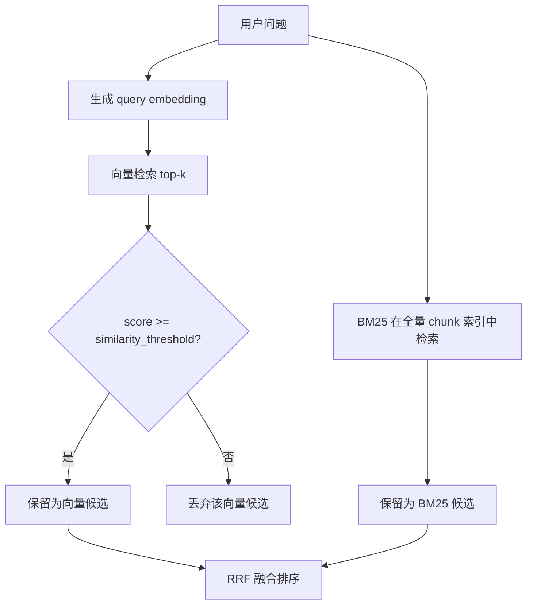
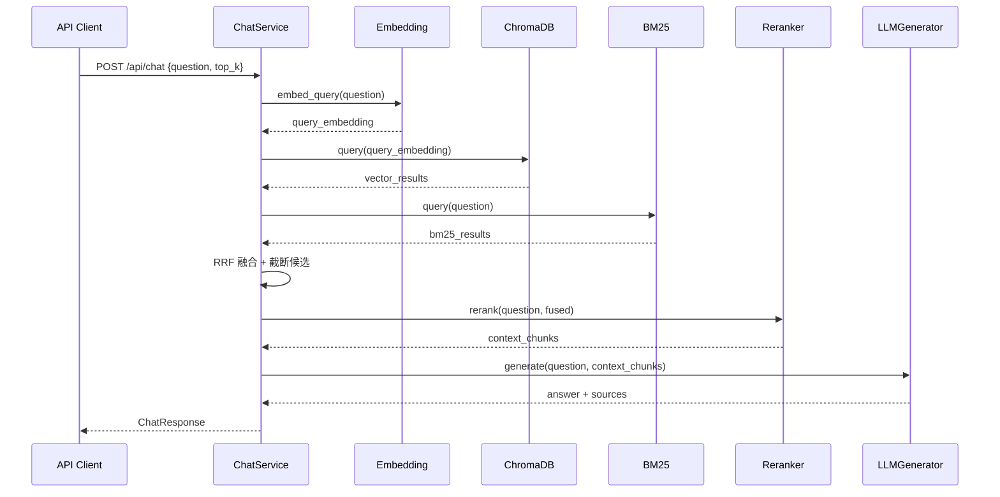
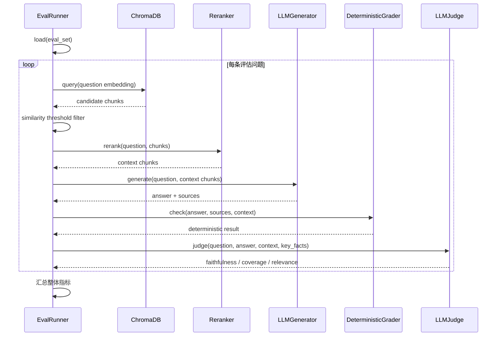
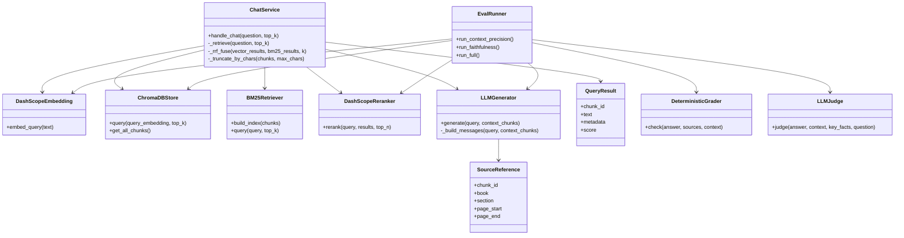

# Vibe Coding 全栈实战：章鱼哥解题 03｜从教材检索到 AI 回答生成

上一期我把章鱼哥解题的教材知识库和检索基线跑通了：教材 PDF 能被 OCR 成 Markdown，内容能按教材结构切成 chunk，向量能写入 ChromaDB，也能用评估集验证“问题能不能搜到对应教材来源”。

但这还不是一个真正能用的解题助手。

检索命中只能说明系统找到了可能相关的教材片段。学生真正需要的是：系统能不能基于这些片段组织回答，能不能把概念讲清楚，能不能引用来源，能不能避免凭空发挥。

所以第三期开始，项目从“教材能不能搜到”继续往前走一步：**把检索结果精炼成可用上下文，再让 AI 基于教材生成回答，并用评估体系检查回答质量。**

不过这一步也不能一下子铺太开。如果同时做前端 Chat UI、流式输出和多轮对话，很容易把问题混在一起：到底是检索不准、上下文太乱、Prompt 没写好，还是前端交互出了问题。

所以这一期先把范围收敛在后端回答链路上：从一个问题进来，到检索教材、精炼上下文、生成回答、返回引用，再到用评估检查回答质量。

```text
用户问题 → 混合检索 → RRF 融合 → Reranker 精排 → 上下文组装 → LLM 生成回答 → 返回引用来源 → 生成质量评估
```

这条链路跑通以后，章鱼哥才开始从“能查教材”，往“能基于教材回答问题”迈出第一步。

---

## 一、检索命中不等于能回答

第二期做完以后，我已经有了一条基础检索链路：

```text
question → query embedding → ChromaDB → top-k chunks
```

评估结果也能回答一个重要问题：教材内容能不能被稳定找出来。

但进入回答生成时，会出现一个新的问题：**搜到正确资料，不代表这些资料就适合直接塞给 LLM。**

比如一个问题问“二次函数的顶点式怎么理解”，基础向量检索可能返回：

- 二次函数定义
- 二次函数图像
- 顶点坐标公式
- 一元二次方程相关内容
- 某个例题的后半段

这些内容都可能“相关”，但相关不等于足够精炼。LLM 拿到一堆噪声上下文后，可能会出现几类问题：

- 回答里混入不该出现的概念
- 引用的教材来源不够准确
- 关键知识点被无关 chunk 稀释
- 明明检索命中了，但回答没有用好检索结果

这也是 RAG 产品里很容易被忽略的一点：**检索评估和生成评估不是一回事。**

检索评估关心“有没有找回来”，生成评估关心“有没有基于找回来的内容回答好”。中间还隔着一个非常重要的步骤：把检索结果精炼成适合 LLM 使用的上下文。

所以这一期的目标不是直接写一个 Prompt，而是先把后端链路拆清楚：

1. 用混合检索提高召回质量
2. 用融合和重排序精炼上下文
3. 让 LLM 基于教材内容生成回答
4. 引用来源由系统构造，不交给 LLM 自己编
5. 用评估体系判断回答是否忠实、完整、切题

---

## 二、从 Retrieve API 到 Chat API

第二期已经有了基础检索接口：

```http
POST /api/retrieve
```

它返回的是 chunks。对开发调试来说，这很有用；但对用户来说，chunks 不是最终产品体验。用户要的是回答。

所以这一期新增的核心接口是：

```http
POST /api/chat
```

请求大致是：

```json
{
  "question": "二次函数的顶点式怎么理解？",
  "top_k": 5
}
```

返回大致是：

```json
{
  "answer": "二次函数的顶点式可以帮助我们直接看出抛物线的顶点位置……",
  "sources": [
    {
      "chunk_id": "必修第一册::3.2二次函数::p86::child::2",
      "book": "必修第一册",
      "section": "3.2 二次函数",
      "page_start": 86,
      "page_end": 87
    }
  ],
  "context_used": 3,
  "degraded": false,
  "degradation_reason": null
}
```

这看起来像是把 `/api/retrieve` 后面接了一个 LLM，但实际中间多了几层处理。

### 2.1 为什么要先精炼上下文

RAG 回答的质量，很大程度上取决于 LLM 看到的上下文。

如果上下文太少，模型可能答不完整；如果上下文太多，模型又会被噪声干扰。尤其是教材类问答，很多 chunk 在语义上都接近，但真正能回答问题的往往只有少数几段。

所以这一期没有把向量检索结果直接交给 LLM，而是在生成前加了一层检索精炼：

```text
用户问题
  ├─ 向量检索 → 相似度阈值过滤 ┐
  └─ BM25 关键词检索          ├─ RRF 融合排序 → Reranker 精排 → 按长度截断 → 交给 LLM
                              ┘
```

下面就按这条链路拆开看：先看两路召回怎么拿候选，再看 RRF 怎么融合，最后看 Reranker 怎么把候选收窄成真正交给 LLM 的上下文。

### 2.2 向量检索和 BM25 各自解决什么问题

向量检索擅长语义相似。比如学生问“函数图像往左移怎么理解”，教材里可能写的是“平移变换”，两者不完全同词，但语义接近，向量检索更容易找回来。

但只用向量检索也有问题。数学教材里有很多非常精确的术语和符号，学生的问题如果包含“顶点式”“诱导公式”“等比数列前 n 项和”这类关键词，向量检索不一定总能把字面匹配最强的片段排到前面。另外，向量分数低并不一定代表完全无关，有些短问题、口语化问题或者公式类问题，本身就不容易被 embedding 表达得很稳定。

BM25 擅长关键词匹配。数学教材里有很多精确术语，比如“顶点式”“单调区间”“诱导公式”“等差数列通项公式”。这类词如果出现在问题里，关键词匹配往往很有价值。

但只用 BM25 也不够。它更依赖字面词匹配，如果学生换一种说法，或者问题里没有直接出现教材里的关键词，BM25 就可能漏掉语义相关内容。比如学生说“图像往左挪”，教材写的是“平移变换”，关键词不一致时，BM25 就不如向量检索自然。

所以这一期没有把两者看成二选一，而是让它们各自返回候选结果：

```text
向量检索：语义召回
BM25：关键词召回
```

向量检索这一路还有一个前置粗筛：`similarity_threshold`。

这里的相似度不是 LLM 主观判断出来的，而是 ChromaDB 根据 query embedding 和 chunk embedding 的 cosine distance 算出来的。项目里把 ChromaDB 返回的 `distance` 转成 `score`：

```python
score = 1.0 - distance
```

然后用配置里的阈值过滤向量候选：

```python
vector_results = [
    r for r in vector_results
    if r.score >= self._settings.similarity_threshold
]
```

默认阈值是 `0.70`。业务含义是：只有向量相似度达到这个分数的 chunk，才被认为是“语义上足够相关的向量候选”。低于这个分数的结果，会从 `vector_results` 这个列表里移除，不再作为向量检索结果进入后面的 RRF。

这当然不是一个完美判断。固定阈值能减少明显低相关的向量候选，但也可能误删一些表达不稳定、实际仍有用的内容。所以这一期把它当成一个低成本粗筛，而不是最终判断。

这个过滤只作用在向量检索这一路，不会影响 BM25。BM25 不依赖过滤后的 `vector_results`，它有自己独立的全量关键词索引。

换句话说，BM25 检索的也不是一个单独的“章节库”，而是同一批教材 chunks。第二期入库时，每个 chunk 都已经有 `chunk_id`、正文文本和来源 metadata。向量检索用的是这些 chunk 的 embedding，BM25 用的是这些 chunk 的文本内容。

BM25 检索器启动时从 ChromaDB 里加载全量 chunks 建索引，查询时用 jieba 分词和 BM25 分数排序：

```python
class BM25Retriever:
    def build_index(self, chunks: list[Chunk]) -> None:
        self._chunk_map = {c.chunk_id: c for c in chunks}
        self._chunk_ids = [c.chunk_id for c in chunks]
        tokenized = [list(jieba.cut(c.text)) for c in chunks]
        self._bm25 = BM25Okapi(tokenized)

    def query(self, query: str, top_k: int = 10) -> list[QueryResult]:
        tokenized_query = list(jieba.cut(query))
        scores = self._bm25.get_scores(tokenized_query)
        ranked = heapq.nlargest(top_k, enumerate(scores), key=lambda x: x[1])
        return build_query_results(ranked)
```

所以，一个 chunk 即使没有通过向量相似度阈值，也只是说明它不会作为**向量候选**进入后续流程；如果 BM25 在全量索引里按关键词独立检索到了同一个 chunk，它仍然会作为**BM25 候选**保留下来。两条检索分支各自产生候选，直到 RRF 阶段才汇合。

这段关系画成流程图会更直观：



两路结果都会被包装成同一种候选结构：每个结果都有 `chunk_id`、文本、来源 metadata 和分数。这样后面的融合逻辑不需要关心候选来自向量检索还是 BM25，可以统一排序。

### 2.3 RRF 融合解决什么问题

有了两路检索结果后，下一步不是简单拼接。

如果直接拼接，就会遇到两个问题：

- 同一个 chunk 可能在两路结果里重复出现
- 两路分数尺度不同，向量相似度和 BM25 分数不能直接相加

比如向量检索的分数来自 cosine distance，BM25 的分数来自关键词匹配统计。一个是语义距离，一个是词项相关性，它们的数值没有可比性。不能简单说“0.82 的向量分数一定比 6.4 的 BM25 分数更重要”，也不能直接把两个分数相加。

两路结果能放在一起融合，是因为它们都指向同一批 chunk。每个候选都有稳定的 `chunk_id`，RRF 可以用这个 ID 判断“这是不是同一个教材片段”，再分别看它在向量结果和 BM25 结果里的排名。

所以这里用了 RRF（Reciprocal Rank Fusion）做排序融合。

RRF 的核心思想很简单：**不要比较不同检索器的原始分数，只比较结果在各自列表里的排名。**

它会给每个候选 chunk 算一个融合分：

```text
score(chunk) += 1 / (k + rank)
```

这里的 `rank` 是这个 chunk 在某一路检索结果里的名次，`k` 是一个平滑参数，这一期实现里默认是 `60`。

`k` 会影响排名差距被放大的程度。`k` 越小，前几名和后几名的分差越明显；`k` 越大，不同名次之间的分差越平缓。它不会改变“排名越靠前贡献越大”这个方向，只是在控制衰减速度。

比如只看某一路检索结果：

| k | 第 1 名贡献 | 第 10 名贡献 | 差距 |
| --- | --- | --- | --- |
| 40 | `1/(40+1)=0.0244` | `1/(40+10)=0.0200` | 更大 |
| 60 | `1/(60+1)=0.0164` | `1/(60+10)=0.0143` | 中等 |
| 80 | `1/(80+1)=0.0123` | `1/(80+10)=0.0111` | 更小 |

所以如果把 `k` 从 60 改成 40，靠前结果的优势会更明显；如果改成 80，排名差异会被压得更平，融合结果会更接近“只要被召回就都有相近贡献”。这一期先采用常见的 `60`，不是因为它一定最优，而是先用一个稳定默认值把混合检索链路跑通，后续再用评估结果调参。

举个简化例子。假设 `k=60`，有三个候选 chunk：

| chunk | 向量检索排名 | BM25 排名 | RRF 计算 | 融合分 |
| --- | --- | --- | --- | --- |
| A | 第 1 名 | 第 3 名 | `1/(60+1) + 1/(60+3)` | `0.0323` |
| B | 第 2 名 | 未命中 | `1/(60+2)` | `0.0161` |
| C | 未命中 | 第 1 名 | `1/(60+1)` | `0.0164` |

所以融合后大致会是：

```text
A（0.0323） > C（0.0164） > B（0.0161）
```

A 因为两路都命中，而且排名都不差，融合分明显更高。B 只被向量检索命中，C 只被 BM25 命中，它们也不会被丢掉，只是分数只来自各自命中的那一路。

RRF 的价值就在这里：它既能让“两路都认为不错”的结果排得更靠前，也不会丢掉只被某一路召回的结果。

这一期为什么选 RRF，而不是直接加权相加、只相信 Reranker，或者上更复杂的学习排序？

原因主要有三个。

第一，RRF 不依赖分数尺度。向量检索和 BM25 的原始分数不在同一个空间里，RRF 用排名融合，可以避开分数归一化的问题。

第二，RRF 实现简单、可解释。它不需要训练数据，也不需要调一堆权重。对当前阶段来说，目标是先把混合检索链路跑通，而不是一上来做复杂排序模型。

第三，RRF 适合作为 Reranker 前的候选合并层。它先把两路召回结果合成一个候选池，再交给 Reranker 做更精细的语义判断。也就是说，RRF 解决“候选怎么合并”，Reranker 解决“哪些候选最适合给 LLM”。

对应到代码里，就是按 `chunk_id` 累积分数并去重：

```python
@staticmethod
def _rrf_fuse(vector_results, bm25_results, k=60):
    scores = {}
    chunk_map = {}

    for rank, r in enumerate(vector_results, 1):
        scores[r.chunk_id] = scores.get(r.chunk_id, 0) + 1.0 / (k + rank)
        chunk_map[r.chunk_id] = r

    for rank, r in enumerate(bm25_results, 1):
        scores[r.chunk_id] = scores.get(r.chunk_id, 0) + 1.0 / (k + rank)
        if r.chunk_id not in chunk_map:
            chunk_map[r.chunk_id] = r

    sorted_ids = sorted(scores, key=scores.get, reverse=True)
    return [chunk_map[cid] for cid in sorted_ids]
```

如果融合后仍然没有任何候选 chunk，`ChatService` 才会认为这次没有找到可用教材内容。非流式 `POST /api/chat` 会返回 `None`，路由层再转换成 `404 未找到相关教材内容`。这一期没有做“自动降低阈值重试”，也没有在无教材内容时强行生成回答；这些兜底策略放到后面的交互阶段再处理。

### 2.4 Reranker 为什么放在生成前

RRF 融合后，候选结果仍然可能偏多。真正交给 LLM 的上下文需要更少、更准。

所以最后加了一层 Reranker。它拿到用户问题和候选 chunk 文本后，重新判断哪些 chunk 更适合作为回答上下文。

```python
reranked = self._reranker.rerank(
    question,
    fused,
    self._settings.rerank_top_n,
)
```

Reranker 排好序后，还会做一次长度控制：

```python
context_chunks = self._truncate_by_chars(
    reranked,
    self._settings.chat_max_context_tokens,
)
```

这里不是精确计算 token，而是按 chunk 文本长度做一个工程上的上限控制：从前往后累加 chunk 文本长度，超过 `chat_max_context_tokens` 对应的长度上限就停止，至少保留第一个 chunk。它解决的是“不要把过多教材片段一次性塞给 LLM”的问题。

这一期的 Reranker 使用 DashScope TextReRank：

```python
resp = TextReRank.call(
    model=self._model,
    query=query,
    documents=documents,
    return_documents=True,
    top_n=top_n,
)
```

这里还有一个重要的工程兜底：Reranker 失败时，系统不应该整个回答失败。因为它只是精炼环节，不是唯一检索能力。

所以降级策略放在 `ChatService`：

```python
try:
    reranked = self._reranker.rerank(question, fused, top_n)
except Exception:
    reranked = fused[:top_n]
    return RetrieveResult(
        chunks=truncate(reranked),
        degraded=True,
        degradation_reason="rerank_failed",
    )
```

这样用户仍然能得到回答，只是响应里会带上 `degraded=true`，说明这次没有走完最佳精排链路。

---

## 三、让 LLM 基于教材生成回答

检索上下文准备好以后，才进入 LLM 生成。

这一层我最关注两个问题：

1. Prompt 怎么把教材上下文组织给模型
2. 引用来源怎么保证可信

### 3.1 Prompt 不是只写一句“请回答”

如果只是把问题交给 LLM，它会凭自己的知识回答。对一个教材型解题助手来说，这不是理想状态。

这一期的生成阶段不是让模型“自由发挥”，而是把第二章精炼出来的 `context_chunks` 组织成一段明确的教材上下文，再和学生问题一起交给模型。这样 LLM 的输入至少包含三层信息：

- 它是谁：章鱼哥，一个高中数学助教
- 它能依据什么回答：前面检索到的教材片段
- 它要回答什么：学生当前提出的问题

这一期的生成器会把系统角色、教材上下文和学生问题一起传给模型：

```python
SYSTEM_PROMPT = """你是章鱼哥，一个高中数学助教。基于给定的教材内容回答学生的问题。
规则：
1. 只使用提供的教材内容回答，不要编造内容
2. 引用回答依据时要标注出处（书名、章节、页码）
3. 如果提供的内容不足以回答问题，明确说明
4. 不要直接给出完整答案，引导学生理解解题思路"""
```

有上下文时，消息大致是：

```python
context_text = build_numbered_context(context_chunks)

messages = [
    {"role": "system", "content": SYSTEM_PROMPT},
    {
        "role": "user",
        "content": f"参考教材内容：\n{context_text}\n\n学生问题：{query}",
    },
]
```

这里的 `build_numbered_context()` 会把 chunk 文本和来源信息组织成带编号的上下文：

```python
def build_numbered_context(chunks: list[QueryResult]) -> str:
    parts = []
    for i, chunk in enumerate(chunks, 1):
        parts.append(
            f"[{i}] ({chunk.metadata.book} - {chunk.metadata.section}, "
            f"第{chunk.metadata.page_start}-{chunk.metadata.page_end}页)\n"
            f"{chunk.text}"
        )
    return "\n\n".join(parts)
```

最终给模型看到的大概是：

```text
参考教材内容：
[1] (必修第一册 - 3.2 二次函数, 第86-87页)
这里是教材 chunk 文本……

[2] (必修第一册 - 3.2 二次函数, 第88-88页)
这里是另一个教材 chunk 文本……

学生问题：二次函数的顶点式怎么理解？
```

这样模型在回答时看到的不只是碎片文本，也能看到每段内容来自哪本书、哪一节、哪几页。Prompt 的重点不是把话术写得很复杂，而是把可用上下文稳定、清楚地交给模型。

### 3.2 引用来源不能让 LLM 自己编

一个很容易踩坑的做法是：让 LLM 在回答末尾自己写“参考来源”。

这样看起来方便，但不可靠。因为 LLM 可能会把来源写错，也可能把没用到的来源编进去。尤其是教材页码和章节这种结构化信息，本来就已经在 chunk metadata 里了，没有必要再让模型生成一遍。

所以这一期的做法是：**回答正文由 LLM 生成，引用来源由系统从 context chunks 构造。**

```python
answer = response.choices[0].message.content

# sources 不是从 LLM 输出里解析，而是从 context_chunks.metadata 构建
sources = chunks_to_sources(context_chunks)
return answer, sources
```

`SourceReference` 只保留后续展示需要的字段：

```python
class SourceReference(BaseModel):
    chunk_id: str
    book: str
    section: str
    page_start: int
    page_end: int
```

这一步很关键。它让引用来源从“生成文本的一部分”变成“系统可验证的数据结构”。

如果来源由 LLM 自己写，后端很难判断它到底有没有引用真实 chunk；如果来源由系统从 metadata 构造，后面至少可以稳定做几件事：

- 前端展示来源时不用解析自然语言
- 评估时可以检查引用页码是否落在 context 范围内
- 可以按 `chunk_id` 去重，避免重复来源
- 后续如果要展示教材页截图，可以直接用 `book + page_start/page_end` 定位

所以这里的设计边界是：**LLM 负责回答内容，系统负责结构化来源。**

### 3.3 ChatService 编排整条链路

这一期新增的 `ChatService` 是后端对话链路的核心编排层。

从职责上看，它不直接实现 embedding、向量库、BM25、Reranker 或 LLM，而是把这些能力串起来：

```text
ChatService
├─ embedding：问题向量化
├─ vector_store：向量检索
├─ bm25：关键词检索
├─ reranker：候选结果精排
├─ generator：LLM 回答生成
└─ settings：检索和生成参数
```

一次非流式 Chat API 的主流程是：

```python
def handle_chat(self, question: str, top_k: int) -> ChatResponse | None:
    result = self._retrieve(question, top_k)
    if not result.chunks:
        return None

    answer, sources = self._generator.generate(question, result.chunks)

    return ChatResponse(
        answer=answer,
        sources=sources,
        context_used=len(result.chunks),
        degraded=result.degraded,
        degradation_reason=result.degradation_reason,
    )
```

这里的 `None` 也有明确含义：检索和融合后没有找到可用教材上下文。路由层会把它转换成 `404 未找到相关教材内容`，而不是让 LLM 在没有教材依据的情况下硬答。

如果有可用上下文，`ChatService` 会继续调用 `LLMGenerator.generate()`，得到回答和系统构造的 sources，再返回统一的 `ChatResponse`。这里的 `context_used` 表示最终交给 LLM 的 chunk 数量，`degraded` 和 `degradation_reason` 用来标记 Reranker 失败等降级情况。

这一层的价值不是“代码很多”，而是把后端能力变成一条清晰的产品链路：



这一期不做多轮对话，所以 `POST /api/chat` 还是一个单轮 API。这个边界是刻意收住的：先把“单轮问题 → 教材上下文 → AI 回答 → 引用来源”跑稳，再进入后面的前端 UI、流式输出和智能体状态管理。

---

## 四、回答质量怎么评估

上一篇已经把检索评估跑起来了，它回答的是：教材内容能不能被稳定找出来，正确来源能不能排得足够靠前。

这一篇进入下一层：**检索结果交给 LLM 以后，生成出来的回答到底靠不靠谱。**

有了 Chat API 以后，如果只手动问几个问题，很容易觉得“能回答了”。但这仍然不够。检索评估只能说明资料有没有找回来，不能说明 LLM 有没有基于这些资料回答好。

RAG 回答至少要面对三个问题：

1. 回答有没有编造？
2. 回答有没有覆盖关键知识点？
3. 回答有没有正面回答学生的问题？

这对应这一期补上的三个生成评估维度：

| 指标 | 评估什么 | 防止什么 |
| --- | --- | --- |
| Faithfulness | 回答是否忠于教材上下文 | 编造、脱离教材 |
| Coverage | 是否覆盖关键知识点 | 漏讲重点 |
| Relevance | 是否正面回应问题 | 答非所问 |

这一期的生成评估不是直接调用线上接口问几次，而是用评估集逐条跑一遍“检索 → 生成 → 评分”链路。这样每次改检索、Prompt 或模型配置后，都能重新跑同一批问题，看指标有没有变化。

评估链路大致是：



这里有一个边界要说清楚：评估管线不是简单地调用一次 HTTP `POST /api/chat`，而是在代码层逐步执行检索、重排、生成和评分。这样做的好处是每个阶段都能拿到中间结果，方便分析问题到底出在检索、上下文、生成，还是评分数据本身。

### 4.1 先做确定性检查

在调用 LLM Judge 之前，我先加了一层确定性评分器。它不判断回答质量高低，而是先记录一批不用模型也能检查出来的结构问题。

检查项包括：

- answer 不能为空
- sources 不能为空
- 引用页码必须能在 context 范围里找到
- sources 里不能有重复 chunk_id

对应代码是 `DeterministicGrader`：

```python
class DeterministicGrader:
    def check(self, answer, sources, context) -> GradingResult:
        failures = []

        if not answer or not answer.strip():
            failures.append("answer 为空")

        if not sources:
            failures.append("sources 为空")

        failures.extend(self._check_page_ranges(sources, context))
        failures.extend(self._check_duplicate_chunk_ids(sources))

        return GradingResult(
            passed=len(failures) == 0,
            failures=failures,
        )
```

这一步很像第二篇里的入库抽检：它不证明回答一定好，但能先把低级结构问题标出来。比如回答空了、引用丢了、来源页码和上下文对不上，这些问题不需要 LLM Judge 才能发现。

当前实现会把确定性检查结果写入 `deterministic_passed`，然后继续进入 LLM Judge。这样报告里既能看到结构检查有没有通过，也能看到回答内容层面的 Faithfulness、Coverage 和 Relevance。

Judge 的输入不是只有回答文本，还包括原始问题、参考教材上下文和评估集里的 `key_facts`。这也是为什么前面要把 sources 和 context 都保留下来：评估时要能回到证据上，而不是只看回答像不像。

### 4.2 Faithfulness：有没有编造

Faithfulness 关注的是回答里的事实声明能不能被教材上下文支持。

评估时会把回答拆成若干事实声明，然后对每个声明判断：

- `Yes`：能从教材上下文中找到支持
- `No`：和上下文矛盾，或上下文中没有依据
- `Unknown`：仅凭当前上下文无法判断

最后用 `Yes / (Yes + No)` 得到忠实度分数，`Unknown` 单独统计比例。

这样做的原因是，RAG 系统最怕的不是回答不够华丽，而是回答看起来很顺，但其实脱离了教材内容。对学习产品来说，这类错误比“不知道”更危险。

### 4.3 Coverage：关键知识点有没有覆盖

Faithfulness 只能说明“说出来的内容有没有依据”，但不能说明“该说的有没有说到”。

比如学生问“等差数列通项公式怎么推导”，回答只说了公式长什么样，但没有解释公差、首项和递推关系。它可能是忠实的，但不够完整。

所以评估集里还需要 `key_facts`，也就是这道题期望覆盖的关键知识点。LLM Judge 会判断每个知识点的覆盖状态：

- `covered`
- `partially_covered`
- `not_covered`

Coverage 关注的是回答有没有把核心知识点讲全。

### 4.4 Relevance：有没有答非所问

后面我又补了一项 Relevance。原因很简单：Faithfulness 和 Coverage 都不能完全防止答非所问。

一个回答可能忠于教材，也覆盖了一些知识点，但没有正面回应学生的问题。比如学生问“为什么这里要配方”，系统却泛泛讲了一遍二次函数定义，这种回答看起来相关，但没有解决学生当前的困惑。

所以 Relevance 只看一个问题：回答是否切题。

| 标签 | 含义 | 分数 |
| --- | --- | --- |
| `relevant` | 正面回应问题核心 | 1.0 |
| `partially_relevant` | 相关但没有完全回答核心 | 0.5 |
| `not_relevant` | 偏离问题 | 0.0 |

补齐以后，生成评估就变成一个三角：

```text
Faithfulness：有没有编造
Coverage：有没有漏重点
Relevance：有没有答偏
```

在代码里，这三个指标是一次 LLM Judge 调用里一起完成的。Prompt 会要求 Judge 同时做三件事：

```text
任务一：把回答拆成事实声明，判断 Yes / No / Unknown
任务二：检查 key_facts 是否 covered / partially_covered / not_covered
任务三：判断回答是否 relevant / partially_relevant / not_relevant
```

这样做不是说 LLM Judge 绝对客观，而是先把主观判断结构化。至少每条评估结果都会落到可检查的 claims、coverage_results 和 relevance_label 上，而不是只给一个“看起来不错”的总分。

### 4.5 评估数据集也要可信

做到这里时，又出现了一个很现实的问题：评估本身也可能不可靠。

如果 `key_facts` 和 `reference_answer` 都由 LLM 生成，回答也由 LLM 生成，最后再让 LLM Judge 评分，就容易形成“LLM 自己出题、自己答题、自己判卷”的闭环，分数可能虚高。

所以这一期对评估数据集也做了约束：

- `key_facts` 必须能回溯到教材 source 页段
- `reference_answer` 只能基于指定教材页段生成
- NEGATIVE 问题不能伪造教材知识点
- 程序化校验先检查关键词、长度、引用和证据密度
- 抽样人工复核，发现问题再修正

这和 Vibe Coding 的工作方式是一致的：AI 可以参与生成，但不能让它在没有约束的情况下完成整个闭环。尤其是评估体系，必须有可追溯证据和独立验收标准。

---

## 五、整体结构性设计

这一期做完后，后端从“检索接口”扩展成了“对话生成 + 质量评估”链路。

核心目录大致是这样：

```text
backend/app
├── chat
│   ├── schemas.py        # ChatRequest / ChatResponse
│   ├── service.py        # ChatService：检索精炼 + 生成编排
│   ├── dependencies.py   # FastAPI 依赖注入
│   └── router.py         # POST /api/chat
├── domain
│   ├── models.py         # SourceReference
│   └── protocols.py      # Reranker / Generator 协议
├── infra
│   ├── bm25.py           # BM25 稀疏检索
│   ├── reranker.py       # DashScope TextReRank
│   └── llm.py            # LLMGenerator
├── rag
│   ├── embeddings.py     # DashScopeEmbedding
│   ├── vector_store.py   # ChromaDBStore
│   └── models.py         # QueryResult / ChunkMetadata
└── evaluation
    ├── eval_runner.py    # 检索 + 生成评估运行器
    ├── eval_types.py     # EvalItem / EvalSource 等数据结构
    └── graders
        ├── deterministic.py # 确定性前置检查
        └── llm_judge.py     # Faithfulness / Coverage / Relevance
```

类之间的关系可以简化成这样：



这次结构拆分里，我比较看重两点。

第一，`domain` 里只放跨模块共享的模型和协议，比如 `SourceReference`、`Reranker`、`Generator`。这样 `chat`、`infra`、`evaluation` 都可以依赖稳定契约，而不是互相引用具体实现。

第二，`ChatService` 只做编排，不把所有技术细节塞进去。BM25、Reranker、LLM 都是独立实现。后面如果要替换模型、调整 rerank 策略、修改 Prompt 或扩展评估，不需要重写整条链路。

这一期的关键不是“接上一个 LLM”，而是把回答生成拆成可验证的工程链路：检索结果先被精炼成上下文，回答和引用来源分开构造，最后再用 Faithfulness、Coverage 和 Relevance 做生成评估。

这也是我在 Vibe Coding 里越来越明确的一点：AI 可以参与实现 BM25、Reranker、Generator 和 Eval Runner，但人必须负责定义边界、确认取舍，并用评估把结果收住。否则看起来能回答，并不等于真的可靠。
