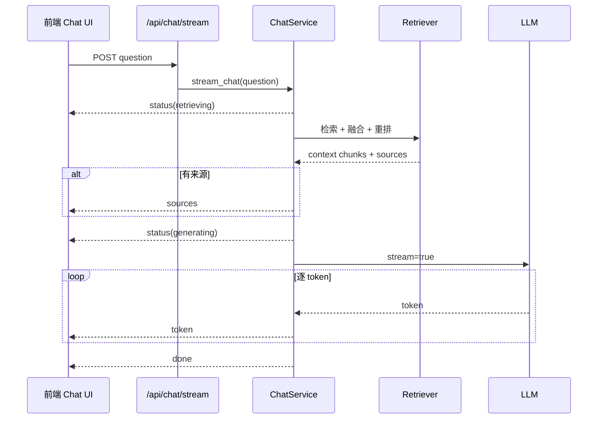
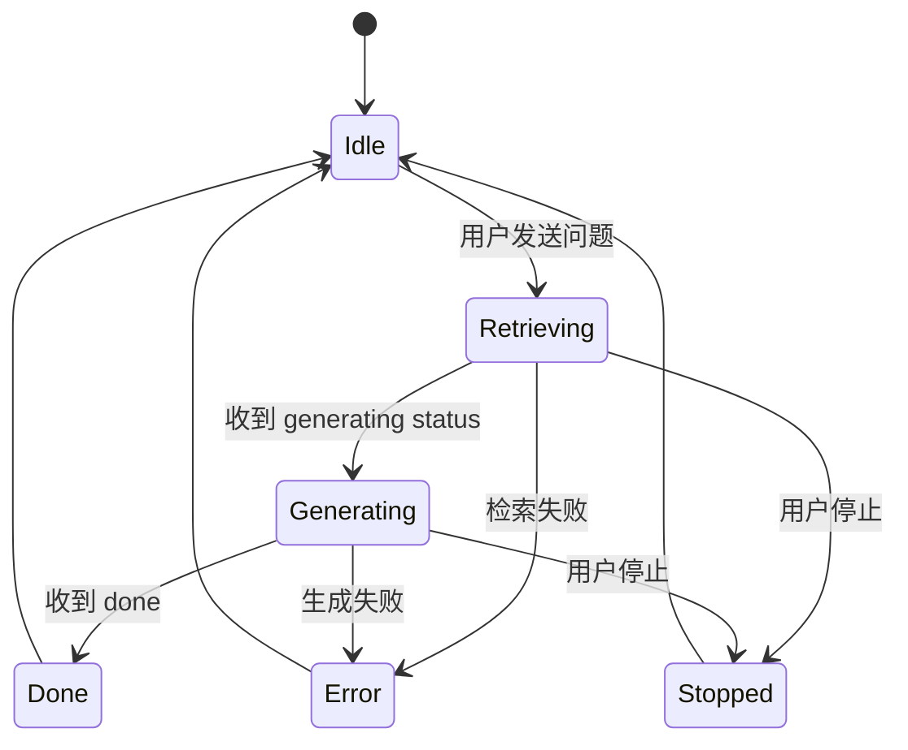
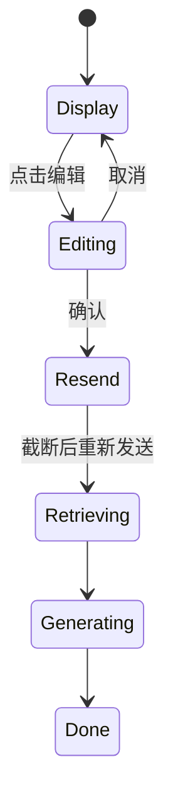
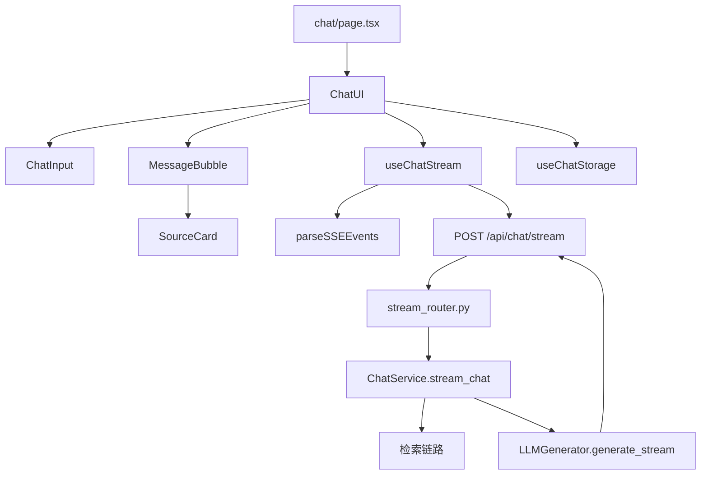

# Vibe Coding 全栈实战：章鱼哥解题 04｜从后端回答到流式对话界面

前面几期，章鱼哥解题已经完成了几块基础能力。

第一期先把产品底座和登录入口搭起来，用户能进入系统；第二期把教材 PDF 处理成可检索的知识库，并做了检索基线；第三期继续往前，把检索结果变成后端回答链路：输入一个数学问题，后端可以检索教材、精炼上下文、调用 LLM 生成回答，并返回引用来源。

到这里为止，核心 AI 能力已经能在后端跑通，但它还没有真正变成用户可用的产品体验。用户不会直接面对 `/api/chat` 这样的接口，也不会关心后端内部是怎么检索、重排和生成的。用户看到的应该是一个页面：能输入问题，能看到回答生成过程，能查看教材来源，出错时不会丢掉已经输入的内容。

所以这一期要做的事情，是把前面已经完成的后端能力接到前端，串通一条完整的产品链路：

```text
用户进入 Chat 页面 → 输入问题 → 前端发送请求 → 后端检索教材并生成回答 → 前端展示回答和来源 → 用户继续操作
```

这听起来像是“做一个聊天页面”，但真实实现里，问题不只是把输入框和消息列表画出来。AI 回答通常需要等待，生成过程可能中断，来源需要结构化展示，用户也可能想停止、重试、编辑刚才的问题。也就是说，这一期真正要补的是从后端到前端的交互闭环。

这期范围仍然收敛在单轮对话体验上：

- 把 Chat 页面做出来
- 把后端回答接到前端
- 展示回答过程和教材来源
- 支持停止生成、重新生成、编辑问题
- 用 localStorage 做本地消息恢复
- 暂不做多轮对话上下文
- 暂不做后端消息持久化
- 暂不做前后端鉴权打通

从这一期开始，章鱼哥才从“后端能回答”，变成“用户能在页面上和它对话”。

---

## 一、Chat UI 不是套一个输入框

做 AI 对话界面时，很容易低估它的复杂度。

表面看，Chat UI 只有两个元素：消息列表和输入框。但真正进入实现时，我拆出来的是几类具体交互问题：

- 发送后要立刻创建用户消息和 AI 占位消息
- 等待阶段要显示检索中、生成中的状态
- 回答内容要逐步出现在当前 AI 消息里
- 用户要能中途停止，并保留已经生成的内容
- 请求失败时，要区分“还没发送成功”和“已经生成了一部分”
- 回答完成后，要能展开查看教材来源
- 用户问题写错时，要能编辑后重新发送
- 页面刷新后，当前浏览器里的对话记录要能恢复

这些问题都不是模型能力本身，而是产品体验和工程状态管理的问题。

上一期后端已经有非流式接口：

```http
POST /api/chat
```

它适合调试和回归验证，但不适合直接作为最终交互。因为用户点击发送后，要等完整回答生成完，前端才能拿到结果。

所以这一期的第一个关键判断是：前端不能只等一个完整 JSON，而要把“检索中、生成中、回答逐步出现”这些过程展示出来。用户感知到的应该是一个连续过程，而不是一个黑盒等待。

### 1.1 这一期要做的用户链路

从用户角度看，这一期的完整交互是：

```text
访问 /chat
  → 输入数学问题
  → 点击发送
  → 页面显示用户消息和 AI 占位气泡
  → 显示检索中的状态提示
  → 收到教材来源
  → 显示“正在生成回答...”
  → 回答逐字出现
  → 完成后展示来源卡片和操作按钮
```

异常情况也要提前想清楚：

- 如果发送前网络失败，问题应该回到输入框，用户不用重新输入
- 如果已经收到部分 token 后失败，半截回答应该保留，并标记错误
- 如果用户点击停止，保留已经生成的内容，不继续请求
- 如果检索没有找到教材内容，前端仍然可以展示兜底回答，但没有来源引用

这也是为什么我没有一上来做多轮对话。多轮对话会引入上下文传递、消息裁剪、服务端持久化和用户隔离，这些问题会把第一版 Chat UI 的核心链路打散。

这一期先把单轮流式对话打稳。

### 1.2 前端状态比界面更重要

Chat UI 真正复杂的地方不是 CSS，而是状态。

一条 AI 消息至少会经历这些状态：

```text
retrieving → generating → done
              ├─ stopped
              └─ error
```

用户消息也不是简单追加到列表里就完了。它还要支持编辑、重新发送、失败撤回。

所以我把这一期的前端状态先收敛成几类：

| 状态 | 含义 |
| --- | --- |
| `retrieving` | 后端正在检索教材，前端展示检索中的提示 |
| `generating` | LLM 正在生成回答 |
| `done` | 回答完成 |
| `stopped` | 用户主动停止 |
| `error` | 请求或生成失败 |

前端 UI 只是这些状态的呈现：什么时候显示 loading，什么时候显示停止按钮，什么时候显示重试按钮，什么时候保存到 localStorage，都由状态驱动。

---

## 二、为什么用 SSE 做流式输出

流式输出有几种选择：轮询、WebSocket、SSE。

这一期选择 SSE，原因很直接：**这个场景只有服务端向浏览器持续推送内容，不需要浏览器和服务端双向实时通信。**

用户发送问题时仍然是一次普通 HTTP POST，请求建立后，服务端通过 `text/event-stream` 持续返回事件。对当前阶段来说，SSE 比 WebSocket 更轻：

- 基于 HTTP，部署和代理更简单
- 浏览器原生支持流式读取
- 更适合“服务器持续推送 token”的单向场景
- 不需要额外维护连接协议和房间状态

这一期不做 WebSocket，不是 WebSocket 不好，而是当前业务没有双向实时通信需求。

这里还有一个实现细节：前端并不是用浏览器原生的 `EventSource`。`EventSource` 更适合 GET 请求，而这次发送问题需要 POST 请求体，所以前端采用的是 `fetch + ReadableStream`：用 `fetch` 发起 `POST /api/chat/stream`，再从 response body 里持续读取 SSE 文本。

### 2.1 SSE 事件协议先定下来

流式接口最怕前后端各写各的。

后端如果只是把 token 一段段吐出来，前端就很难知道某一段内容到底是状态、来源、回答正文，还是错误信息。

所以第一步是先定义事件协议。

这一期的事件类型主要有五类：

| 事件 | 作用 |
| --- | --- |
| `status` | 告诉前端当前阶段，比如检索中、生成中 |
| `sources` | 推送教材引用来源 |
| `token` | 推送 LLM 生成的文本片段 |
| `done` | 表示本次回答结束 |
| `error` | 表示请求失败或生成失败 |

SSE 文本格式大致是：

```text
event: status
data: {"stage":"retrieving","message":"正在检索教材..."}

event: sources
data: [{"chunk_id":"必修第一册::3.2二次函数::p86::child::2","book":"必修第一册","section":"3.2 二次函数","page_start":86,"page_end":87}]

event: token
data: "二次函数的顶点式可以帮助我们直接看出..."

event: done
data: null
```

协议定下来以后，前端不需要猜内容含义，只需要按事件类型更新状态。

### 2.2 后端流式链路怎么走

后端的流式链路复用了上一期的检索和生成能力，但返回方式变了。

非流式接口是：

```text
检索上下文 → 调用 LLM → 等完整 answer → 返回 JSON
```

流式接口变成：

```text
发送 retrieving 状态
  → 检索教材
  → 如果有来源，发送 sources
  → 发送 generating 状态
  → 调用 LLM stream=True
  → 每收到一个 token，就转成 SSE token 事件
  → 发送 done
```

对应流程图是：



这里有两个细节比较重要。

第一，检索阶段本身不流式。用户看到的是检索中的状态提示，而不是每个检索步骤的内部细节。因为对用户来说，知道系统正在查找教材依据已经足够；过多内部事件反而会增加噪声。

第二，生成阶段才逐 token 输出。这个阶段耗时最长，也最适合流式呈现。

### 2.3 保留非流式接口

这一期新增 `/api/chat/stream`，但没有删除 `/api/chat`。

原因不是产品上还要同时做两套入口，而是工程上需要保留一条稳定基线。`/api/chat` 适合调试完整回答、做后端回归测试，也能在流式接口出问题时提供对照；`/api/chat/stream` 才是这一期前端对话页面使用的主链路。

所以接口边界是：

```text
/api/retrieve      用于检索调试
/api/chat          用于非流式回答
/api/chat/stream   用于前端流式对话
```

这也是 Vibe Coding 里我比较在意的一点：新增能力时不要随手破坏已有稳定链路。AI 很容易为了新功能直接改掉旧接口，但真实项目里，旧接口往往承担着测试和回归的作用。

### 2.4 错误事件也要结构化

流式接口还有一个容易忽略的问题：错误不一定发生在请求开始前。

可能的情况有三种：

```text
请求还没建立就失败
已经建立连接，但检索失败
已经输出一部分 token，LLM 中途失败
```

这三种情况前端处理方式不一样。

如果第一个事件都没收到，说明用户消息还没有真正进入对话流程，这时可以把问题撤回输入框。

如果已经收到过事件，说明对话已经开始。即使后面失败，也应该保留已有消息和部分回答，再展示错误状态。

所以后端错误也走 SSE：

```text
event: error
data: {"code":"02201","message":"模型连接失败","action":"retry"}
```

前端则根据“是否收到过第一个事件”来决定是撤回，还是保留。

---

## 三、前端如何消费流式事件

后端把事件推出来以后，前端要做的不是简单 `setText(text + token)`。

前端需要处理：

- SSE 文本分块可能不完整
- 一个网络 chunk 里可能包含多个事件
- token 要追加到当前 AI 消息
- sources 要挂到当前 AI 消息上
- status 要改变当前 AI 消息的展示状态
- error 要区分首事件前和首事件后
- stop 要通过 AbortController 中断请求

所以这一期把网络流和 UI 状态拆开。

### 3.1 SSE 解析独立成纯函数

浏览器拿到的是字节流，不一定刚好按 SSE 事件边界切开。

比如一次 `reader.read()` 可能拿到：

```text
event: token
data: "二次函数"

event: token
data: "的顶点"
```

也可能只拿到半个事件：

```text
event: token
data: "二次
```

所以前端先写一个独立的解析函数，负责把文本流拆成事件，并把不完整的尾巴留到下一次继续拼。

```ts
export function parseSSEEvents(
  chunk: string,
  remaining: string,
): { events: SSEEvent[]; remaining: string } {
  const buffer = remaining + chunk;
  const parts = buffer.split('\n\n');
  const events: SSEEvent[] = [];
  const newRemaining = parts.pop() || '';

  for (const part of parts) {
    if (!part.trim()) continue;
    let type = '';
    let data = '';
    for (const line of part.split('\n')) {
      if (line.startsWith('event: ')) type = line.slice(7);
      else if (line.startsWith('data: ')) data = line.slice(6);
    }
    if (type) {
      events.push({
        type,
        data: data === 'null' ? null : JSON.parse(data),
      });
    }
  }
  return { events, remaining: newRemaining };
}
```

这个函数不依赖 React，也不依赖页面状态，所以可以单独测试：

- 完整事件能解析
- 多个事件能解析
- 不完整事件能保留
- `data: null` 能正确处理

这类底层解析逻辑如果混在组件里，后面排查流式问题会很痛苦。

### 3.2 useChatStream 只管网络副作用

解析完事件以后，前端还需要把请求过程封装起来。

这一期用了一个 `useChatStream` hook。它不直接修改消息列表，而是通过回调把事件交给上层：

```ts
sendMessage(question, {
  onStatus(stage, message) {},
  onSources(sources) {},
  onToken(token) {},
  onDone() {},
  onError(error) {},
});
```

这样 `useChatStream` 只关心几件事：

- 发起 `POST /api/chat/stream`
- 读取 `ReadableStream`
- 调用 `parseSSEEvents`
- 根据事件类型触发回调
- 用 `AbortController` 支持停止
- 区分连接失败和连接中断

UI 状态怎么变，由 `ChatUI` 决定。

这种拆分的好处是：网络层可以独立测试，UI 层也可以独立测试。否则一个组件里同时处理 fetch、reader、SSE parser、消息列表、按钮状态和 localStorage，很快就会变成一坨难以维护的状态机。

### 3.3 ChatUI 负责把事件变成界面

`ChatUI` 是这一期前端的主控组件。

它负责维护消息列表，并把 SSE 事件转换成消息状态：

```text
onStatus(retrieving) → 当前 AI 消息状态改为 retrieving
onSources(sources)  → 当前 AI 消息挂上来源
onStatus(generating) → 当前 AI 消息状态改为 generating
onToken(token)      → 追加到当前 AI 消息 content
onDone()            → 当前 AI 消息状态改为 done，保存历史
onError(error)      → 根据阶段撤回或标记 error
```

简化后的状态流是：



这里的关键不是状态名字，而是让每个用户操作都有明确落点：

- 发送：创建 user 消息和 ai 占位消息
- token：只更新当前 ai 消息
- 停止：中断请求并保留已有内容
- 完成：保存消息
- 错误：根据发生时机处理

---

## 四、把对话体验补完整

把问题发出去、把回答流式显示出来，只是主链路跑通了。

真正进入对话界面后，还会遇到一组边界操作：回答依据怎么展示，生成到一半怎么停止，回答不满意怎么重新生成，问题写错了怎么修改，刷新页面后当前对话怎么恢复。这些能力单独看都不复杂，但如果不提前设计清楚，Chat UI 很容易变成一个只能演示、不能稳定使用的页面。

### 4.1 来源卡片：回答依据要能展开

第三篇后端已经把引用来源做成结构化数据，而不是让 LLM 自己编。

到了前端，这些来源不能直接混在回答正文里。更好的方式是把它们作为回答的附属信息展示：

```text
来源
  必修第一册 · 3.2 二次函数 · 第 86-87 页
```

所以这一期做了 `SourceCard`：

- 默认收起，避免打断阅读
- 展开后显示书名、章节、页码
- 没有来源时不展示来源卡片

这一步虽然只是 UI，但它延续了前面 RAG 链路里的一个关键原则：来源信息是系统结构化数据，不是模型生成文本。

### 4.2 停止生成：保留半截回答

用户点停止时，最直接的实现是调用 `AbortController.abort()` 关闭请求。

这一期没有单独设计一个“停止生成”的后端接口。前端发送请求时会创建一个 `AbortController`，并把 `signal` 传给 `fetch`：

```ts
const abortController = new AbortController();

fetch('/api/chat/stream', {
  method: 'POST',
  body: JSON.stringify({ question, top_k: 10 }),
  signal: abortController.signal,
});
```

用户点击停止时，前端直接调用：

```ts
abortController.abort();
```

这会关闭当前 SSE 请求。后端路由里每轮发送事件前会检查连接是否已经断开：

```python
if await http_request.is_disconnected():
    break
```

所以停止生成不需要再发一个额外的 WebSocket 消息，也不需要新增 `/stop` 接口。对这一期的单轮流式回答来说，关闭当前连接就是最简单、最明确的停止信号。

但停止之后 UI 怎么处理，需要提前定规则。

这一期采用的是：

```text
停止后保留已经生成的内容，并标记为 stopped
```

没有做“继续生成”。原因是这一期不做多轮上下文，也不维护服务端消息状态。继续生成看起来只是一个按钮，背后其实涉及从哪里接着生成、要不要把半截回答传回模型、如何避免重复输出等问题。

所以第一版只做停止，不做续写。

### 4.3 重新生成：删除旧回答再发一次

重新生成不是简单刷新页面。

更合理的行为是：

```text
用户点击重新生成
  → 找到这条 AI 回答对应的上一条用户问题
  → 删除旧 AI 回答
  → 用同一个问题重新发起 SSE
```

这样用户看到的是同一个问题下的一次新回答，而不是消息列表里多出一堆重复问答。

这一期仍然是单轮请求，所以重新生成不会携带历史上下文。它只是基于同一个问题重新走一次后端回答链路。

### 4.4 编辑问题：原地改，而不是丢回输入框

用户问题写错时，我参考了一些常见智能对话助手的交互方式，最后选择让用户消息在原位置进入编辑态，而不是把原问题丢回底部输入框。

这样用户能清楚地知道自己正在修改哪一条问题，也可以在确认前取消，不会因为点了一次编辑就立刻破坏后面的问答结构。

所以这一期采用的是原地编辑：

```text
点击编辑
  → 用户消息气泡变成 textarea
  → 显示确认 / 取消
  → 确认后截断该消息之后的内容
  → 用修改后的问题重新发起 SSE
  → 取消则恢复原样
```

这个设计更符合用户直觉：编辑是一个可撤销的临时状态，而不是立即破坏对话。

对应状态图是：



这里也有一个边界：编辑中不能同时发送新问题。同一时刻只允许一条消息处于编辑态。

### 4.5 localStorage 只是临时恢复，不是消息系统

这一期还做了本地消息恢复：刷新页面后，用户能看到之前的对话记录。

但这里要分清楚：

```text
localStorage 保存的是前端 UI 历史，不是后端消息持久化
```

它解决的是刷新页面不丢当前浏览器里的记录。它不能解决换设备、换浏览器、用户隔离、服务端审计这些问题。

所以这一期只在几个稳定节点保存：

- 回答完成
- 用户停止
- 回答失败

流式输出过程中不逐 token 写 localStorage。否则生成长回答时会频繁写入本地存储，既没必要，也会增加状态同步复杂度。

---

## 五、错误恢复和验收

流式对话的验收不能只看“正常情况下能显示 token”。真正容易出问题的，反而是那些边界场景：请求还没建立就失败、回答生成到一半断开、代理没有正确透传事件流。

所以这一期的验收重点不是看一条 happy path，而是确认这些边界状态都能落到前面设计好的交互规则里。

### 5.1 首事件前失败：问题要回到输入框

第一类风险是请求还没真正建立就失败，比如网络异常、HTTP 非 200、响应流不可用。

这时用户刚刚点了发送，但后端还没有开始返回任何 SSE 事件。对用户来说，这次发送并没有成功进入对话流程，所以前端应该撤回刚创建的用户消息和 AI 占位消息，并把问题重新放回输入框。

这就是前端为什么要记录“是否收到过第一个事件”。在 `useChatStream` 里，如果首事件前失败，会触发连接失败类错误；`ChatUI` 收到后，把最后一组 user + ai 消息撤回，并恢复输入框内容。

### 5.2 首事件后失败：保留已有内容

第二类风险是连接已经建立，甚至已经输出了一部分回答，但后面失败了。

这时处理方式就不能再撤回输入框了。因为用户已经看到系统进入检索或生成阶段，甚至可能已经读到了半截回答。更合理的做法是保留已有消息，把当前 AI 消息标记为 `error`，再给用户一个重试入口。

这类场景包括：

- 后端返回 `error` 事件
- LLM 生成过程中连接中断
- 已经收到 token 后网络异常

这些问题都要求前端状态机能区分“发送失败”和“生成中失败”。否则很容易出现两种坏体验：要么把用户已经看到的回答直接删掉，要么在发送根本没成功时留下一个空的错误气泡。

### 5.3 事件流本身要在真实环境验证

第三类风险来自部署链路。SSE 在单元测试里很容易过，但真实运行时还要经过代理、容器网络和外部模型服务：

```text
Traefik → Backend SSE → ChromaDB → DashScope → LLM → Browser/curl
```

这里要确认几件事：

- 代理是否正确透传 `text/event-stream`
- 后端容器能不能访问 LLM 服务
- ChromaDB 数据是否挂载正确
- curl 能不能持续收到事件
- 断开连接后后端有没有异常堆栈

最后再回到测试层面，后端要覆盖事件顺序、无来源兜底、Reranker 降级和非流式接口回归；前端要覆盖 status、sources、token、done、error、stop、重新生成和编辑这些状态转换。流式 UI 的问题往往不是“页面打不开”，而是某个边界状态处理异常。

这也是我一直强调实现和验收要分开的原因。AI 可以把代码写出来，但流式链路最终要靠真实环境验证。

---

## 六、整体结构性设计

这一期做完后，系统结构从“后端能回答”扩展成了“前端能流式对话”。

核心目录大致是这样：

```text
backend/app
├── chat
│   ├── schemas.py          # StreamEvent / StatusPayload / ChatRequest
│   ├── errors.py           # 流式错误码和错误响应
│   ├── service.py          # ChatService.stream_chat()
│   ├── router.py           # 非流式 POST /api/chat
│   └── stream_router.py    # 流式 POST /api/chat/stream
└── infra
    └── llm.py              # generate_stream()

frontend/src
├── app/chat/page.tsx       # Chat 页面入口
├── chat
│   ├── types.ts            # Message / SourceReference / SSECallbacks
│   ├── parse-sse.ts        # SSE 文本解析
│   ├── use-chat-stream.ts  # SSE 请求和 AbortController
│   └── use-chat-storage.ts # localStorage 消息恢复
└── components
    ├── chat-ui.tsx         # 对话主控组件
    ├── chat-input.tsx      # 输入框、发送、停止
    ├── message-bubble.tsx  # 用户/AI 消息气泡
    └── source-card.tsx     # 教材来源卡片
```

类和模块关系可以简化成这样：



从职责上看，这次拆分有几个明确边界：

| 模块 | 职责 |
| --- | --- |
| `stream_router.py` | 把 `StreamEvent` 序列化成 SSE 文本 |
| `ChatService.stream_chat()` | 编排检索、来源、生成和错误事件 |
| `LLMGenerator.generate_stream()` | 调用 LLM 流式接口并逐 token 产出 |
| `parse-sse.ts` | 把 SSE 文本流解析成事件 |
| `useChatStream` | 管理请求、读取流、停止和错误回调 |
| `ChatUI` | 管理消息状态和用户操作 |
| `MessageBubble` | 渲染消息、公式、操作按钮 |
| `SourceCard` | 展示教材来源 |

这一期的关键不是“做了一个聊天页面”，而是把 AI 产品里最基础的一条用户体验链路跑通：

```text
发出去有反馈，等待时有状态，生成时能看到过程，回答后能查来源，出错时能恢复，写错时能编辑。
```

这也是 Vibe Coding 里很典型的一类任务。AI 写单个组件、hook、路由都不难，难的是把状态边界提前想清楚：什么时候算发送成功，什么时候应该撤回输入，什么时候保留半截回答，什么时候保存历史，什么时候不能继续生成。

这些判断不是某个函数内部的实现细节，而是产品交互和工程链路之间的约定。约定清楚了，AI 才能稳定地把代码补齐；约定不清楚，就很容易得到一个“看起来能跑，但边界状态一碰就乱”的聊天界面。
