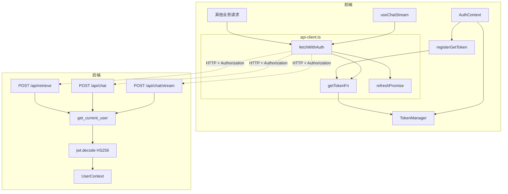

# Vibe Coding 全栈实战：章鱼哥解题 05｜打通前后端鉴权链路

前几期做完以后，章鱼哥解题已经有了一个可以使用的基础形态：用户能进入系统，教材内容能被检索，后端能基于教材生成回答，前端也能通过 Chat UI 接收流式输出。

但这里还有一个关键问题：**前端页面知道用户已经登录，不代表后端接口也知道请求来自谁。**

第一期接入登录时，主要解决的是浏览器端的登录入口和页面保护：用户点击登录，跳转到 auth-center，回调后前端拿到登录态，`RouteGuard` 可以决定是否让用户进入页面。

这一步解决的是“用户能不能进来”。

到了这一期，要解决的是另一个问题：**用户进入页面以后，调用后端 API 时，后端怎么确认这个请求真的来自一个已登录用户？**

如果没有这条链路，虽然页面上看起来已经登录，但后端的 `/api/chat`、`/api/chat/stream`、`/api/retrieve` 仍然可能被任何人直接调用。对于一个会消耗 LLM、Embedding 和检索资源的产品来说，这显然不够。

所以这一期的目标是打通完整的前后端鉴权链路：

```text
前端拿到 access_token
  → 请求自动带上 Authorization: Bearer token
  → 后端验证 JWT
  → 验证通过后继续执行业务接口
  → token 过期时前端自动刷新并重试
```

这一期仍然只做鉴权打通，不做消息持久化，也不把 `user_id` 传到业务 service 里做数据隔离。`UserContext` 会先在路由层注入，为后面的用户数据和对话持久化做准备。

---

## 一、登录不等于后端已经安全

前端登录和后端鉴权是两件事。

前端登录解决的是浏览器里的用户状态：

```text
用户是否登录
用户信息是什么
是否应该展示受保护页面
登录过期时是否跳回认证中心
```

但后端 API 面对的是 HTTP 请求。它不能只相信“这个请求来自某个页面”，而要看请求里是否携带可信凭证。

这一期之前，系统已经有这些能力：

- `AuthContext` 能初始化 auth SDK
- `RouteGuard` 能保护 `/chat` 页面
- Chat 页面能发起流式请求
- 后端能处理 `/api/chat`、`/api/chat/stream`、`/api/retrieve`

但这些后端接口还没有统一的身份校验。

所以这一期真正要补的是这条链路：

```text
登录态 → access_token → Authorization Header → 后端 JWT 验证 → UserContext
```

### 1.1 哪些接口需要保护

不是所有接口都应该加鉴权。

这一期的规则是：

| 接口 | 是否鉴权 | 原因 |
| --- | --- | --- |
| `GET /api/health` | 否 | Docker / 部署健康检查需要公开访问 |
| `POST /api/retrieve` | 是 | 检索教材资源 |
| `POST /api/chat` | 是 | 消耗 LLM 资源 |
| `POST /api/chat/stream` | 是 | 流式对话同样消耗 LLM 资源 |

也就是说，健康检查保持公开，业务接口统一保护。

这个边界很重要。如果直接做全局中间件，可能会把 `/api/health` 也拦住，导致容器健康检查失败。最后选择的是 FastAPI `Depends` 注入：哪个路由需要鉴权，就显式声明 `Depends(get_current_user)`。

---

## 二、整条鉴权链路怎么走

从用户视角看，流程应该尽量无感：

```text
用户已经登录
  → 在 Chat 页面发送问题
  → 前端自动拿到 access_token
  → 请求带上 Authorization Header
  → 后端验证通过
  → 正常返回回答或 SSE 流
```

如果 token 过期，也不应该立刻打断用户：

```text
请求返回 401
  → 前端尝试刷新 token
  → 刷新成功后重试原请求
  → 用户继续看到回答
```

如果刷新也失败，才说明登录态真的失效，需要重新登录。

整体时序是：


这里可以看到，这一期其实分成两半：

- 后端：验证 token，拒绝未认证请求
- 前端：自动带 token，处理过期刷新和重试

---

## 三、后端如何验证 JWT

后端鉴权这里，一开始不是直接写代码，而是先确定鉴权方式。

这里主要有几种思路：

| 方案 | 做法 | 问题 |
| --- | --- | --- |
| 每次请求调用 auth-center | 后端拿到 token 后请求 auth-center 校验 | 链路更长，后端鉴权依赖一次额外网络调用 |
| 全局中间件统一拦截 | 所有请求先过鉴权中间件 | `/api/health` 这类公开接口容易被误拦，边界不够直观 |
| 本地验证 JWT + 路由按需注入 | 后端用共享密钥解码 JWT，需要保护的路由显式声明鉴权 | 需要保证后端和 auth-center 的密钥一致 |

最后选的是第三种：**与 auth-center 共享 HS256 密钥，在 OctoTutor 后端本地验证 JWT，并通过 FastAPI `Depends` 按需注入鉴权。**

这个选择和项目阶段有关。章鱼哥还是一个个人项目，不是大规模微服务体系；auth-center 已经签发 HS256 JWT；OctoTutor 后端和 auth-center 都在可控部署环境里。相比每次远程调用 auth-center，本地验证更简单，也减少了鉴权链路对网络的依赖。

后端也没有做 token 黑名单、撤销列表或数据库会话查询。这些能力不是这一期的目标，后面如果要做更复杂的会话管理，再继续升级。

auth-center 签发的是 JWT，OctoTutor 后端和 auth-center 共享同一个 `JWT_SECRET_KEY`，所以后端可以本地解码验证：

```text
Authorization: Bearer {token}
  → jwt.decode(token, JWT_SECRET_KEY, algorithms=["HS256"])
  → 校验签名、过期时间、type
  → 提取 sub 作为 user_id
  → 构建 UserContext
```

这样做的好处是：后端鉴权不依赖额外网络调用，请求进入业务接口前就能快速判断是否可信。

### 3.1 UserContext：先把身份拿出来

后端新增了一个很小的数据结构：

```python
@dataclass(frozen=True)
class UserContext:
    """从 JWT 解码后的用户上下文"""

    user_id: str
    username: str
```

`UserContext` 是后端鉴权通过后的身份载体。它把 JWT 里的 `sub`、`client_id` 解析成后端可使用的 `user_id` 和 `username`。

### 3.2 get_current_user：鉴权入口

核心函数是 `get_current_user()`：

```python
def get_current_user(
    request: Request,
    credentials: HTTPAuthorizationCredentials | None = Depends(_bearer_scheme),
) -> UserContext:
    if credentials is None:
        raise HTTPException(
            status_code=status.HTTP_401_UNAUTHORIZED,
            detail="Missing authentication token",
            headers={"WWW-Authenticate": "Bearer"},
        )

    token = credentials.credentials

    try:
        payload = jwt.decode(
            token,
            settings.auth_jwt_secret,
            algorithms=["HS256"],
        )
    except JWTError as exc:
        raise HTTPException(
            status_code=status.HTTP_401_UNAUTHORIZED,
            detail=f"Invalid token: {exc}",
            headers={"WWW-Authenticate": "Bearer"},
        ) from exc

    if payload.get("type") != "access":
        raise HTTPException(
            status_code=status.HTTP_401_UNAUTHORIZED,
            detail="Invalid token type, expected 'access'",
            headers={"WWW-Authenticate": "Bearer"},
        )

    user_id = payload.get("sub")
    if not user_id:
        raise HTTPException(
            status_code=status.HTTP_401_UNAUTHORIZED,
            detail="Token missing subject (sub)",
            headers={"WWW-Authenticate": "Bearer"},
        )

    username = payload.get("client_id", user_id)
    return UserContext(user_id=str(user_id), username=str(username))
```

这段代码做了几类判断：

- 没有 token：401
- token 损坏、签名错误、过期：401
- token 类型不是 `access`：401
- token 没有 `sub`：401
- 验证通过：返回 `UserContext`

所有失败都返回 401，并带上 `WWW-Authenticate: Bearer`。

### 3.3 为什么用 Depends，而不是全局中间件

这一期没有把鉴权做成全局中间件，而是让需要保护的路由显式声明：

```python
@router.post("/chat/stream")
async def stream_chat(
    body: ChatRequest,
    http_request: Request,
    service: ChatService = Depends(get_chat_service),
    user: UserContext = Depends(get_current_user),
):
    ...
```

这样有两个好处：

第一，边界清楚。`/api/chat`、`/api/chat/stream`、`/api/retrieve` 都声明鉴权，`/api/health` 不声明。

第二，符合现有 FastAPI 依赖注入风格。项目里很多能力本来就是通过 `Depends` 组装的，鉴权也用同样模式，代码结构更一致。

这一期 `user` 参数只注入，不传递到 service 层。它的作用是让 FastAPI 在进入路由函数前完成校验；后面真正做用户数据隔离时，再把 `user_id` 往下传。

---

## 四、前端如何把登录态带到 API 请求里

后端开始拒绝无 token 请求以后，前端必须统一处理请求凭证。

如果每个业务模块自己去拿 token，再自己拼 header，很快会变得混乱：

- Chat 流式请求要带 token
- Retrieve 请求要带 token
- token 过期要刷新
- 刷新失败要跳登录
- 并发请求不能同时刷新一堆 token
- SSE 请求仍然要返回原生 `Response`，不能被封装坏

所以这一期新增了一个统一网络层：`api-client.ts`。

### 4.1 apiClient 不直接依赖 AuthContext

`api-client.ts` 没有直接 import `AuthService`，也没有依赖 React。

它只暴露一个注册函数：

```ts
type GetTokenFn = () => Promise<string | null>;

let getTokenFn: GetTokenFn | null = null;

export function registerGetToken(fn: GetTokenFn): void {
  getTokenFn = fn;
}
```

这样 `api-client.ts` 只知道“我可以调用一个函数拿 token”，不知道 token 是由哪个 SDK、哪个 React Context 管理的。

这个边界很重要。否则网络层会反向依赖认证上下文，认证上下文又要依赖网络层，很容易形成循环。

### 4.2 AuthContext 如何注册 TokenManager

`api-client.ts` 只是一个统一网络层，它自己并不知道 token 从哪里来。

真正提供 token 的地方还是 `AuthContext`。

第一期登录接入时，`AuthContext` 已经负责初始化 `AuthService`，处理登录、登出和 OAuth 回调。这一期在它里面新增了一个独立的 `TokenManager` 实例：

```ts
let tokenManager: TokenManager | null = null;

function getTokenManager(): TokenManager {
  if (!tokenManager) {
    tokenManager = new TokenManager();
  }
  return tokenManager;
}
```

初始化 SDK 配置以后，给 `TokenManager` 设置同样的配置：

```ts
const tm = getTokenManager();
tm.setConfig(sdkConfig);
```

然后把获取 token 的能力注册给 `apiClient`：

```ts
registerGetToken(() => tm.ensureValidToken());
```

这样调用关系就变成：

```text
fetchWithAuth()
  → getTokenFn()
  → TokenManager.ensureValidToken()
  → 返回有效 access_token 或自动刷新
```

如果 `api-client.ts` 自己创建 `TokenManager`，它就需要知道 SDK 配置、auth-center 地址、clientId、redirectUri 等认证细节。这样会让网络层变成半个认证层。

最终采用的方式是：

```text
AuthContext 负责 SDK 生命周期和 TokenManager 配置
apiClient 只负责请求前拿 token、请求后处理 401
```

这样职责更清楚，也方便测试。

### 4.3 fetchWithAuth：自动附加 Authorization

业务请求统一走 `fetchWithAuth()`：

```ts
export async function fetchWithAuth(
  url: string,
  init?: RequestInit,
): Promise<Response> {
  const fullURL = url.startsWith('http') ? url : `${BASE_URL}${url}`;

  const token = getTokenFn ? await getTokenFn() : null;

  const headers = new Headers(init?.headers);
  if (token) {
    headers.set('Authorization', `Bearer ${token}`);
  }
  if (init?.body && !headers.has('Content-Type')) {
    headers.set('Content-Type', 'application/json');
  }

  const response = await fetch(fullURL, {
    ...init,
    headers,
  });

  if (response.status === 401 && !headers.has('X-Retry')) {
    const newToken = await refreshAndGetToken();
    if (newToken) {
      const retryHeaders = new Headers(init?.headers);
      retryHeaders.set('Authorization', `Bearer ${newToken}`);
      retryHeaders.set('X-Retry', 'true');
      if (init?.body && !retryHeaders.has('Content-Type')) {
        retryHeaders.set('Content-Type', 'application/json');
      }
      return fetch(fullURL, {
        ...init,
        headers: retryHeaders,
      });
    }
  }

  if (response.status === 401) {
    window.dispatchEvent(new CustomEvent('auth:session-expired'));
  }

  return response;
}
```

这段逻辑分成几步：

1. 拼出 `/api` 前缀后的真实 URL
2. 调用 `getTokenFn()` 获取有效 token
3. 有 token 就附加 `Authorization: Bearer ...`
4. 发起原始 `fetch`
5. 如果返回 401，就尝试刷新 token 并重试一次
6. 如果刷新失败后响应仍是 401，就触发 `auth:session-expired`

这里还有一个边界：`fetchWithAuth()` 返回的仍然是原生 `Response`，不在网络层解析 JSON，也不读取响应体。

普通接口如果需要 JSON，可以在业务层自己解析：

```ts
const response = await fetchWithAuth('/some-api');
const data = await response.json();
```

Chat 流式请求则继续读取 `ReadableStream`：

```ts
const reader = response.body?.getReader();
```

也就是说，`apiClient` 只增强请求链路，不接管响应解析。这样普通 JSON 请求和 SSE 流式请求都能复用同一套 token 注入、401 刷新和会话过期处理。

### 4.4 JWT 过期后的刷新与重试

后端返回 401，不一定代表用户需要重新登录。access token 本来就会过期，用户正在聊天时，如果某个请求刚好带着过期 token 发出去，更合理的处理不是立刻跳转登录页，而是先尝试刷新 token。

单个请求的恢复链路是：

```text
请求带旧 access token
  → 后端返回 401
  → 前端尝试刷新 access token
  → 刷新成功后，用新 token 重试原请求
  → 重试成功，用户无感知
```

只有在刷新失败、没有 refresh token 时，才说明当前会话已经不可恢复，需要跳转登录。至于刷新成功后的重试请求如果仍然返回 401，这一期不会继续刷新，而是把 401 `Response` 返回给业务层处理。

这一段真正需要小心的是几个临界场景：

| 临界场景 | 处理方式 | 目标 |
| --- | --- | --- |
| 单个请求 token 过期 | 刷新 token 后重试原请求 | 用户无感恢复 |
| 多个请求同时 401 | `refreshPromise` 去重 | 只刷新一次 |
| 刷新过程中用户退出 | 依赖 `TokenManager` 读到本地 token 已清空并返回 `null` | 进入会话过期流程 |
| 刷新请求失败 | 返回 `null`，触发 `session-expired` | 统一失败出口 |
| 刷新请求超时 | 30 秒超时 + 清空刷新锁 | 避免请求一直挂住 |
| 超时后再次请求 | `finally` 清空 `refreshPromise` | 避免刷新锁死锁 |
| 重试后仍然 401 | `X-Retry` 阻止再次进入刷新分支，响应交给业务层处理 | 避免无限循环 |
| 没有 refresh token | 拿不到新 token，跳转登录 | 安全降级 |
| SSE 请求 401 | 复用 `fetchWithAuth` 的刷新重试，成功后重新发起这次流式请求 | 流式请求也走同一套恢复链路 |

这里最容易漏的是并发 401。假设页面同时发起三个请求，它们拿到的都是同一个即将过期的 access token，并且几乎同时收到后端返回的 401。如果每个请求都各自去刷新 token，就会打出一堆 refresh 请求。

这不只是多发几个请求的问题。更麻烦的是，多个 refresh 请求并发返回时，前端对当前有效 token 的判断会变得不稳定：部分请求可能成功，部分请求可能继续 401。用户看到的现象就是：明明已经登录，有些请求成功，有些请求又突然跳登录。

所以 `api-client.ts` 里加了一个刷新锁：

```ts
let refreshPromise: Promise<string | null> | null = null;

async function refreshAndGetToken(): Promise<string | null> {
  if (refreshPromise) {
    return refreshPromise;
  }

  refreshPromise = (async () => {
    try {
      const result = await Promise.race([
        getTokenFn ? getTokenFn() : Promise.resolve(null),
        new Promise<null>((_, reject) =>
          setTimeout(() => reject(new Error('Token refresh timeout')), 30_000),
        ),
      ]);
      return result;
    } catch {
      return null;
    } finally {
      refreshPromise = null;
    }
  })();

  return refreshPromise;
}
```

它的作用是：

```text
A 请求收到 401
  → refreshPromise 为空
  → 创建 refreshPromise，开始刷新 token

B 请求也收到 401
  → 发现 refreshPromise 已存在
  → 不再发起新的刷新
  → 直接等待 A 创建的 refreshPromise

A 的刷新完成
  → refreshPromise resolve(new-token)
  → A、B、C 都拿到同一个 new-token
  → 各自用 new-token 重试自己的原请求

finally
  → 清空 refreshPromise
  → 下一轮过期可以重新刷新
```

这里有几个关键点：

- 同一轮并发 401 中，只有第一个请求真正创建刷新 Promise。
- 后续请求不会刷新，只会复用同一个 Promise。
- 刷新成功后，每个请求仍然要各自重试自己的原始 API。
- 重试请求会带上 `X-Retry: true`，如果仍然 401，就不再刷新；这一期会把这个响应交给业务层处理，避免无限循环。
- `finally` 必须清空 `refreshPromise`，否则后续请求会永远以为还在刷新。
- 30 秒超时用来处理刷新请求挂死，避免整个网络层死锁。

并发问题不能只靠看代码判断，所以这里专门做了单元测试。测试会同时发起三个 `fetchWithAuth()` 请求，让前三次请求都返回 401；然后把 token 刷新 Promise 手动挂起，先检查刷新阶段只发生了一次。等测试手动返回 `new-token` 后，三个请求再一起用同一个新 token 重试，并全部返回 200。

换句话说，这个测试验证的不是“刷新功能能用”，而是验证这个异常场景：

```text
三个请求同时 401
  → 只创建一次 refreshPromise
  → 三个请求等待同一个刷新结果
  → 刷新成功后统一重试
  → 不出现重复刷新或死锁
```

另外还补了两个失败场景：

- 刷新超过 30 秒会触发 `auth:session-expired`，用户重新登录。
- 超时以后再次发请求，`refreshPromise` 已经被清空，可以重新进入正常请求流程，不能把系统卡死在 refreshing 状态。

这里说的“安全”，不是加密意义上的安全，而是前端刷新流程的并发安全：多个请求同时遇到 401 时，只允许产生一次刷新动作；所有请求共享同一个刷新结果；刷新失败或超时时进入重新登录流程；重试仍失败时不继续刷新，避免无限循环，并且不会把刷新锁卡死。

### 4.5 session-expired：用事件解耦跳转登录

当刷新失败、拿不到可用 token，或者调用方带着 `X-Retry` 的请求仍然返回 401 时，`apiClient` 不能直接调用 `service.login()`。因为它不应该依赖 React Context，也不应该知道 AuthService 单例在哪里。

所以这里用了一个浏览器事件：

```ts
window.dispatchEvent(new CustomEvent('auth:session-expired'));
```

`AuthContext` 监听这个事件：

```ts
useEffect(() => {
  const handleSessionExpired = () => {
    const service = getAuthService();
    service.login();
  };
  window.addEventListener("auth:session-expired", handleSessionExpired);
  return () => window.removeEventListener("auth:session-expired", handleSessionExpired);
}, []);
```

这样 `apiClient` 只负责发出“会话过期”的信号，真正跳转登录仍然由认证上下文处理。

这里还有一个边界：多个请求同时不可恢复失败时，可能会派发多次 `auth:session-expired` 事件。这一期先把跳转入口收敛到了 `AuthContext`，没有再做事件级去重；后面如果要更严谨，可以在 `AuthContext` 里加一个 redirecting 标记，保证同一轮会话过期只触发一次跳转。

---

## 五、鉴权链路怎么验收

鉴权功能不能只测“有效 token 能通过”。

这一期至少要覆盖几类风险：

### 5.1 后端 JWT 验证

后端单元测试覆盖了这些场景：

- 无 Authorization header
- 空 Bearer
- 错误 scheme
- token 损坏
- token 过期
- token type 不是 `access`
- 缺少 `sub`
- 错误密钥签发
- 正确 token 提取 `user_id` / `username`

这些测试保证 `get_current_user()` 不是只在 happy path 下能跑。

### 5.2 路由鉴权矩阵

后端集成测试要确认接口边界：

```text
无 token POST /api/chat        → 401
无 token POST /api/chat/stream → 401
无 token POST /api/retrieve    → 401
无 token GET  /api/health      → 200
有效 token 访问受保护接口       → 正常响应
```

这里最重要的是 `/api/health`。它必须保持公开，否则部署健康检查会被鉴权拦住。

### 5.3 前端 token 注入和刷新

前端单元测试重点在 `api-client.ts`：

- 注册 `getTokenFn` 后会附加 Authorization header
- 没注册 token 函数时退化为普通 fetch
- 401 后刷新成功会自动重试
- 401 + `X-Retry` 不会无限重试
- 三个并发请求同时 401 时，只创建一次刷新 Promise
- 刷新超时后锁会释放，下一次请求不会死锁
- SSE 请求能拿到原生 `Response`

这些测试对应的是用户真实使用中最容易出问题的地方：token 过期、并发刷新、SSE 流被封装破坏。

### 5.4 Docker 环境端到端验证

最后还要在 Docker 环境里验证：

```text
auth-center → 登录获取 token → OctoTutor 受保护接口 → 200
无 token / 过期 token / 损坏 token → 401
SSE 带有效 token → 正常收到事件流
```

因为这条链路依赖几个环境变量和服务之间的配置一致性，尤其是 `JWT_SECRET_KEY`。如果 OctoTutor 后端和 auth-center 的密钥不一致，所有 token 都会验证失败。

---

## 六、整体结构性设计

这一期做完后，认证链路从“前端知道用户登录”扩展成了“后端 API 能验证用户身份”。

核心目录大致是这样：

```text
backend/app
├── middleware
│   ├── __init__.py
│   └── auth.py              # UserContext + get_current_user
├── config.py                # JWT_SECRET_KEY 配置
├── chat
│   ├── router.py            # POST /api/chat 注入 Depends
│   └── stream_router.py     # POST /api/chat/stream 注入 Depends
└── api/routes
    ├── retrieve.py          # POST /api/retrieve 注入 Depends
    └── health.py            # GET /api/health 保持公开

frontend/src
├── lib
│   └── api-client.ts        # fetchWithAuth + registerGetToken + 刷新锁
├── contexts
│   └── auth-context.tsx     # TokenManager 注册到 apiClient
└── chat
    └── use-chat-stream.ts   # 改用 fetchWithAuth
```

如果只看鉴权链路，模块之间的关系可以简化成这样：



从职责上看，这次拆分有几个边界：

| 模块 | 职责 |
| --- | --- |
| `middleware/auth.py` | 提取 Bearer token，验证 JWT，构建 `UserContext` |
| `router.py / stream_router.py / retrieve.py` | 显式声明哪些接口需要鉴权 |
| `api-client.ts` | 请求前注入 token，401 后刷新并重试 |
| `auth-context.tsx` | 初始化 SDK 和 TokenManager，把 token 获取能力注册给 apiClient |
| `use-chat-stream.ts` | 继续负责 SSE 读取，只把请求入口换成 `fetchWithAuth` |

这一期的关键不是“又加了一层登录”，而是把登录态真正接入到后端 API 边界里。前端页面能登录，只说明用户能进入系统；后端接口能验证 token，才说明系统资源开始被保护起来。

这也是做全栈 AI 产品时很容易被忽略的一步。AI 可以很快帮你写出页面、接口、流式输出和 LLM 调用，但只要 API 没有鉴权，整个系统就仍然是开放的。把这条链路补上以后，后面再做消息持久化、用户数据隔离和对话管理，才有可靠的身份基础。
