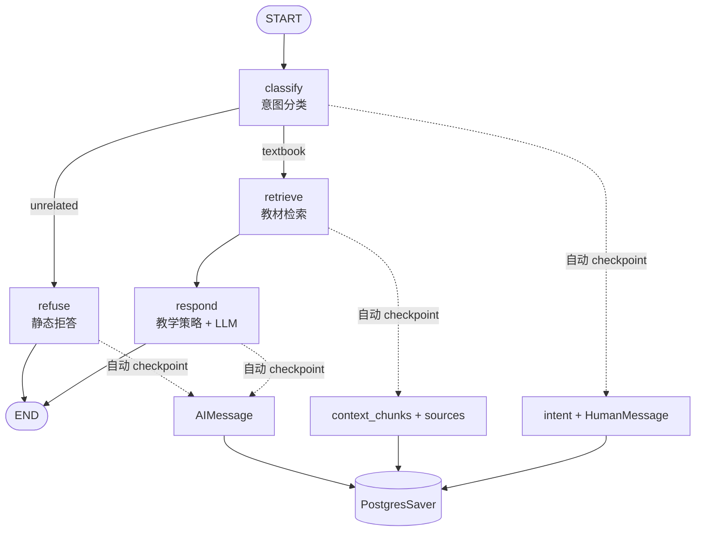
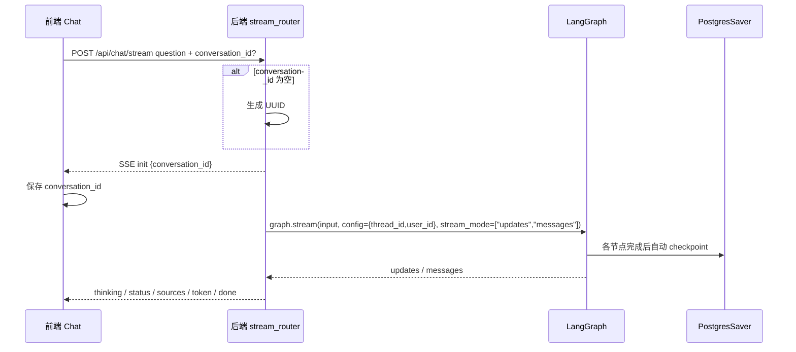
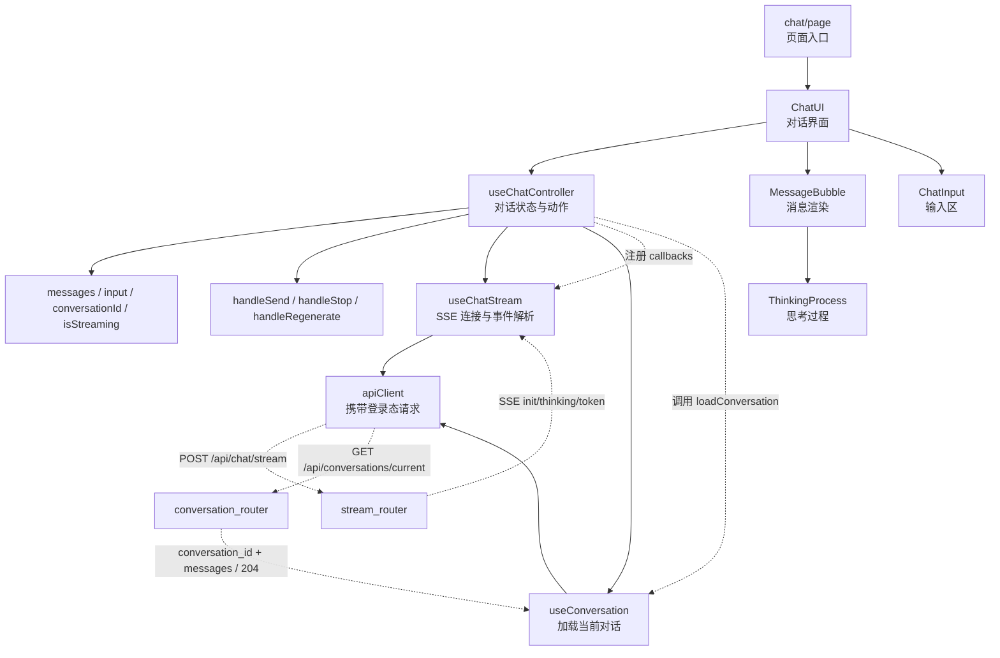
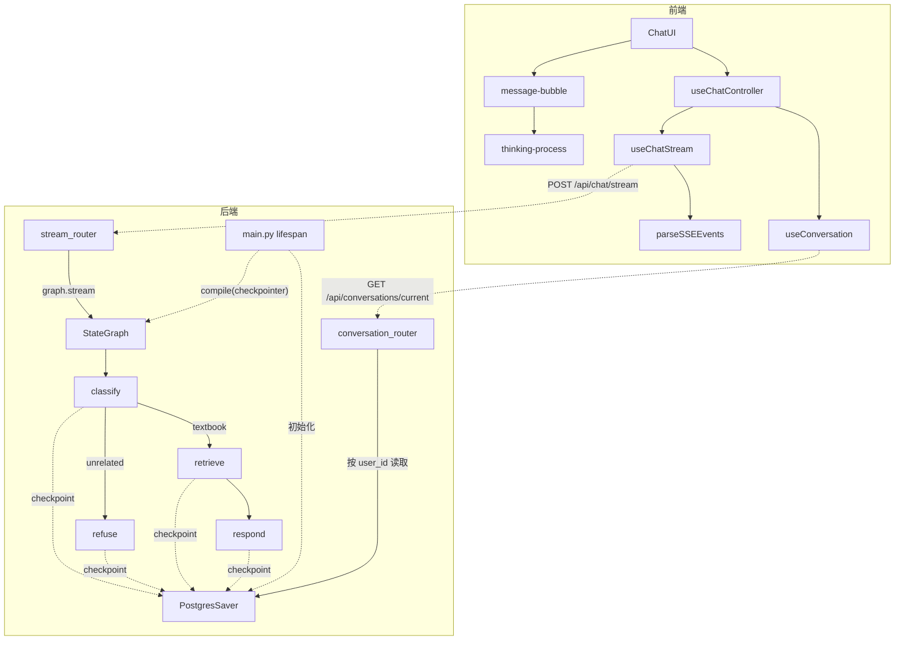

# Vibe Coding 全栈实战：章鱼哥解题 06｜对话持久化与用户数据隔离

上一期把前后端鉴权链路打通以后，后端终于不再只是被动接收请求，而是能知道“这个请求来自哪个用户”。

但这还只是身份链路的起点。

用到这里，我发现一个很实际的问题：刷新页面以后，对话没了；换个用户登录，也还没有清楚的消息边界。学生问过哪些问题，AI 回答到哪里，下一次打开页面时应该恢复哪段内容，这些都需要有稳定的对话状态。

所以这一期要继续往前走一步：**把用户身份接进对话链路，让当前对话能保存、能恢复，后续消息能继续进入同一个 thread。**

这一期的目标不是做完整的多对话管理系统。侧边栏、对话列表、重命名、置顶、删除这些能力会放到后面。当前阶段先解决更基础的问题：

```text
用户发送问题
  → 后端拿到 user_id
  → 生成或复用 conversation_id
  → LangGraph 按 thread 保存 checkpoint，里面包含消息状态
  → 前端拿到 conversation_id
  → 刷新页面后还能恢复当前对话
```

也就是说，05 解决的是“后端能不能识别用户”，06 解决的是“用户的对话能不能留下来”。

---

## 一、为什么只会回答还不够

前几期做完后，章鱼哥已经能完成一条回答链路：

```text
用户输入问题
  → 后端检索教材
  → 组装上下文
  → LLM 生成回答
  → 前端流式展示
```

这条链路能证明系统“会回答”，但还不能证明它“像一个对话产品”。

真实使用时，学生很少只问一个完全孤立的问题。他可能先问一个概念，再围绕同一段内容继续追问。对系统来说，这一期先把问题收敛到一个更基础的层面：同一段对话能不能被保存下来，下一次打开页面时能不能继续接着看。至于更复杂的追问理解，可以等对话状态稳定以后再往上加。

如果后端没有对话状态，每一次请求都是孤立的：

- 刷新页面后历史消息丢失
- 用户继续发送消息时，后端只能把它当成孤立问题处理
- 不同用户的消息没有明确隔离边界
- 前端只能靠 localStorage 兜底保存，换设备后也不能从后端恢复这段当前对话

所以这一期真正要补的是对话状态：

```text
身份 user_id
  → 对话 conversation_id
  → 消息历史 messages
  → 当前对话恢复
```

这里有一个范围边界需要先说清楚：这一期只做“当前对话”的保存和恢复，不做完整的对话列表管理。换句话说，系统先知道“这个用户当前这段对话是什么”，后面再做“这个用户有哪些对话”。

---

## 二、这一期要做什么

这期的改动可以拆成三条线。

第一条是后端对话编排。原来的回答链路更像一条手写流水线：先判断问题，再检索，再调用 LLM。我一开始还想继续在 `stream_router` 里加分支，但很快发现，分类、检索、拒答、生成、thinking 事件会挤在同一个函数里，后面会很难判断问题到底出在哪一段。

所以这一期引入 LangGraph，并用它的 StateGraph 把后端链路整理成几个明确节点：

```text
classify → retrieve → respond
        ↘ refuse
```

第二条是消息持久化。这里没有自己设计一套 messages 表，而是使用 LangGraph 的 PostgresSaver。它会按 `thread_id` 保存 graph checkpoint；这一期把 `conversation_id` 映射成这个 thread 标识，而不是单独建 `messages` 业务表。

第三条是前端对话恢复。前端打开 Chat 页面时，不再只依赖 localStorage，而是先向后端请求当前对话历史。发送第一条消息时，如果前端还没有 `conversation_id`，后端会生成一个，并通过 SSE 的 `init` 事件回传给前端。

这一期做：

- 用 LangGraph 的 StateGraph 编排回答流程
- PostgresSaver 持久化消息和 graph 状态
- `conversation_id` 贯穿前后端
- `user_id` 进入 graph config，并用于后端恢复当前对话时按用户过滤
- `GET /api/conversations/current` 恢复当前对话
- SSE 新增 `init` 和 `thinking` 事件
- 前端展示 thinking 过程
- 前端从后端恢复历史消息，localStorage 只做降级兜底

这一期不做：

- 不做多对话侧边栏
- 不做对话重命名、置顶、删除
- 不做对话搜索和标签
- 不做 ReAct / tool-calling
- 不接外部工具，比如计算器或网络搜索

这个范围收敛很重要。否则很容易把“消息持久化”“智能体编排”“多对话管理”“知识库问答优化”全部塞进一期，最后每条链路都做不扎实。

---

## 三、后端：从流水线到 StateGraph

这一期后端最核心的变化，是把回答链路改成 LangGraph 的 StateGraph。

选择 LangGraph 不是因为一定要做复杂 Agent，而是因为当前链路已经开始出现几个稳定节点：

- `classify`：判断问题是否课程相关
- `retrieve`：课程相关问题检索教材
- `respond`：基于教材和教学策略生成回答
- `refuse`：非课程问题直接拒答

流程可以简化成这样：



这里有一个取舍：没有用 ReAct，也没有做 tool-calling。

原因很简单，当前系统只有一个核心工具：教材检索。后端并不需要让模型自己在多个工具之间循环决策。问题是否需要检索，可以先由 `classify` 节点判断；课程相关就走 `retrieve → respond`，非课程相关就走 `refuse`。

也就是说，这一期更像是**固定流程的智能体编排**，而不是开放式 Agent。

这样的好处是边界更清楚：

```text
classify 负责分流
retrieve 负责找教材
respond 负责教学表达
refuse 负责非课程问题兜底
PostgresSaver 负责保存状态
```

LLM 主要参与 `respond` 节点，`classify`、`retrieve`、`refuse` 这些节点尽量保持规则化或确定性。节点职责必须先设计清楚，否则后面调试时，很难判断问题出在分类、检索、prompt，还是持久化。

这次真正影响回答风格的是 `respond` 里的教学策略 prompt，而不是让模型自己决定要不要调用工具。

---

## 四、消息如何保存下来

消息持久化有两种常见做法。

一种是自己设计业务表，比如 `conversations`、`messages`，然后手动在每次请求结束时写入数据库。另一种是复用 LangGraph 的 checkpoint 机制，让 graph 在节点执行过程中自动保存状态。

这一期先选了第二种：**PostgresSaver**。

核心设计是：

```text
conversation_id = LangGraph thread_id
user_id = 当前登录用户
messages = LangGraph state 里的消息列表
```

这里要区分两个概念：PostgresSaver 保存的是 **graph checkpoint**，不是专门给前端展示的 `messages` 业务表。checkpoint 里可能会有 `intent`、`context_chunks`、`sources` 这类内部状态。恢复对话时，后端主要从 checkpoint state 中取 `messages`，再按需要把 AI 消息关联的 `sources`、`thinking_steps` 映射成前端消息字段；`context_chunks` 这类内部状态不直接展示成消息。

也就是说，教材检索结果会参与回答生成，也会通过 SSE 的 `sources` 事件展示引用来源，但不会因为存在 checkpoint 里，就被当成一条用户消息或 AI 消息展示出来。

当用户第一次发送消息时，如果前端没有传 `conversation_id`，后端会生成一个 UUID，并把它作为 LangGraph 的 `thread_id`：

```text
前端 conversation_id = null
  → 后端生成 conversation_id
  → graph config.thread_id = conversation_id
  → PostgresSaver 按 thread 保存 graph checkpoint
```

后续继续发送消息时，前端把同一个 `conversation_id` 带回来：

```text
前端 conversation_id = xxx
  → 后端继续使用 thread_id = xxx
  → LangGraph 继续使用同一条 thread 状态
  → 新消息追加到同一段对话里
```

这里还有一个关键点：`user_id` 也要进入 graph config。它本身不参与生成回答，但后端恢复对话时要用它过滤 checkpoint，避免把别人的 thread 当成当前用户的对话。

这一期没有自己建完整的对话列表业务表，所以不能把它写成“已经完成对话管理系统”。更准确地说，它完成的是：**当前对话的状态能保存，后端可以按用户恢复最近对话。**

---

## 五、conversation_id 怎么回到前端

这一期最容易踩坑的地方，是 `conversation_id` 的回传。

这里要先区分两条链路。

第一条是页面加载链路：用户打开或刷新 Chat 页面时，前端会先调用 `GET /api/conversations/current`。如果后端能按 `user_id` 找到最近对话，就直接返回 `conversation_id + messages`，前端不用等用户发送新消息，也能把历史消息渲染出来。

第二条是发送消息链路：用户点击发送后，前端会建立 SSE 流式请求。如果这是已有对话，前端通常已经带着 `conversation_id`；如果这是新对话，前端还没有 ID，后端会生成一个新的。`init` 的作用就是把“本次请求最终使用的 `conversation_id`”确认给前端：已有对话时相当于确认复用，新对话时则把新 ID 发回来。

这里我踩到的坑是：后端确实生成了 `conversation_id`，但前端一直不知道它。结果每次继续发消息都会变成新 thread，看起来能回答，实际上对话没有接上。

后端生成 `conversation_id` 并不够。因为同一段对话要靠前端在下一次请求时把同一个 `conversation_id` 带回来。如果前端不知道这个 ID，后端每次都会创建新 thread，结果就是：

```text
第一次提问 → 后端创建 thread A
第二次追问 → 前端不知道 A → 后端创建 thread B
第三次追问 → 前端不知道 B → 后端创建 thread C
```

看起来每次都能回答，但每次其实都是新的对话。

所以这一期在 SSE 流开头增加了一个 `init` 事件：

```text
event: init
data: {"conversation_id": "uuid"}
```

完整链路变成：



这个 `init` 事件很小，但它决定了前后端是不是在说同一段对话。

前端拿到 `conversation_id` 后，后续发送问题就会复用它。这样后续消息才能进入同一个 LangGraph thread。

---

## 六、前端：从 Chat UI 到 ChatController

前端这一期也做了一次职责收敛。

原来的 Chat UI 里同时处理很多事情：

- 消息列表
- 输入框
- 是否正在生成
- SSE 事件回调
- 本地缓存
- 历史加载
- 停止生成
- 重新生成

功能少的时候还能接受，但接入对话恢复以后，状态开始变复杂。尤其是 `conversation_id`、历史消息、thinking 事件、错误保留策略都要放进同一条链路里。

所以这一期抽了一个 `useChatController`，把对话状态统一收进去：

```text
useChatController
  → messages
  → input
  → conversationId
  → mounted
  → isStreaming
  → handleSend
  → handleStop
  → handleRegenerate
```

ChatUI 尽量只负责渲染。

模块关系可以这样看：



这里的重点不是把前端拆得更复杂，而是把状态流向收敛起来：页面负责组装，ChatUI 负责展示，`useChatController` 负责统一管理对话状态和用户动作，`useChatStream` 只处理 SSE 连接和事件解析。

消息列表也是在 `useChatController` 里维护的。它有三类来源：

```text
页面加载
  → loadConversation()
  → 后端返回历史 messages
  → setMessages(loadedMessages)

用户发送
  → 先追加 userMsg
  → 再追加一个空的 aiMsg
  → aiMsg.status = retrieving

SSE 返回
  → status 更新 aiMsg 状态
  → thinking 追加 thinkingSteps
  → sources 写入引用来源
  → token 逐段拼到 aiMsg.content
  → done 把 aiMsg.status 改成 done
  → error 保留 userMsg，把 aiMsg 标记为 error
```

这样做的好处是，ChatUI 不需要知道消息是从历史接口来的，还是从 SSE 流里一点点长出来的。它只拿到 `messages` 然后渲染；至于什么时候追加、什么时候更新、失败时保留哪一条消息，都放在 controller 里处理。

页面加载时，前端先调用：

```text
GET /api/conversations/current
```

如果后端返回历史消息，就渲染历史；如果返回 204，就显示空态；如果接口不可用，再降级读取 localStorage。

这里还有一个细节：204 不能用 `JSONResponse(content=None)` 返回。那样会带出 `null` body，最后触发 Content-Length 相关错误。所以无历史对话时要直接返回空的 204 响应。

这里还修了一个真实问题：`loadConversation` 如果没有用 `useCallback` 固定引用，每次渲染都会生成新函数。ChatUI 里的 `useEffect` 依赖它时，就会反复触发加载逻辑，导致用户刚发出去的消息又被重新加载覆盖，看起来像“消息一闪就没了”。

最后的处理是：把 `loadConversation` 做成稳定引用，让页面初始化加载只在应该发生的时候发生。

---

## 七、thinking 事件：让过程可见

这一期除了保存消息，还把后端的中间过程透给前端。

原来的 SSE 事件主要是：

- `status`
- `sources`
- `token`
- `done`
- `error`

这一期新增了：

- `init`：返回 `conversation_id`
- `thinking`：返回智能体当前执行阶段的展示文案

比如：

```text
event: thinking
data: {"text": "先判断这个问题是否需要教材检索", "index": 1}
```

前端收到后，会把 thinking steps / 执行阶段渲染成可折叠区域。这样用户不只看到最终回答，也能看到系统大概经历了哪些阶段：

```text
正在分析问题
正在检索教材
基于教材组织引导式回答
```

这里的重点不是把模型的真实内心过程暴露出来，而是把系统执行阶段展示出来。对于一个学习产品来说，这种过程感很重要：学生知道系统不是卡住了，而是在分析、检索和生成。

---

## 八、验收怎么做

这一期的验收不能只看“能回答”。

因为回答链路之前已经能跑，这一期真正要验的是状态和边界：

| 验收维度 | 要确认什么 |
| --- | --- |
| conversation_id 创建 | 第一次发送消息时，后端能生成 conversation_id |
| conversation_id 回传 | SSE 第一个 `init` 事件能把 conversation_id 返回给前端 |
| 同一对话复用 | 第二次发送问题时，前端会带上同一个 conversation_id |
| 消息持久化 | 正常完成时 checkpoint 能保存 HumanMessage 和完整 AIMessage；主动停止时只保留前端 localStorage 兜底 |
| 历史恢复 | 刷新页面后能从后端恢复最近对话 |
| 用户隔离 | 查询当前对话时基于 user_id 过滤，验证不会返回其他用户的 thread |
| thinking 展示 | 前端能接收并展示 thinking 事件 |
| 异常保留 | 请求失败时不静默删除用户消息 |
| 加载稳定性 | `loadConversation` 引用稳定，不会反复触发加载覆盖刚发送的消息 |
| 204 响应 | 无历史对话时返回 204 且没有 body |

这里最重要的是 `conversation_id`。如果它没有正确回到前端，后面的同一对话复用、消息恢复和用户隔离都会变得不可靠。

---

## 九、整体结构性设计

这一期完成后，系统从“单次问答”变成了“有当前对话状态的问答”。

和对话链路直接相关的核心目录可以先简化成这样：

```text
backend/app
├── agent
│   ├── __init__.py
│   ├── graph.py              # AgentState + StateGraph 节点与条件路由
│   ├── nodes.py              # classify / refuse 等节点函数
│   └── prompts.py            # 教学策略 prompt
├── chat
│   ├── dependencies.py       # get_graph / get_checkpointer
│   ├── schemas.py            # ChatRequest + conversation_id
│   ├── stream_router.py      # SSE 流式对话 + conversation_id
│   ├── conversation_router.py# 当前对话恢复接口
│   └── question_classifier.py# textbook / unrelated 分类
└── main.py                   # 启动时初始化 PostgresSaver + graph

frontend/src
├── chat
│   ├── use-chat-stream.ts    # 解析 init/thinking/token 等 SSE 事件
│   ├── use-conversation.ts   # 加载当前对话历史
│   └── controller.ts         # useChatController
└── components
    ├── chat-ui.tsx
    ├── message-bubble.tsx
    └── thinking-process.tsx
```

模块关系可以简化成这样：



从职责上看，这次拆分有几个边界：

| 模块 | 职责 |
| --- | --- |
| `StateGraph` | 编排 classify / retrieve / respond / refuse |
| `PostgresSaver` | 保存 LangGraph checkpoint，实现当前对话恢复 |
| `stream_router.py` | 接收问题、绑定 user_id / conversation_id、输出 SSE |
| `conversation_router.py` | 按 user_id 获取当前用户最近对话 |
| `useChatController` | 统一管理前端对话状态 |
| `use-chat-stream.ts` | 处理 SSE 流和事件回调 |
| `thinking-process.tsx` | 展示智能体执行过程 |

这一期的关键不是“加了 LangGraph”，而是把对话状态接上了身份链路。前端页面知道用户是谁，后端 API 能验证用户是谁，LangGraph thread 能记录当前对话；后端再用 `user_id` 过滤恢复结果，才形成用户边界。这样后面再做多对话列表、标题生成、置顶删除，才有可靠的状态基础。

Vibe Coding 做到这一步时，我越来越明显地感觉到：AI 写节点、写 Hook、写接口都不难，真正需要人盯住的是状态的归属。谁创建 `conversation_id`，谁保存它，谁在下一次请求带回来，谁用 `user_id` 做隔离，这些问题如果一开始没设计清楚，后面就会变成一堆看起来能跑、但串不起来的局部代码。
