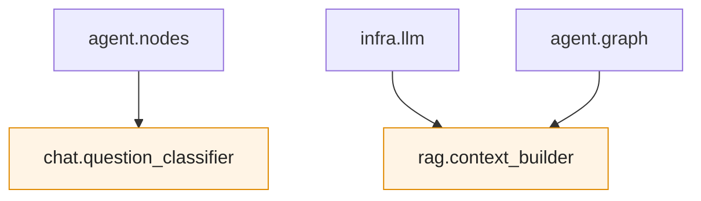
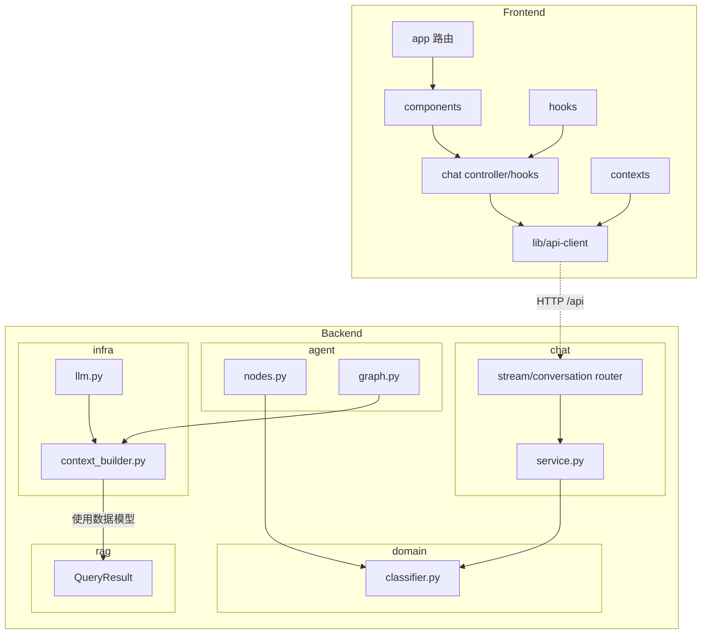

# Vibe Coding 全栈实战：章鱼哥解题 07｜功能跑通后的架构收敛

上一期做完对话持久化以后，章鱼哥已经不只是一个“能回答问题”的接口了。它有了登录态，有了当前对话，有了 LangGraph thread，也能在刷新页面后恢复最近的消息。

但功能跑通以后，我回头看了一下后端模块依赖，发现了两个不太舒服的地方。

一个是 `agent` 依赖了 `chat`：

```text
agent.nodes → chat.question_classifier
```

另一个是 `infra.llm` 依赖了 `rag.context_builder`：

```text
infra.llm → rag.context_builder
```

这两个问题都不影响已有功能基线。但它们会让模块边界慢慢变歪：功能越往后加，越难判断一段代码到底属于业务编排、基础设施，还是 RAG 检索。

所以这一期没有继续加新功能，而是停下来做了一次小范围架构收敛。

这一期的目标很克制：

```text
不改业务逻辑
不改函数签名
只移动模块归属
只更新 import 路径
最后用测试和残留引用检查验收
```

---

## 一、为什么功能跑通后还要重构

Vibe Coding 做功能很快。

从 RAG 检索、流式输出、鉴权接入，到对话持久化，很多代码都是在“先把链路跑通”的节奏下完成的。这个阶段最重要的是验证方向：用户能不能问，后端能不能答，前端能不能显示，刷新后对话能不能回来。

但功能一多，另一个问题就会出现：**AI 往往能把局部代码写对，但它不一定会长期维护模块边界。**

比如问题分类这件事，最开始只是 Chat 接口里的一段逻辑，放在 `chat/question_classifier.py` 里很自然。后来引入 LangGraph 后，`agent` 也要做意图分类，于是 `agent.nodes` 直接引用了 `chat.question_classifier`。

代码能跑，但依赖关系变成了这样：

```text
agent → chat
```

这就有点别扭了。`agent` 和 `chat` 都是业务层模块，`agent` 不应该为了一个通用分类函数去依赖 `chat`。

另一个类似的问题是 `context_builder`。

它的职责是把检索出来的 chunk 组装成给 LLM 使用的上下文，比如带编号的教材片段、引用来源列表。最开始它放在 `rag` 包里，因为输入来自 RAG 检索结果。但后来 `infra.llm` 和 `agent.graph` 都要用它，于是依赖变成：

```text
infra.llm → rag.context_builder
agent.graph → rag.context_builder
```

这里的问题不是函数错了，而是位置不对。`context_builder` 更像是“给 LLM 组装 prompt 上下文”的基础设施能力，不是 RAG 检索本身。

所以这一期做的事情很简单：把模块放回更合适的位置。

---

## 二、先看重构前的问题

重构前的两个关键问题可以画成这样：



第一条问题是同层耦合。

```text
agent.nodes → chat.question_classifier
```

`agent` 负责智能体流程编排，`chat` 负责对话业务接口和服务。分类器本身是一个无状态纯函数，只依赖正则规则，不属于 Chat 接口专有能力。它应该放在更底层、更通用的位置。

第二条问题是职责归属不清。

```text
infra.llm → rag.context_builder
```

`infra.llm` 是 LLM 调用实现，`rag` 应该更专注于教材读取、分块、向量化、检索这些事情。`context_builder` 做的是把检索结果格式化成 LLM 可用的 prompt context，更适合跟 LLM 基础设施放在一起。

这类问题如果不处理，短期不一定出 bug，但后面继续加新的智能体节点、评估逻辑、对话策略时，很容易继续复用“刚好能用”的内部函数。等到要拆分服务、替换实现或调整模块职责时，import 关系就会先卡住。

---

## 三、把 question_classifier 移到 domain

第一个调整是移动问题分类器。

重构前：

```text
backend/app/chat/question_classifier.py
```

重构后：

```text
backend/app/domain/classifier.py
```

为什么放到 `domain`？

因为它满足几个特征：

- 不依赖 FastAPI
- 不依赖数据库
- 不依赖 LLM
- 不依赖 ChatService
- 只是根据问题文本判断 `textbook` / `unrelated`

也就是说，它是一个通用领域判断函数。`chat` 可以用，`agent` 也可以用，后面如果评估或 API 层需要复用，也不应该反向依赖 `chat`。

调整后依赖关系变成：

```text
agent.nodes → domain.classifier
chat.service → domain.classifier
```

代码层面没有改分类规则，只改 import：

```python
# 改前
from app.chat.question_classifier import classify_question

# 改后
from app.domain.classifier import classify_question
```

这类重构最重要的是克制。只移动归属，不顺手改逻辑。否则一旦测试失败，就很难判断是迁移出错，还是业务行为被改坏了。

---

## 四、把 context_builder 移到 infra

第二个调整是移动上下文构建逻辑。

重构前：

```text
backend/app/rag/context_builder.py
```

重构后：

```text
backend/app/infra/context_builder.py
```

这里最容易混淆的是：它处理的是 RAG 检索结果，为什么不放在 `rag`？

我的判断是：看一个模块属于哪里，不只看它的输入，还要看它服务谁。

`context_builder` 的输入确实是 `QueryResult`，但它的输出是给 LLM prompt 用的上下文文本和引用来源。它不是在做检索，也不是在做分块，而是在把检索结果变成 LLM 可以消费的格式。

所以它更像 LLM 调用链路的一部分。

调整后依赖变成：

```text
infra.llm → infra.context_builder
agent.graph → infra.context_builder
```

对应 import 也只是改路径：

```python
# 改前
from app.rag.context_builder import build_numbered_context
from app.rag.context_builder import chunks_to_sources

# 改后
from app.infra.context_builder import build_numbered_context
from app.infra.context_builder import chunks_to_sources
```

函数签名不改，返回结构不改，调用方式不改。按设计，这次重构不应该影响 RAG 检索质量，也不应该改变传入 LLM 的上下文格式和来源结构；验收时要确认调用链路和关键行为保持一致。

---

## 五、重构后的项目结构和依赖关系

这次虽然只移动了两个后端模块，但我还是把前后端放在一起重新看了一遍。原因很简单：架构收敛不是只看某个文件放在哪里，而是要看它在整条产品链路里承担什么职责。

前端这一期没有做结构调整，它主要作为后端能力的调用边界放进图里。重构真正发生在后端：`classifier.py` 从 `chat` 移到 `domain`，`context_builder.py` 从 `rag` 移到 `infra`。

下面只列和本文相关的关键结构。重构后，项目结构可以简化成这样：

```text
OctoTutor
├── frontend/src
│   ├── app                 # Next.js 路由入口
│   ├── chat                # 对话状态、SSE、历史恢复等前端逻辑
│   ├── components          # Chat UI、消息气泡、来源展示等组件
│   ├── contexts            # 登录态、全局状态上下文
│   ├── hooks               # 页面和组件复用的 React hooks
│   └── lib                 # API client、工具函数
└── backend/app
    ├── main.py             # FastAPI 应用入口，装配依赖和路由
    ├── config.py           # 环境配置
    ├── domain              # 领域模型、协议、通用领域逻辑
    │   ├── models.py
    │   ├── protocols.py
    │   └── classifier.py   # 从 chat 移入：问题意图分类
    ├── rag                 # 教材读取、分块、向量化、向量存储
    │   ├── models.py
    │   ├── embeddings.py
    │   ├── vector_store.py
    │   ├── chunkers/
    │   ├── readers/
    │   └── classifiers/
    ├── infra               # 外部能力和基础设施适配
    │   ├── llm.py
    │   ├── context_builder.py  # 从 rag 移入：LLM 上下文格式化
    │   ├── bm25.py
    │   └── reranker.py
    ├── agent               # LangGraph 编排和智能体节点
    │   ├── graph.py
    │   ├── nodes.py
    │   └── prompts.py
    ├── chat                # 对话 API 的业务编排
    │   ├── service.py
    │   ├── stream_router.py
    │   ├── conversation_router.py
    │   ├── schemas.py
    │   └── dependencies.py
    ├── api                 # 其他 HTTP API 路由
    ├── ingestion           # 教材入库流程
    ├── evaluation          # 检索和回答质量评估
    └── middleware          # 鉴权等请求中间件
```

模块关系可以简化成这样。虚线表示前后端之间的 HTTP 调用边界；后端内部只画这次重构最相关的代码依赖和数据模型使用关系：



这张图里最重要的，是这次重构当时收敛出来的两组路径。

```text
agent.nodes   → domain.classifier
chat.service  → domain.classifier

infra.llm     → infra.context_builder
agent.graph   → infra.context_builder
```

也就是说，`agent` 不再依赖 `chat`，`infra.llm` 也不再跨到 `rag` 包里拿 prompt 组装逻辑。

这里要说清楚一个边界：这次不是要让所有模块都完全隔离。比如 `infra.context_builder` 仍然会使用 `QueryResult` 这类 RAG 数据模型。真正要收敛的是职责不清的路径：LLM 调用不应该从 `rag.context_builder` 里拿 prompt 格式化逻辑，智能体节点也不应该从 `chat` 包里拿通用分类函数。

---

## 六、怎么验收这类重构

这种重构不需要很复杂的验收，但一定要有验收。

因为它看起来只是“挪文件、改 import”，真正的风险却是：

- 旧路径有没有漏改
- 调用方行为有没有变化
- 模块依赖有没有真的收敛

所以我主要看三件事。

第一，确认旧引用已经清理干净。比如不应该再出现：

```text
from app.chat.question_classifier
from app.rag.context_builder
```

第二，先跑和这两个模块直接相关的测试，再跑后端全量测试。分类器迁移后，问题分类结果要保持不变；上下文构建迁移后，相关调用路径和 StateGraph 图编译要能正常通过；最后再用全量测试确认这次移动没有影响其他模块。

第三，回到依赖图上确认目标已经达成：

```text
agent 不再依赖 chat
infra.llm 不再依赖 rag.context_builder
domain 新增 classifier
infra 新增 context_builder
```

这里的关键不是把验收做得多复杂，而是证明一件事：这次只改变模块归属，没有偷偷改变业务行为。范围越小，验收越清楚，这类架构收敛才不会变成另一场失控的大改。
