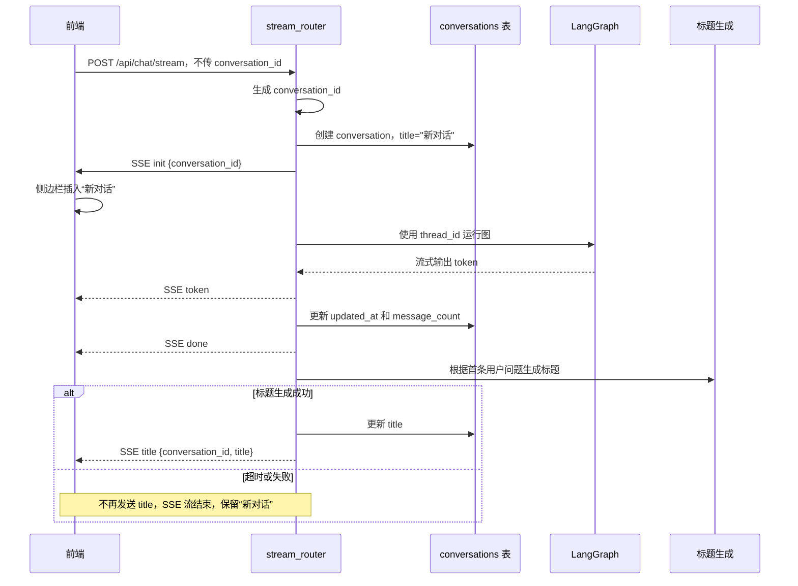
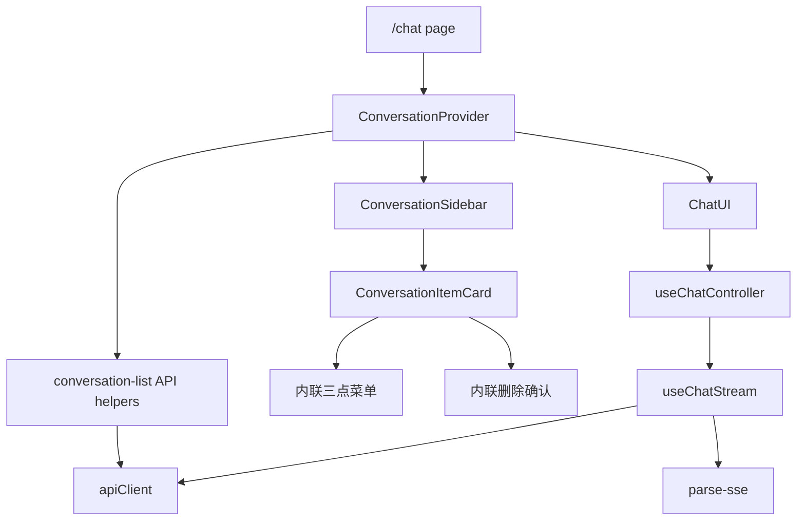
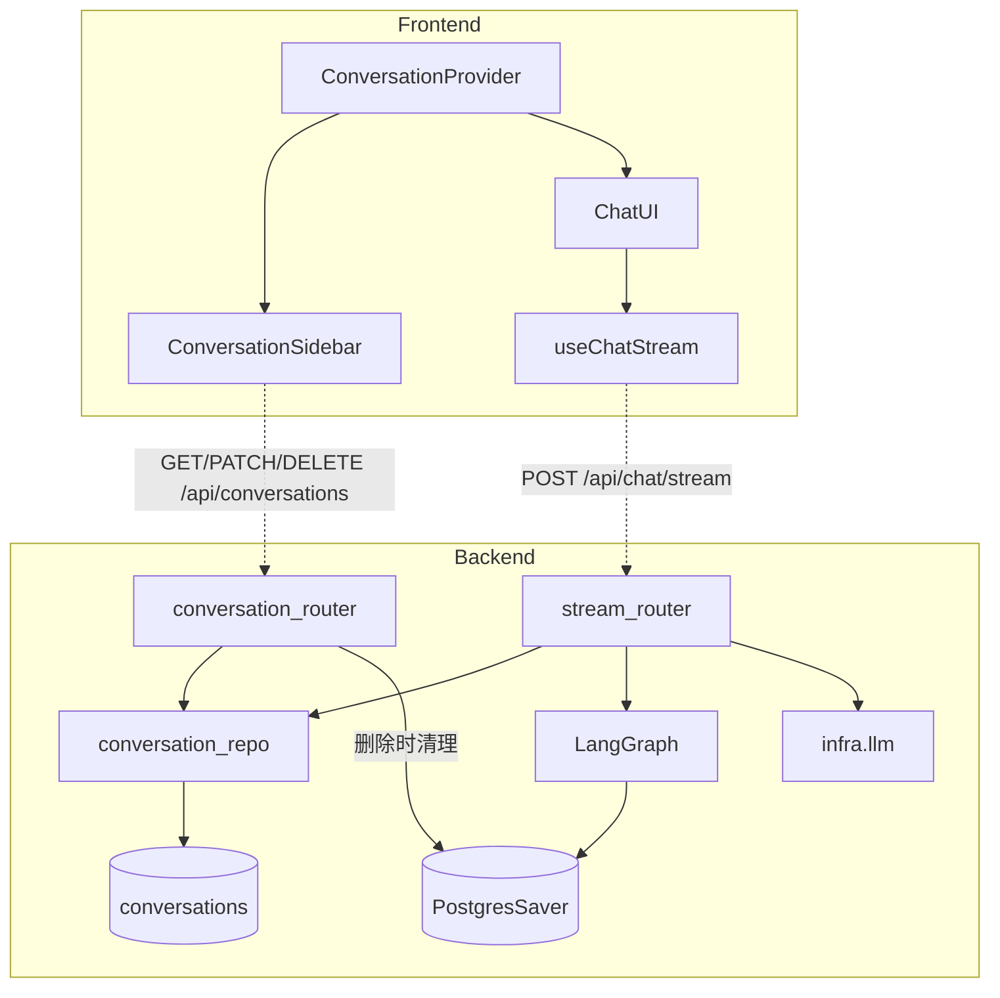

# Vibe Coding 全栈实战：章鱼哥解题 08｜对话能持久化，为什么还要做对话管理

对话能持久化，不代表产品已经有了对话管理。

用户刷新后能接着聊，只解决了"当前这一次"；当他今天问函数、明天问数列、后天问立体几何时，真正缺的是一套能找回、命名、置顶、删除的对话列表。

前面已经做了对话持久化。用户刷新页面后，可以恢复最近一次对话；后端也可以通过 LangGraph 的 `thread_id` 找回历史消息。这个能力解决的是“当前对话能不能接上”。

但真实使用时，学生不会只问一组题。每一组问题都应该有自己的对话入口、标题、更新时间和操作菜单。否则对话越多，用户越难找回之前的学习过程。

所以这一期要解决的问题是：**把单个当前对话，扩展成可管理的多对话列表。**

这一期做的事情可以概括成一条完整链路：

```text
用户进入 /chat
→ 加载对话列表
→ 选择或新建一条对话
→ 发送问题时自动创建 conversation 记录
→ 新对话首轮回答结束后生成标题
→ 用户可以重命名、置顶、删除、切换对话
```

RAG、智能体和流式输出解决的是“能不能回答”；多对话管理解决的是“用户能不能长期使用”。

---

## 一、为什么 PostgresSaver 还不够

前面已经接入了 LangGraph 的 PostgresSaver。它能把对话状态按 `thread_id` 存下来，后端也可以根据 `conversation_id` 恢复一段对话。

但 PostgresSaver 解决的是图执行状态的持久化，不是产品层的对话管理。

它不适合直接回答这些问题：

- 用户有哪些历史对话？
- 哪些对话应该显示在列表顶部？
- 每个对话叫什么标题？
- 最近活跃时间是什么？
- 用户想删除某条对话时，业务记录和 checkpoint 怎么一起处理？

所以这一期需要新增一层业务数据：`conversations` 表。

这里的关键不是"再存一遍消息"，而是给每段对话补上产品身份：它属于谁、叫什么、什么时候活跃、能不能被置顶或删除。

它不替代 PostgresSaver，而是和 PostgresSaver 分工：

```text
conversations 表
  负责产品层元数据：标题、置顶、更新时间、消息数、用户归属

PostgresSaver checkpoint
  负责 LangGraph 状态：thread_id 对应的消息历史和图状态
```

两者通过同一个 ID 关联：

```text
conversation.id = LangGraph thread_id
```

这个设计的好处是，不需要再维护一张额外映射表。前端看到的 `conversation_id`，后端查业务表和查 checkpoint 都用同一个值。

---

## 二、后端：新增对话业务表和 API

这一期后端最核心的变化，是新增 `conversations` 业务表。

表里记录的是对话列表需要展示和操作的元信息：

```text
id             对话 ID，同时也是 LangGraph thread_id
user_id        用户 ID，用于数据隔离
title          对话标题，默认是“新对话”
pinned         是否置顶
pinned_at      置顶时间，用于置顶区排序
message_count  消息数量
created_at     创建时间
updated_at     最近活跃时间
```

这里有一个重要边界：**对话正文不放在 `conversations` 表里。**

正文仍然由 PostgresSaver 管理。`conversations` 表只负责列表展示、排序、标题、置顶和删除这些产品管理能力。

#### 数据访问层

有了 `conversations` 表以后，还要决定后端怎么操作这张表。

最直接的做法是在 router 里手写 SQL。这样短期能跑，但很快会把 HTTP 参数校验、用户归属判断、错误码处理和数据库查询混在一起。对话管理后面还会继续扩展，列表、置顶、重命名、删除、标题更新都要访问同一张表，如果每个接口各写一段 SQL，后面会很难维护。

所以这一期没有把 SQL 直接写进 router，而是单独抽出 `ConversationRepo`。这样 HTTP 参数校验、用户归属、错误码和数据库查询不会混在一起，后面扩展搜索、标签、归档时也更容易控制边界。

`ConversationRepo` 只关心“怎么查、怎么改 `conversations` 表”。它不处理 HTTP 请求，不判断错误码，也不负责鉴权，这些仍然留在 router 里。

它封装的能力包括：

```text
list_by_user          查询当前用户的对话列表
get_by_id             按 id + user_id 查询对话
create                创建新对话
update                更新标题、置顶状态
delete_by_id          删除对话
count_pinned          统计置顶数量
update_message_stats 更新 updated_at 和 message_count
```

事务提交也放在调用方控制。router 或 stream_router 调用完 Repository 后，再显式 `commit`。这样 Repository 只负责数据访问，业务流程和事务边界留在更外层。

表结构这期没有引入 Alembic，而是在应用启动时通过 SQLAlchemy `create_all` 自动建表。当前只有一张 `conversations` 表，结构也比较简单；等后续表结构变化变多，再引入迁移工具更合适。

#### 接口与排序

后端新增的接口围绕这张表展开：

| 接口 | 用途 |
| --- | --- |
| `GET /api/conversations` | 获取当前用户的对话列表 |
| `PATCH /api/conversations/{id}` | 重命名、置顶、取消置顶 |
| `DELETE /api/conversations/{id}` | 删除对话 |
| `GET /api/conversations/current?conversation_id=xxx` | 加载某条对话的历史消息，不传时保留加载最近对话的 fallback |
| `POST /api/chat/stream` | 发送问题，必要时自动创建新对话 |

列表接口要处理两个排序规则：

```text
置顶对话：按 pinned_at 倒序
普通对话：按 updated_at 倒序
```

置顶数量有限，所以置顶区可以一次返回；普通对话可能越来越多，所以用游标分页。

游标分页的思路是：用上一页最后一条记录的排序字段值作为"游标"，查询"比这个值更早的记录"，而不是用页码翻页。对话列表按时间倒序排列，用户一边翻页一边可能产生新对话，传统 page/offset 在这种场景下容易出现重复或漏项。用 `updated_at + id` 做游标，排序会更可控。

---

## 三、发送消息时如何自动创建对话

新建对话不是简单地点击按钮就立刻写数据库。

用户点击“新建对话”时，前端只是进入一个空白对话状态。真正创建 `conversation` 记录，是在用户发送第一条消息之后。

这样可以避免用户点了很多次“新建对话”，但没有真正提问，数据库里产生一堆空对话。

完整流程是：



这里有两个细节比较关键。

第一，`init` 事件要尽早推送。前端只有拿到后端生成的 `conversation_id`，才能把新对话插入侧边栏，并把后续消息归到正确的对话里。

第二，`done` 只是回答结束，不是流结束。回答内容生成结束后，后端还会尝试生成标题。如果标题生成成功，会继续推送一个 `title` 事件。

也就是说，前端不能把 `done` 理解成“这条 SSE 流的最后一帧”，只能理解成“回答内容已经生成结束”。这个改动引起了前端 SSE 解析逻辑的连锁调整：之前收到 `done` 就清理状态、关闭监听；现在需要在 `done` 之后继续保持连接，等待可能出现的 `title` 事件。前端必须把“回答结束”和“流结束”拆成两个不同的时机。

标题生成失败不会影响主链路。因为用户最在意的是回答能不能出来，标题只是列表体验优化。所以标题生成设置了超时，失败就静默跳过，保留默认标题“新对话”。

---

## 四、前端：从单个 conversationId 到对话列表状态

前端原来的状态比较简单：只需要记住当前 `conversationId`，发送消息时带给后端，刷新时再恢复当前对话。

多对话管理引入以后，状态变成了一个列表系统：

```text
items             对话列表
activeId          当前选中的对话
cursor            分页游标
hasMore           是否还有更多
isLoading         是否正在加载
isNewConversation 是否处于新建对话态
```

这个状态不只 Chat UI 需要，侧边栏也需要。比如：

- 侧边栏要知道当前选中哪条对话
- Chat UI 要知道当前消息属于哪条对话
- 新建按钮要清空消息区并进入新建态
- SSE `init` 事件要把新对话插入列表
- SSE `title` 事件要更新列表标题
- 删除当前对话后，要自动切到下一条或进入空态

所以这一期把对话列表状态提升到 `ConversationContext` 里，由页面级 Provider 统一管理。

前端模块关系可以简化成这样：



这个结构里，`ChatUI` 尽量只负责渲染和交互，列表加载、当前对话、切换、新建、删除这些状态放在 Context 里统一处理。

切换对话时，前端不缓存每条对话的消息，而是重新从后端加载：

```text
点击对话
→ 设置 activeId
→ GET /api/conversations/current?conversation_id=xxx
→ 用加载到的历史消息覆盖当前消息
→ 自动滚动到底部
```

这里选择“不缓存消息”，是为了先把状态复杂度压住。多对话消息缓存会带来同步问题：一边流式生成、一边切换对话、一边更新列表，很容易出现某条消息写到错误对话里的情况。第一版先让后端成为消息历史的唯一来源，切换时重新加载。

---

## 五、对话操作：重命名、置顶、删除

多对话列表不是只展示标题，还要能管理。

这一期实现了几个基础操作。

### 重命名

用户在三点菜单里选择重命名，对话标题变成输入框。提交后调用 `PATCH /api/conversations/{id}` 更新标题。

标题需要做基础校验：不能为空，也不能过长。失败时前端恢复原标题并提示错误。

### 置顶和取消置顶

置顶用于把常用对话固定在列表顶部。

后端限制最多置顶 5 条。这个限制不是技术限制，而是产品限制：置顶太多以后，置顶区本身就失去了筛选意义。

置顶后的排序逻辑是：

```text
置顶区：pinned_at 倒序
普通区：updated_at 倒序
```

这里踩了一个小坑。原本希望 `updated_at` 只反映“最近有新消息的时间”，用来给普通对话区排序。但 `Conversation` ORM model 给 `updated_at` 配了 SQLAlchemy 的 `onupdate` 参数，结果任何字段更新——重命名、置顶、取消置顶、标题生成——都会刷新 `updated_at`。

实际表现是：用户给一个很久没用的对话改名，这个对话会突然跳到普通区列表顶部，因为改名操作更新了 `updated_at`。

第一版先接受 `updated_at` 同时反映消息活跃和元数据更新。置顶对话本身有独立的排序规则（按 `pinned_at` 倒序），受影响的主要是普通区的排序语义。后续如果要严格区分“最近消息时间”和“记录更新时间”，可以再拆出 `last_message_at`。

### 删除

删除对话需要同时考虑两类数据：

```text
conversations 表中的业务记录
PostgresSaver 中对应 thread_id 的 checkpoint
```

后端删除时先校验 `user_id` 归属，再删除 conversation 记录。如果 checkpointer 暴露 `adelete_thread`，再尝试清理对应 checkpoint；清理失败不阻断删除响应。

如果用户删除的是当前正在查看的对话，前端会从列表里选择下一条最近对话；如果已经没有其他对话，就进入空态。

删除是硬删除，不做回收站。这个阶段先把主链路做清楚，对话搜索、标签、导出、分享、软删除都不在这一期范围内。

---

## 六、整体结构怎么落到代码里

代码上，后端主要落在 `conversation_router`、`stream_router`、`conversation_repo` 三处；前端主要落在 `ConversationProvider`、`ConversationSidebar` 和 `useChatStream` 三处。

前后端关系可以简化成：



这张图里最重要的是两条链路：

```text
列表管理链路：
ConversationSidebar → conversation_router → conversation_repo → conversations 表

流式创建链路：
useChatStream → stream_router → conversation_repo + LangGraph/PostgresSaver + LLM title
```

也就是说，对话管理不是只在前端加一个侧边栏。它必须同时打通业务表、API、SSE 生命周期和前端状态。

---

## 七、怎么确认它不是只在 demo 里能跑

这一期的验收比架构收敛更偏产品流程，因为它同时改了后端数据模型、流式链路和前端交互。

我主要看三类结果。

第一，后端数据链路能不能跑通：

- 启动后自动创建 `conversations` 表
- 新对话发送首条消息后，表里有记录
- 列表接口只返回当前用户的数据
- 重命名、置顶、删除能正确更新数据库
- 删除时如果 checkpointer 支持 `adelete_thread`，会尝试清理对应 checkpoint，清理失败不阻断对话删除

第二，SSE 生命周期是否正确：

- 新对话不传 `conversation_id`
- 后端生成 ID 后立即推送 `init`
- 回答结束后推送 `done`
- 标题生成成功时继续推送 `title`
- 标题失败不影响回答主链路

第三，前端交互是否符合真实使用：

- 进入页面能看到对话列表
- 点击对话能加载对应历史
- 新建对话后发送消息，侧边栏出现“新对话”
- 标题生成后列表标题自动更新
- 重命名、置顶、删除都有反馈
- 删除当前对话后能自动切到下一条或显示空态
- 流式生成时点击已有对话会提示等待，避免回答写到错误对话里

最后用后端接口、SSE 生命周期和前端真实交互三条线做回归，重点确认新建、切换、标题生成、置顶、删除这些动作不会互相打架。

从验收记录看，这一期后端和前端都做了比较完整的测试，覆盖了对话列表、流式创建、标题生成和主要前端交互，没有发现新增失败。

---

## 八、这一期做完以后的变化

这一期做完以后，用户进入章鱼哥解题不再只有一个当前对话了。

侧边栏能看到所有历史对话，置顶的置顶，改名的改名，删掉的删掉。每个对话有独立的标题和时间，点击就能加载历史。新建对话时不会立刻写数据库，而是等用户真的提了问题才创建记录——避免空对话堆积。

这些改动没有涉及模型能力，但对长期使用体验的影响不小。后面做多轮追问、上下文压缩、问题改写和更细的评估时，这些能力可以直接落到具体的对话上，不需要再回头补列表管理。
