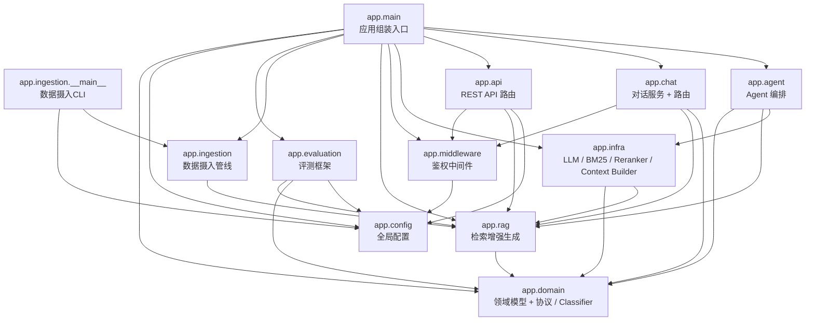
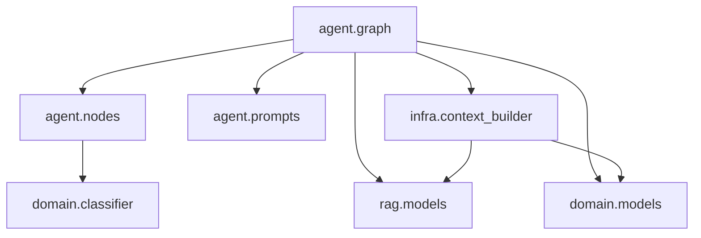
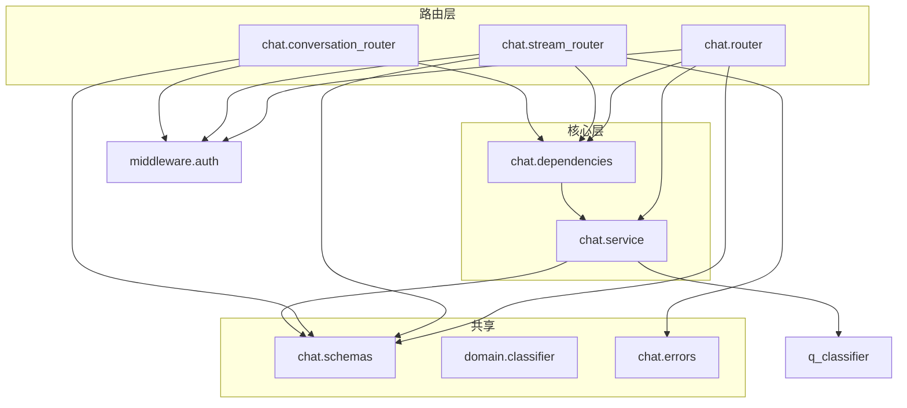
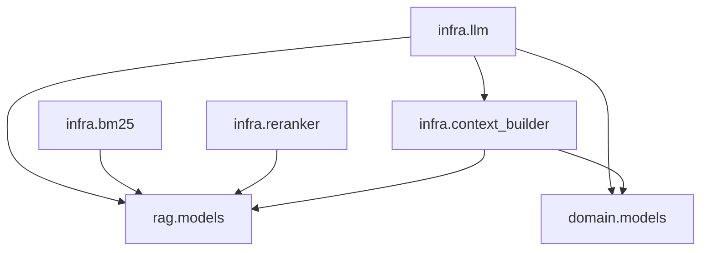
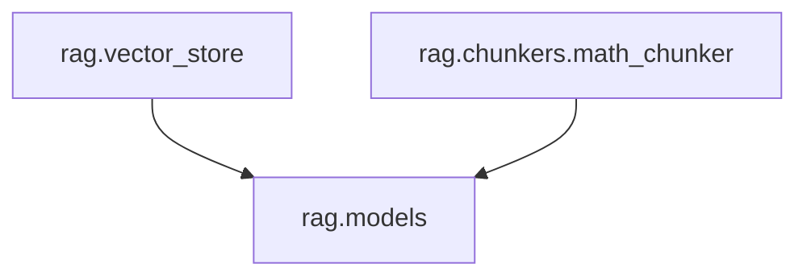
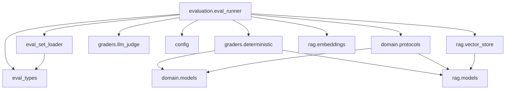
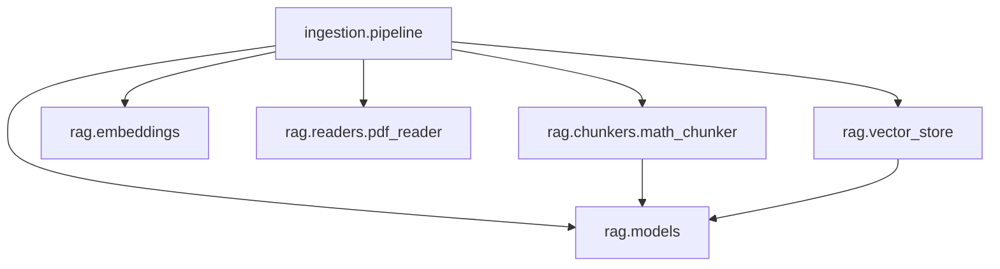

# OctoTutor 模块依赖关系图

## 包级别依赖

```mermaid
graph TB
    main["app.main<br/>应用组装入口"]
    ingestion_main["app.ingestion.__main__<br/>数据摄入CLI"]

    agent["app.agent<br/>Agent 编排"]
    chat["app.chat<br/>对话服务 + 路由"]
    api["app.api<br/>REST API 路由"]
    ingestion["app.ingestion<br/>数据摄入管线"]
    evaluation["app.evaluation<br/>评测框架"]

    infra["app.infra<br/>LLM / BM25 / Reranker / Context Builder"]
    middleware["app.middleware<br/>鉴权中间件"]
    rag["app.rag<br/>检索增强生成"]
    domain["app.domain<br/>领域模型 + 协议 / Classifier"]
    config["app.config<br/>全局配置"]

    main --> agent
    main --> chat
    main --> api
    main --> infra
    main --> middleware
    main --> rag
    main --> ingestion
    main --> evaluation
    main --> config
    main --> domain

    ingestion_main --> ingestion
    ingestion_main --> config

    agent --> infra
    agent --> rag
    agent --> domain

    chat --> domain
    chat --> rag
    chat --> middleware

    api --> config
    api --> rag
    api --> middleware

    ingestion --> rag

    evaluation --> config
    evaluation --> domain
    evaluation --> rag

    infra --> rag
    infra --> domain

    middleware --> config

    rag --> domain
```

---

## 模块级别依赖（每个包内部展开）

### app.agent 依赖链

```mermaid
graph TB
    agent_graph["agent.graph"] --> agent_nodes["agent.nodes"]
    agent_graph --> agent_prompts["agent.prompts"]
    agent_graph --> infra_ctx["infra.context_builder"]
    agent_graph --> rag_models["rag.models"]
    agent_graph --> domain_models["domain.models"]
    agent_nodes --> classifier["domain.classifier"]
    infra_ctx --> rag_models
    infra_ctx --> domain_models
```

### app.chat 依赖链

```mermaid
graph TB
    subgraph routes["路由层"]
        chat_router["chat.router"]
        stream_router["chat.stream_router"]
        conv_router["chat.conversation_router"]
    end
    subgraph core["核心层"]
        chat_service["chat.service"]
        chat_deps["chat.dependencies"]
    end
    subgraph shared["共享"]
        chat_schemas["chat.schemas"]
        classifier["domain.classifier"]
        chat_errors["chat.errors"]
    end

    chat_router --> chat_service
    chat_router --> chat_deps
    chat_router --> chat_schemas
    chat_router --> mw_auth["middleware.auth"]
    stream_router --> chat_deps
    stream_router --> chat_errors
    stream_router --> chat_schemas
    stream_router --> mw_auth
    conv_router --> chat_deps
    conv_router --> chat_schemas
    conv_router --> mw_auth
    chat_deps --> chat_service
    chat_service --> q_classifier
    chat_service --> chat_schemas
```

### app.infra 依赖链

```mermaid
graph TB
    infra_llm["infra.llm"] --> infra_ctx["infra.context_builder"]
    infra_llm --> rag_models["rag.models"]
    infra_llm --> domain_models["domain.models"]
    infra_bm25["infra.bm25"] --> rag_models
    infra_reranker["infra.reranker"] --> rag_models
    infra_ctx --> rag_models
    infra_ctx --> domain_models
```

### app.rag 依赖链

```mermaid
graph TB
    rag_vs["rag.vector_store"] --> rag_models["rag.models"]
    rag_chunker["rag.chunkers.math_chunker"] --> rag_models
```

### app.evaluation 依赖链

```mermaid
graph TB
    eval_runner["evaluation.eval_runner"] --> eval_loader["eval_set_loader"]
    eval_runner --> eval_types["eval_types"]
    eval_runner --> grader_det["graders.deterministic"]
    eval_runner --> llm_judge["graders.llm_judge"]
    eval_runner --> config["config"]
    eval_runner --> domain_protos["domain.protocols"]
    eval_runner --> rag_emb["rag.embeddings"]
    eval_runner --> rag_vs["rag.vector_store"]
    eval_loader --> eval_types
    grader_det --> domain_models["domain.models"]
    grader_det --> rag_models["rag.models"]
    domain_protos --> domain_models
    domain_protos --> rag_models
    rag_vs --> rag_models
```

### app.ingestion 依赖链

```mermaid
graph TB
    pipeline["ingestion.pipeline"] --> rag_chunker["rag.chunkers.math_chunker"]
    pipeline --> rag_emb["rag.embeddings"]
    pipeline --> rag_models["rag.models"]
    pipeline --> pdf_reader["rag.readers.pdf_reader"]
    pipeline --> rag_vs["rag.vector_store"]
    rag_chunker --> rag_models
    rag_vs --> rag_models
```
