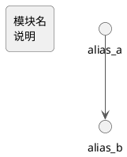

# 模块依赖图绘制指南

## 输出格式

| 格式 | 文件 | 用途 |
|------|------|------|
| PlantUML | `module-dependency.puml` | 生成 SVG 的源文件 |
| SVG | `OctoTutor_Dependencies.svg` | 嵌入文档、演示 |
| Mermaid | `module-dependency.md` | VS Code 内快速预览 |

生成 SVG 命令：

```bash
java -jar ~/.vscode/extensions/justuskarlsson.plan-uml-*/plantuml-*.jar docs/module-dependency.puml -tsvg
```

## 绘制规则

### 1. 粒度控制

- **全局图**：按包级别聚合，一个包一个节点（如 `agent`、`chat`、`rag`）
- **拆分视图**：每个包内部再展开子模块，单独画一张图
- 不在全局图中展开文件级别细节

### 2. 节点命名

- 去掉 `app.` 等项目前缀，只写模块名（`agent` 而不是 `app.agent`）
- 节点内第一行模块名，第二行简要中文/英文说明（用 `\n` 换行）
- 别名用下划线命名（`as chat_service`）

### 3. 依赖线

- 两个模块之间只画一条线，不要重复
- 箭头方向：依赖方 → 被依赖方（从上层指向下层）
- 不画组装入口（`main`、`__main__`）的依赖线，它们依赖所有模块是理所当然的，画出来只会把图搞乱

### 4. 分层原则

从上到下按依赖层级排列：

```
Level 3 — 业务层      agent, chat, api, ingestion, evaluation
Level 2 — 基础设施层  infra, middleware
Level 1 — 基础层      rag, domain, config
```

底层模块不依赖上层模块，保证 DAG（无循环依赖）。

### 5. 排除规则

以下模块不纳入全局图，只在拆分视图中体现：
- `main` / `__main__` — 纯组装入口
- `errors` / `schemas` / `prompts` — 叶子常量/数据定义，无依赖分析价值
- 测试文件（`tests/`）

## PlantUML 样式模板



## 分析方法

1. 扫描所有 `.py` 文件的 `from app.xxx import` 语句
2. 按包级别聚合：将 `app.rag.models`、`app.rag.vector_store` 等归入 `rag` 包
3. 去重：A 包依赖 B 包，只保留一条 A → B
4. 去掉组装入口节点的依赖线
5. 按层级排列，验证无循环依赖
